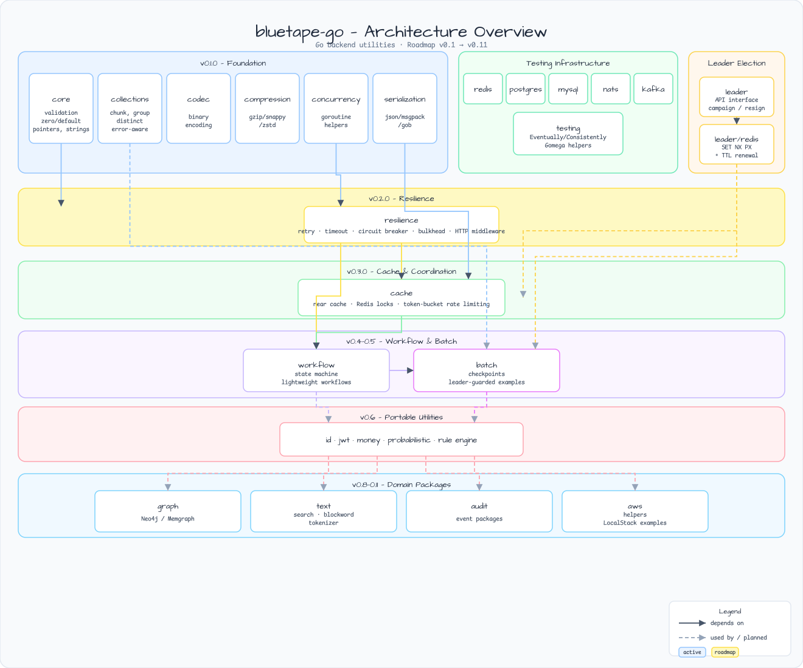
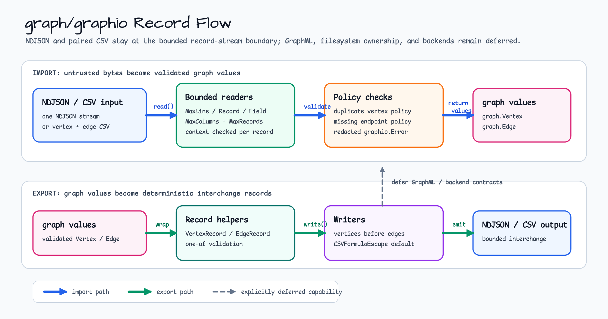
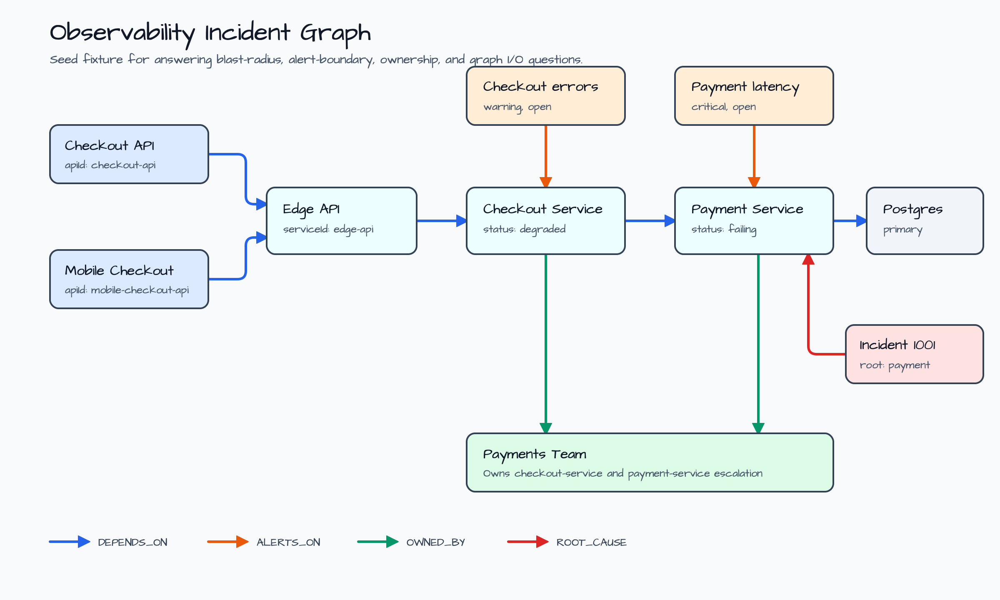
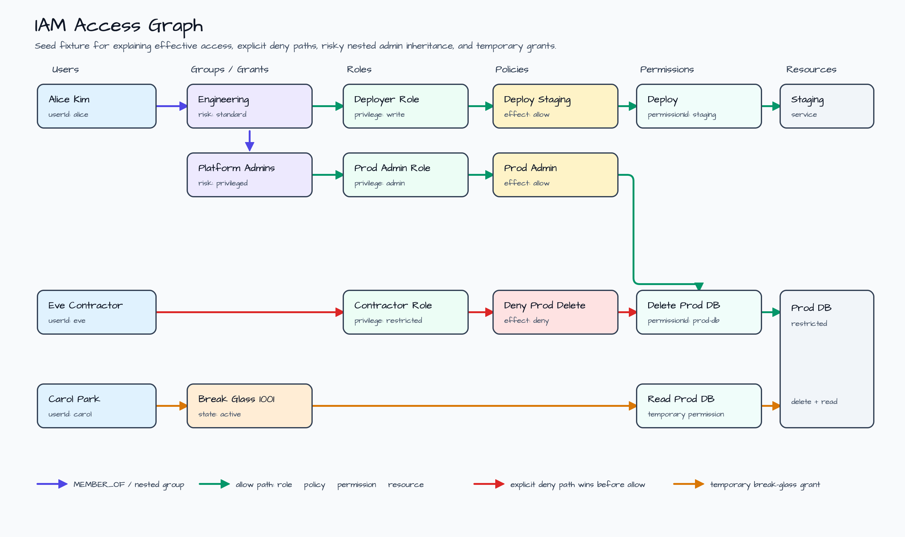
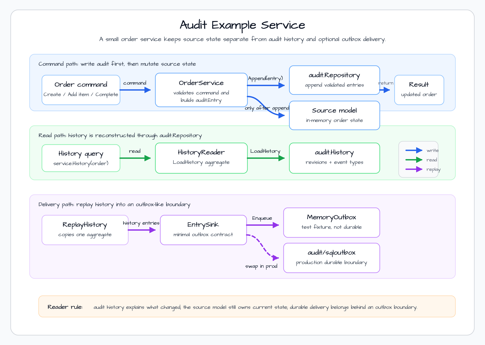

# bluetape-go

[English](README.md) | [한국어](README.ko.md)


Idiomatic Go backend utilities and distributed infrastructure packages for the
bluetape ecosystem.

`bluetape-go` complements the Kotlin/JVM bluetape4k libraries without trying to
mirror their API surface. It gives Go teams small, focused packages for service
infrastructure, coordination, test fixtures, resilience, caching, workflows,
batch processing, portable values, and Redis-backed adapters.

## Architecture



## Logging

`bluetape-go` examples use the standard-library `log/slog` contract for
structured logging. Applications configure handlers and levels; library
packages expose caller-owned hooks such as `resilience.OnEvent` instead of
mutating global logging defaults or installing a bluetape-go logger registry.
Guard expensive debug attributes with `logger.Enabled(ctx, slog.LevelDebug)`
before computing them.

## Current Status

`bluetape-go` has published the `v0.17.0` release line. The repository now covers
foundation helpers, codecs, compression, context-aware concurrency, serializer
contracts, Redis-backed leader election and locks, resilience policies, cache
coordination, token-bucket rate limiting, finite state machines, workflow
reports, lightweight workflow runners, checkpointed batch jobs, and portable
service values, SQL helpers, text search primitives, audit/event packages,
graph helpers, bounded image helpers, encryption helpers, and first-party rule
primitives. The `0.18.0` development line is release-prepared with MongoDB
group and strategic leader electors, bounded GraphML graph I/O, and a Redis
Streams sqloutbox publisher provider; the `v0.18.0` tag is still pending until
the release PR, main promotion, tag, and GitHub Release gates complete.

The `v0.6.x` portable utilities scope includes UUID, ULID, KSUID, and Snowflake
ID generation; explicit-algorithm JWT signing, parsing, validation, and local
or distributed key rotation backed by in-memory, Redis, or MongoDB KeyChain
repositories; typed units and measured values; ISO currency and decimal-backed
money operations; and in-memory Bloom filters plus Redis-backed Bloom and
HyperLogLog helpers. RedisBloom `CF*` Cuckoo support remains a module-gated
future scope, not part of the current public API.

## Packages

| Package | Status | Purpose |
|---|---:|---|
| [`core`](core/README.md) | active | Small shared validation, zero/default, pointer, string, and number helpers. |
| [`collections`](collections/README.md) | active | Focused generic slice/map helpers for chunking, grouping, distinct, and error-aware transforms. |
| [`concurrency`](concurrency/README.md) | active | Context-aware goroutine groups, worker pools, and bounded parallel helpers. |
| [`codec`](codec/README.md) | active | Base58, Base62, Base64, hex, and URL-safe encoding helpers. |
| [`encrypt`](encrypt/README.md) | active | Stdlib AES-GCM byte/string facade with versioned envelopes and associated data. |
| [`compression`](compression/README.md) | active | gzip, deflate, zstd, lz4, snappy, and registry-backed compression helpers. |
| [`imagekit`](imagekit/README.md) | active | Bounded pure-Go thumbnail, resize, and JPEG/PNG conversion helpers for service inputs. |
| [`serialization`](serialization/README.md) | active | JSON and binary serializer interfaces with safe defaults. |
| [`testing`](testing/README.md) | active | Common test helpers for eventual consistency checks. |
| [`testing/concurrency`](testing/concurrency/README.md) | active | Stress and async job helpers for concurrent tests. |
| [`testcontainers/redis`](testcontainers/redis/README.md) | active | Redis fixture helpers based on Testcontainers for Go. |
| [`testcontainers/postgres`](testcontainers/postgres/README.md) | active | PostgreSQL fixture helpers based on Testcontainers for Go. |
| [`testcontainers/mysql`](testcontainers/mysql/README.md) | active | MySQL 8.4 fixture helpers based on Testcontainers for Go. |
| [`testcontainers/mongodb`](testcontainers/mongodb/README.md) | active | MongoDB fixture helpers based on Testcontainers for Go. |
| [`testcontainers/nats`](testcontainers/nats/README.md) | active | NATS fixture helpers based on Testcontainers for Go. |
| [`testcontainers/kafka`](testcontainers/kafka/README.md) | active | Kafka fixture helpers based on Testcontainers for Go. |
| [`dynamodb/batchwrite`](dynamodb/batchwrite/README.md) | active | Narrow AWS SDK for Go v2 BatchWriteItem chunking and unprocessed-item retry helper. |
| [`examples/integration`](examples/integration/README.md) | example | Compile-checked end-to-end recipes across corrected `0.6.x` packages. |
| [`examples/audit`](examples/audit/README.md) | example | Runnable audit-backed order service demonstrating repository history and outbox replay boundaries. |
| [`examples/graph/observability`](examples/graph/observability/README.md) | example | Runnable observability incident graph showing blast-radius, alert-boundary, ownership, and NDJSON graph I/O boundaries. |
| [`examples/graph/iamaccess`](examples/graph/iamaccess/README.md) | example | Runnable IAM access graph showing effective access, deny paths, risky privilege chains, least-privilege drift, and NDJSON graph I/O boundaries. |
| [`examples/s3`](examples/s3/README.md) | example | Compile-checked AWS SDK for Go v2 S3 examples backed by the Floci fixture. |
| [`examples/sqs-sns`](examples/sqs-sns/README.md) | example | Compile-checked AWS SDK for Go v2 SQS/SNS examples backed by the Floci fixture. |
| [`leader`](leader/README.md) | active | Leader election API, including single, group, and strategy-based contracts. |
| [`leader/redis`](leader/redis/README.md) | active | Redis-backed single, group, and strategic leader election using TTL renewal, ZSET slot tokens, and candidate registries. |
| [`leader/mongo`](leader/mongo/README.md) | active | MongoDB-backed single, group, and strategic leader election using owner-token leases, bounded slots, candidate registries, and TTL cleanup indexes. |
| [`leader/sql`](leader/sql/README.md) | active | PostgreSQL-only single leader election using caller-owned row leases and a caller-owned `*sql.DB`. |
| [`resilience`](resilience/README.md) | active | First-party composable retry, timeout, circuit breaker, and bulkhead policies with synchronous observability hooks and `net/http` adapters. |
| [`cache`](cache/README.md) | active | Generic in-process TTL cache interfaces with context-aware loaders and same-key stampede protection. |
| [`cache/redisnear`](cache/redisnear/README.md) | active | Redis Pub/Sub near-cache invalidation for process-local loading caches. |
| [`cache/rediscoord`](cache/rediscoord/README.md) | active | Opt-in Redis coordination wrapper that shares one loader result across process-local caches during a cold burst. |
| [`cache/redisfory`](cache/redisfory/README.md) | active | Bounded Go-native Apache Fory binary values stored directly in Redis with explicit schema generations. |
| [`redis`](redis/README.md) | active | Shared Redis key, owner-token, lease script, TTL, and redacted operation error primitives. |
| [`lock/redis`](lock/redis/README.md) | active | Redis single-instance owner-token lock with TTL acquisition and owner-safe Lua unlock. |
| [`ratelimit`](ratelimit/README.md) | active | Process-local keyed token-bucket limiter and `net/http` middleware. |
| [`ratelimit/redis`](ratelimit/redis/README.md) | active | Redis-backed token-bucket limiter with atomic Lua consume/refill and idle key expiration. |
| [`ratelimit/sql`](ratelimit/sql/README.md) | active | PostgreSQL atomic token buckets for moderate-QPS, database-only deployments with caller-owned schema and cleanup. |
| [`state`](state/README.md) | active | Small finite state machine primitives with typed transitions, guards, final states, and sentinel errors. |
| [`workreport`](workreport/README.md) | active | Status, failure-policy, and report-tree values for lightweight workflow code. |
| [`workflow`](workflow/README.md) | active | Sequential, conditional, and all-branches parallel runners built on `context.Context` and `workreport`. |
| [`batch`](batch/README.md) | active | Chunk-oriented batch steps, sequential jobs, retry/skip policies, reports, and checkpoints. |
| [`batch/sqlcheckpoint`](batch/sqlcheckpoint/README.md) | active | PostgreSQL durable checkpoints that atomically commit a batch callback and consumed-input progress with revision CAS. |
| [`id`](id/README.md) | active | UUID v4/v7, random and monotonic ULID, standard KSUID, Kotlin-compatible KSUID millis, and Snowflake ID generators. |
| [`jwt`](jwt/README.md) | active | JWT signing, parsing, validation, typed claim reading, in-memory/distributed `kid` key rotation, and optional provider cache adapters with explicit algorithms. |
| [`jwt/redis`](jwt/redis/README.md) | active | Redis-specific facade for distributed JWT key-chain repository construction. |
| [`jwt/mongo`](jwt/mongo/README.md) | active | MongoDB-specific facade for distributed JWT key-chain repository construction. |
| [`measure`](measure/README.md) | active | Typed units, measured values, compound units, parsing, formatting, and affine temperature helpers. |
| [`money`](money/README.md) | active | ISO 4217 currency values, CLDR-backed locale currency lookup, decimal-backed money amounts, aggregation, serialization, caller-supplied exchange-rate conversion, and ECB-backed provider conversion. |
| [`rules`](rules/README.md) | active | Dependency-free facts, functional rules, deterministic rule sets, composite groups, bounded inference, result details, and context cancellation. |
| [`sqlkit`](sqlkit/README.md) | active | Runtime-first `database/sql` transaction helpers, explicit row mapping/cardinality helpers, and PostgreSQL-first inspectable SQL builders. |
| [`audit`](audit/README.md) | active | Storage-neutral aggregate event and audit model with validated JSON entries, pending-event recording, and history reconstruction. |
| [`audit/sqloutbox`](audit/sqloutbox/README.md) | active | PostgreSQL-backed audit outbox store and relay with caller-owned transaction choreography. |
| [`audit/sqloutbox/redisstreams`](audit/sqloutbox/redisstreams/README.md) | active | Redis Streams sqloutbox publisher that preserves stable event and idempotency metadata. |
| [`audit/sqloutbox/sqloutboxtest`](audit/sqloutbox/sqloutboxtest/README.md) | active | Deterministic publisher helpers for sqloutbox tests, examples, retries, and duplicate-delivery assertions. |
| [`graph`](graph/README.md) | active | Model-only graph values for vertices, edges, paths, labels, IDs, shallow properties, and validated JSON. |
| [`graph/graphio`](graph/graphio/README.md) | active | Stream-oriented NDJSON and paired CSV import/export helpers for graph vertices and edges. |
| [`graph/neo4j`](graph/neo4j/README.md) | active | Proof adapter from the official Neo4j Go driver to graph vertices and edges. |
| [`probabilistic`](probabilistic/README.md) | active | Goroutine-safe in-memory Bloom filters with deterministic config, merge compatibility checks, and stress/race coverage. |
| [`probabilistic/redis`](probabilistic/redis/README.md) | active | Redis-backed shared Bloom filters and HyperLogLog estimates with static Lua Bloom scripts, immutable config metadata, and operator runbook boundaries. |

Next planned package families include additional durable audit transport
publisher adapters and example services. Redis-backed Cuckoo support is tracked
separately after the Redis Bloom and HyperLogLog scope.

## SerDe Baseline Guidance

The 0.14.0 cross-repo SerDe matrix keeps defaults conservative. Go
serialization uses JSON, raw bytes/strings, and the Go-local `BTGS` envelope;
`compression.Default()` remains zstd; lz4/snappy are throughput candidates;
gzip/deflate are compatibility choices; and Base58/Base62/URL62 stay ID/key
surfaces rather than large binary transport codecs. See
[`docs/research/2026-07-07-issue-402-cross-repo-serde-recommendation.md`](docs/research/2026-07-07-issue-402-cross-repo-serde-recommendation.md).

## Install

```bash
go get github.com/bluetape4k/bluetape-go
```

## Package Documentation

Package-level READMEs contain the practical details: usage examples, operational
boundaries, benchmark notes, and the constraints that do not belong in a root
overview.

- Foundation: [`core`](core/README.md), [`collections`](collections/README.md),
  [`concurrency`](concurrency/README.md), [`codec`](codec/README.md),
  [`encrypt`](encrypt/README.md), [`compression`](compression/README.md), and
  [`serialization`](serialization/README.md).
- Test support: [`testing`](testing/README.md),
  [`testing/concurrency`](testing/concurrency/README.md), and the fixture
  package READMEs listed above. Focused examples in `testing` cover
  table-driven tests, package-local builders, golden files, deterministic random
  data, and cancellation assertions without adding an assertion DSL.
- AWS/Floci: [`dynamodb/batchwrite`](dynamodb/batchwrite/README.md) and
  compile-checked examples under [`examples/integration`](examples/integration/README.md),
  [`examples/s3`](examples/s3/README.md), and
  [`examples/sqs-sns`](examples/sqs-sns/README.md).
- Text: [`textsearch`](textsearch/README.md) for deterministic multi-pattern
  search, tokenizer core interfaces, blockword detection/masking, severity
  metadata, normalization, boundary-aware matching, and the optional
  [`textsearch/japanese`](textsearch/japanese/README.md) Kagome adapter plus
  [`textsearch/language`](textsearch/language/README.md) Lingua-Go detector.
- Image: [`imagekit`](imagekit/README.md) for bounded pure-Go resize,
  thumbnail, and JPEG/PNG conversion helpers with explicit format and memory
  boundaries.
- Coordination: [`leader`](leader/README.md),
  [`leader/redis`](leader/redis/README.md),
  [`leader/mongo`](leader/mongo/README.md),
  [`leader/sql`](leader/sql/README.md),
  [`redis`](redis/README.md), [`redis/stream`](redis/stream/README.md), and
  [`lock/redis`](lock/redis/README.md).
- Runtime policies, cache, state, and workflow: [`resilience`](resilience/README.md),
  [`cache`](cache/README.md), [`cache/redisnear`](cache/redisnear/README.md),
  [`cache/rediscoord`](cache/rediscoord/README.md), [`cache/redisfory`](cache/redisfory/README.md),
  [`ratelimit`](ratelimit/README.md),
  [`state`](state/README.md), [`workreport`](workreport/README.md),
  [`workflow`](workflow/README.md), and [`batch`](batch/README.md).
- Portable utilities: [`id`](id/README.md), [`jwt`](jwt/README.md),
  [`jwt/redis`](jwt/redis/README.md), [`jwt/mongo`](jwt/mongo/README.md),
  [`measure`](measure/README.md), [`money`](money/README.md),
  [`rules`](rules/README.md), and [`probabilistic`](probabilistic/README.md), including
  [`probabilistic/redis`](probabilistic/redis/README.md).
- Data access: [`sqlkit`](sqlkit/README.md) and the optional
  [SQL generator/migration guide](docs/sql-generator-migration-guidance.md).
- Audit: [`audit`](audit/README.md) for storage-neutral aggregate event values,
  pending event handoff, validated audit entry JSON, and history
  reconstruction, plus [`audit/sqloutbox`](audit/sqloutbox/README.md) for
  PostgreSQL-backed at-least-once outbox delivery,
  [`audit/sqloutbox/redisstreams`](audit/sqloutbox/redisstreams/README.md) for
  Redis Streams publish attempts,
  [`audit/sqloutbox/sqloutboxtest`](audit/sqloutbox/sqloutboxtest/README.md) for
  deterministic publisher helpers, and
  [`examples/audit`](examples/audit/README.md) for a runnable audit-backed
  order service.
- Graph: [`graph`](graph/README.md) for model-only vertex, edge, path, label,
  ID, shallow property, and validated JSON values, plus
  [`graph/graphio`](graph/graphio/README.md) for bounded NDJSON and paired CSV
  import/export helpers, [`graph/neo4j`](graph/neo4j/README.md) for the first
  Neo4j backend proof, and
  [`examples/graph/observability`](examples/graph/observability/README.md) for
  a runnable incident-response graph example plus
  [`examples/graph/iamaccess`](examples/graph/iamaccess/README.md) for IAM
  access-path review.

## Workshop Adoption

The companion
[`bluetape-go-workshop`](https://github.com/bluetape4k/bluetape-go-workshop)
repository owns runnable scenario tutorials. This library README points to
matching workshop examples and active backlog items without duplicating the
tutorial text. The source-checked adoption matrix is tracked in
[`docs/research/2026-07-08-issue-415-workshop-adoption-matrix.md`](docs/research/2026-07-08-issue-415-workshop-adoption-matrix.md)
and issue [#415](https://github.com/bluetape4k/bluetape-go/issues/415).

- SQL adoption: [`sql-access-strategy-decision`](https://github.com/bluetape4k/bluetape-go-workshop/tree/develop/examples/sql-access-strategy-decision),
  [`sql-order-repository`](https://github.com/bluetape4k/bluetape-go-workshop/tree/develop/examples/sql-order-repository),
  [`sql-transaction-boundary`](https://github.com/bluetape4k/bluetape-go-workshop/tree/develop/examples/sql-transaction-boundary),
  [`gin-sql-crud-api`](https://github.com/bluetape4k/bluetape-go-workshop/tree/develop/examples/gin-sql-crud-api), and
  [`gin-sql-order-service`](https://github.com/bluetape4k/bluetape-go-workshop/tree/develop/examples/gin-sql-order-service).
- AWS/Floci adoption: [`s3-floci-storage`](https://github.com/bluetape4k/bluetape-go-workshop/tree/develop/examples/s3-floci-storage),
  [`sqs-floci-worker`](https://github.com/bluetape4k/bluetape-go-workshop/tree/develop/examples/sqs-floci-worker),
  [`dynamodb-batchwrite-materializer`](https://github.com/bluetape4k/bluetape-go-workshop/tree/develop/examples/dynamodb-batchwrite-materializer),
  [`dynamodb-conditional-repository`](https://github.com/bluetape4k/bluetape-go-workshop/tree/develop/examples/dynamodb-conditional-repository), and
  [`s3-sqs-dynamodb-document-workflow`](https://github.com/bluetape4k/bluetape-go-workshop/tree/develop/examples/s3-sqs-dynamodb-document-workflow).
- Probabilistic adoption: [`probabilistic-dedupe-admission`](https://github.com/bluetape4k/bluetape-go-workshop/tree/develop/examples/probabilistic-dedupe-admission),
  [`shared-redis-bloom-admission`](https://github.com/bluetape4k/bluetape-go-workshop/tree/develop/examples/shared-redis-bloom-admission), and the planned
  [Redis HyperLogLog workflow](https://github.com/bluetape4k/bluetape-go-workshop/issues/151).
- Text adoption: [`text-moderation-masking`](https://github.com/bluetape4k/bluetape-go-workshop/tree/develop/examples/text-moderation-masking),
  [`gin-text-search-service`](https://github.com/bluetape4k/bluetape-go-workshop/tree/develop/examples/gin-text-search-service),
  plus follow-up issues
  [#34](https://github.com/bluetape4k/bluetape-go-workshop/issues/34),
  [#55](https://github.com/bluetape4k/bluetape-go-workshop/issues/55),
  [#67](https://github.com/bluetape4k/bluetape-go-workshop/issues/67),
  [#118](https://github.com/bluetape4k/bluetape-go-workshop/issues/118),
  [#119](https://github.com/bluetape4k/bluetape-go-workshop/issues/119).
- Audit, graph, and logging adoption remain issue-tracked workshop scope:
  audit [#35](https://github.com/bluetape4k/bluetape-go-workshop/issues/35),
  [#56](https://github.com/bluetape4k/bluetape-go-workshop/issues/56),
  [#57](https://github.com/bluetape4k/bluetape-go-workshop/issues/57),
  [#58](https://github.com/bluetape4k/bluetape-go-workshop/issues/58),
  [#68](https://github.com/bluetape4k/bluetape-go-workshop/issues/68),
  [#150](https://github.com/bluetape4k/bluetape-go-workshop/issues/150);
  graph [#36](https://github.com/bluetape4k/bluetape-go-workshop/issues/36),
  [#50](https://github.com/bluetape4k/bluetape-go-workshop/issues/50),
  [#51](https://github.com/bluetape4k/bluetape-go-workshop/issues/51),
  [#52](https://github.com/bluetape4k/bluetape-go-workshop/issues/52),
  [#69](https://github.com/bluetape4k/bluetape-go-workshop/issues/69); and
  slog [#139](https://github.com/bluetape4k/bluetape-go-workshop/issues/139).
  Workshop backlog does not block this library release line.

### Graph I/O At A Glance



`graph/graphio` keeps import/export at the record-stream boundary. Readers apply
byte, column, record-count, duplicate-vertex, and missing-endpoint checks before
returning `graph.Vertex` and `graph.Edge`; writers emit deterministic NDJSON or
paired CSV records. Optional `graph/graphio/graphml` covers a bounded directed
GraphML subset without claiming broad yEd/yFiles, filesystem, or backend
ownership.

### Observability Graph Example



The observability example seeds checkout APIs, service dependencies, alerts, an
incident root cause, and the owning team. It proves graph caller value with
compile-checked queries for upstream impact, affected APIs, alert boundaries,
ownership, and NDJSON round-trip behavior while backend adapters remain
follow-up work.

### IAM Access Graph Example



The IAM example seeds users, groups, roles, policies, permissions, resources,
and a break-glass grant. It proves caller-valued graph questions for effective
access, explicit deny paths, risky nested admin inheritance, least-privilege
drift, temporary access, and NDJSON round-trip behavior without requiring a
backend adapter.

### Audit Example At A Glance



The audit example is intentionally small. It separates the current source model
from the audit history: commands append `audit.Entry` values through an
`audit.Repository`, then mutate the example order state only after the append
succeeds. History queries read the same repository boundary, and outbox replay
uses a minimal `EntrySink` so production code can swap the in-memory fixture for
`audit/sqloutbox` without turning the example into a framework. The adoption
path stays explicit: `Store.Enqueue` writes durable rows, `Relay.RunOnce` or
`Relay.Run` claims them, and a `sqloutbox.Publisher` adapter preserves
`Record.EventID` / `Record.IdempotencyKey` for duplicate-safe consumers.

## Roadmap

| Milestone | Theme |
|---|---|
| `0.1.0` | Core support, collections, goroutine helpers, codecs, compression, Redis leader election, Testcontainers. |
| `0.2.0` | Resilience primitives: retry, timeout, circuit breaker, bulkhead, HTTP middleware. |
| `0.3.0` | Cache and coordination: near cache, Redis locks, token-bucket rate limiting, strategic leader election. |
| `0.4.0` | State machine and lightweight workflow primitives. |
| `0.5.0` | Batch processing with checkpoints and leader-guarded examples. |
| `0.6.0` | Portable utilities: ID generation, JWT, measured values, money, probabilistic structures. |
| `0.6.1` | Portable utility hardening: Redis Bloom filters, provider caches, exchange-rate providers, locale currency mapping, and compatibility evidence. |
| `0.6.2` | Corrective source-parity matrix and hardening plan for core, testing, and Testcontainers. |
| `0.6.3` | Core foundation parity and hardening. |
| `0.6.4` | JUnit5-inspired Go testing helper parity. |
| `0.6.5` | Testcontainers contract hardening and service coverage expansion. |
| `0.6.6` | Developer-experience parity, integration examples, and corrective-series closure. |
| `0.7.0` | Relational SQL DSL and repository helpers. |
| `0.8.0` | Text search, blockword masking, tokenizer adapters. |
| `0.9.0` | Audit and event packages inspired by bluetape4k-javers patterns. |
| `0.10.0` | Graph packages and examples. |
| `0.11.0` | Image, encryption, rule-engine research, and utility follow-ups. |
| `0.12.0` | Core foundation parity: source-backed replacements for core, collections, codec, concurrency, logging conventions, and first-party rules primitives. |
| `0.13.0` | Retrospective hardening: 7-tier review, stress/race coverage, P0/P1 fixes, cumulative lesson cleanup, MongoDB Testcontainers fixture, feature-gap triage, and release-readiness audit. |
| `0.14.0` | Cross-repo SerDe/compression benchmark evidence, raw artifact retention, and evidence-scoped recommendation matrix. |
| `0.15.0` | Audit sqloutbox publisher adoption helpers plus focused JSON/zstd allocation reductions. |
| `0.16.0` | Redis probabilistic follow-up: HyperLogLog support, Testcontainers/stress/race coverage, and explicit RedisBloom Cuckoo deferral. |
| `0.17.0` | Workshop adoption sync: library-side pointers, cross-repo issue links, and release-readiness notes that separate library readiness from workshop backlog. |
| `0.18.0` | Ecosystem follow-up: MongoDB group/strategic leader electors, bounded GraphML graph I/O, and Redis Streams sqloutbox publisher provider. |

The closed `0.7.0 Research Gate` milestone recorded the larger-domain scope
decisions and was not tagged as a release.

See the [GitHub milestones](https://github.com/bluetape4k/bluetape-go/milestones)
and [`docs/research`](docs/research/) for the current planning record.

## Development

```bash
make test
make coverage
make ci
```

Common commands:

| Command | Purpose |
|---|---|
| `make fmt` | Format Go sources with `gofmt`. |
| `make fmt-check` | Fail when Go sources are not formatted. |
| `make tidy` | Run `go mod tidy`. |
| `make tidy-check` | Fail when `go.mod` or `go.sum` drift after `go mod tidy`. |
| `make vet` | Run `go vet ./...`. |
| `make lint` | Run `golangci-lint run ./...`. |
| `make test` | Run `go test -p 1 -count=1 ./...` so Testcontainers tests execute with serial package scheduling. |
| `make race` | Run `go test -race -p 1 -count=1 ./...` so Testcontainers tests execute under the race detector with serial package scheduling. |
| `make coverage` | Generate Go coverage profile, package subtotal table, text summary, and HTML report under `coverage/`. |
| `make bench-cache` | Run opt-in cache, Redis NearCache, and Redis coordinator benchmarks. |
| `make bench-ratelimit` | Run opt-in local rate limiter benchmarks. |
| `make bench-id` | Run opt-in id generator benchmarks. |
| `make ci` | Run the local CI gate. |

Redis integration tests use Testcontainers and require Docker. The regular CI
and Nightly workflows both run these tests against real containers and publish
Go coverage report artifacts.

See [`testing`](testing/README.md), [`testing/concurrency`](testing/concurrency/README.md),
and the package-level Testcontainers README files for fixture usage.

## Project Management

- [Changelog](CHANGELOG.md)
- [Current WIP](WIP.md)
- [Research index](docs/research/README.md)
- [Package layout policy](docs/package-layout.md)
- [Release guide](docs/release.md)

## Project Rules

- Keep APIs idiomatic to Go. Do not mechanically copy Kotlin extension-style
  APIs.
- Prefer small packages with clear service value over catch-all utility bags.
- Use proven Go dependencies where they reduce risk, but avoid wrapping mature
  SDKs without a bluetape-specific reason.
- Add Testcontainers-backed smoke tests for infrastructure packages.
