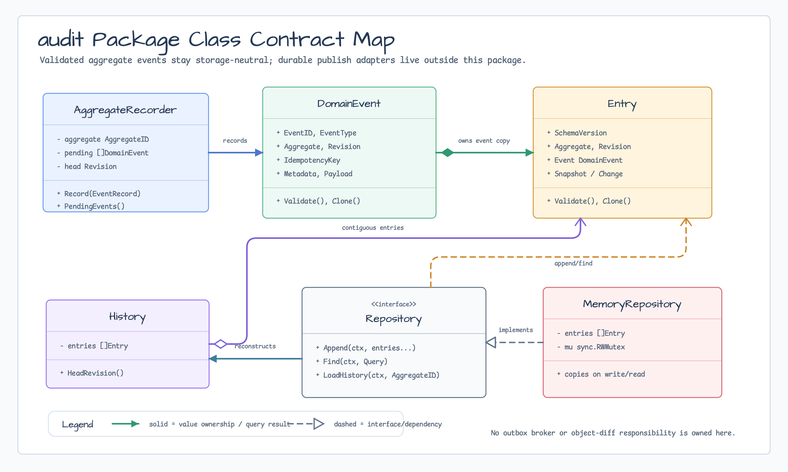
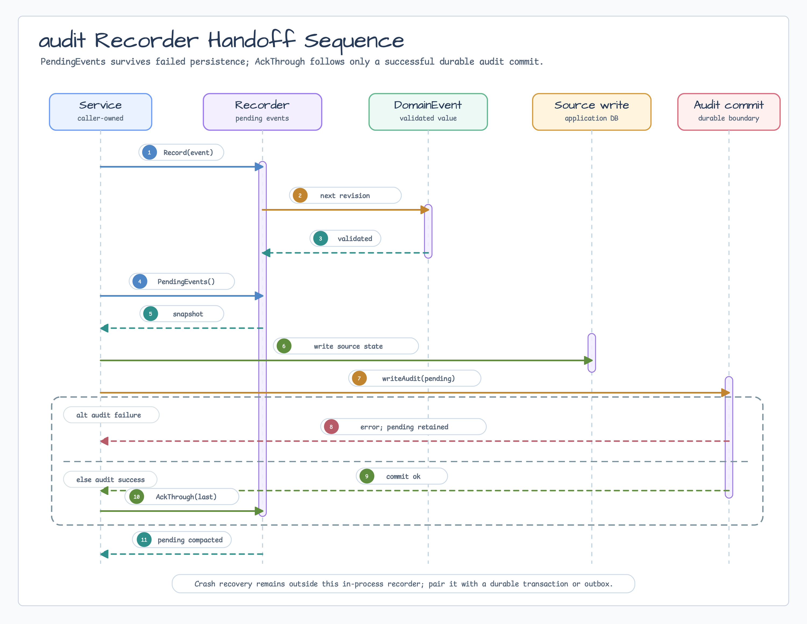

# audit

[English](README.md) | [한국어](README.ko.md)

Service package에서 사용할 storage-neutral aggregate event와 audit model 값입니다.

이 package는 검증된 aggregate ID, positive revision, caller-owned event ID,
idempotency key, audit entry, snapshot/change metadata, goroutine-safe pending
event recorder, deterministic history reconstruction, storage-neutral
repository interface, test/example용 non-durable in-memory repository를
제공합니다. Outbox publish, SQL/Redis/Kafka/NATS adapter 정의, JaVers식 object
diff 계산은 맡지 않습니다.

## Diagrams





## Import

```go
import "github.com/bluetape4k/bluetape-go/audit"
```

## Minimal Usage

```go
aggregate, err := audit.NewAggregateID("account", "42")
if err != nil {
	return err
}

recorder, err := audit.NewAggregateRecorder(aggregate)
if err != nil {
	return err
}

event, err := recorder.Record(audit.EventRecord{
	EventID:        audit.EventID("evt-001"),
	EventType:      audit.EventType("AccountDebited"),
	OccurredAt:     time.Now().UTC(),
	IdempotencyKey: "command-001",
	Payload:        json.RawMessage(`{"amount":"10.00"}`),
})
if err != nil {
	return err
}

entry, err := audit.NewEntry(audit.EntryOptions{
	Author: "billing-service",
	Event:  event,
})
if err != nil {
	return err
}
```

## Validated Decode

`DecodeEntryJSON`은 이미 size/depth가 제한된 JSON byte를 trusted storage나
transport layer에서 읽을 때 사용합니다. Repository/outbox adapter는 untrusted
input을 읽거나 decode하기 전에 byte/depth limit을 적용해야 합니다.

```go
entry, err := audit.DecodeEntryJSON(data)
if err != nil {
	return err
}
```

`Entry`에 직접 `json.Unmarshal`해도 entry, nested event, aggregate ID,
snapshot metadata, change metadata가 검증됩니다. 지원하지 않는 schema version은
거부됩니다.

## Recorder Handoff

`PendingEvents`는 defensive snapshot을 반환하며 event를 지우지 않습니다.
Source write와 durable audit commit이 모두 성공한 뒤에만 `AckThrough`를 호출합니다.

```go
pending := recorder.PendingEvents()
if len(pending) == 0 {
	return nil
}
if err := writeSource(ctx, aggregate, pending); err != nil {
	return err
}
if err := writeAudit(ctx, pending); err != nil {
	// 실패하면 event는 pending 상태로 남고 retry 때 다시 읽을 수 있습니다.
	return err
}
return recorder.AckThrough(pending[len(pending)-1].Revision)
```

이 방식은 failure-then-success retry 경로를 명확히 합니다. Persistence 실패는
pending event를 보존하고, durable audit commit 성공만 acknowledgment boundary를
전진시킵니다.

이 흐름은 in-process retry pattern일 뿐입니다. Source write와 audit commit은
같은 durable transaction으로 묶이거나, audit 실패 시 rollback되거나, durable
outbox/reconciliation mechanism으로 복구되어야 합니다. In-memory pending event는
crash recovery가 아닙니다.

## Repository Queries

`Repository`는 all-or-nothing append와 `HistoryReader` query를 함께 제공합니다.
모든 method는 `context.Context`를 받으며, 취소된 context는 caller-owned context
error를 반환합니다.

```go
repo := audit.NewMemoryRepository()
if err := repo.Append(ctx, entry); err != nil {
	return err
}

history, ok, err := repo.LoadHistory(ctx, aggregate)
if err != nil {
	return err
}
if !ok {
	return nil
}
_ = history.HeadRevision()
```

`Find`는 기본적으로 append order를 사용하고 `NewestFirst`가 true이면 그 순서를
뒤집습니다. `Limit`은 filter와 ordering 뒤에 적용됩니다. Revision과 recorded-time
bound는 inclusive입니다.

```go
entries, err := repo.Find(ctx, audit.Query{
	Aggregate:     &aggregate,
	FromRevision:  audit.Revision(2),
	ToRevision:    audit.Revision(4),
	NewestFirst:   true,
	Limit:         10,
})
if err != nil {
	return err
}
```

`Latest`, `LatestSnapshot`, `PreviousSnapshot`은 `(Entry, bool, error)`를
반환하므로 missing history는 예외가 아닙니다.

`MemoryRepository`는 goroutine-safe이며 write/read 시 entry를 복사합니다. Durable
store가 아니며 test, example, adapter conformance 용도입니다.

Adapter package는 repository contract를 다음 helper로 재사용할 수 있습니다.

```go
audittest.RunRepositoryConformance(t, func(testing.TB) audit.Repository {
	return audit.NewMemoryRepository()
})
```

## JaVers Migration Notes

| JaVers/Kotlin 개념 | Go package 형태 | 경계 |
|---|---|---|
| Aggregate root identity | `AggregateID` | Caller domain object는 package-owned root interface를 구현하지 않습니다. |
| Domain event | `DomainEvent` | Event ID와 idempotency key는 caller가 제공합니다. |
| Audit entry/snapshot | `Entry`, `SnapshotMetadata`, `ChangeMetadata` | JSON 검증은 local contract이고 storage schema는 외부 책임입니다. |
| Event recording | `AggregateRecorder` | Pending event는 명시적 ack 뒤에만 정리됩니다. |
| Repository history query | `Repository`, `HistoryReader`, `Query` | #57은 storage-neutral contract와 in-memory conformance만 맡습니다. |
| Repository event publishing | 이후 outbox issue | SQL, Redis, Kafka, NATS, transaction choreography는 범위 밖입니다. |
| Object diffing | 범위 밖 | Caller는 change metadata를 저장할 수 있지만 이 package는 object diff를 계산하지 않습니다. |

## Durable Outbox

Issue #58은 첫 durable publisher target으로 SQL outbox store와 relay contract를
선택했습니다. 설계는
[`docs/research/2026-06-27-issue-58-audit-outbox-design.md`](../docs/research/2026-06-27-issue-58-audit-outbox-design.md)에
기록했습니다. 첫 구현은 [`audit/sqloutbox`](sqloutbox/README.ko.md)에 있습니다.
Publisher contract는 at-least-once retry, caller context cancellation, 안정적인
event/idempotency-key handoff, duplicate-safe adapter behavior를 다룹니다.
Test와 local example을 위한 deterministic publisher helper는
[`audit/sqloutbox/sqloutboxtest`](sqloutbox/sqloutboxtest/README.ko.md)에 있습니다.

Kafka, NATS, Redis Streams, RabbitMQ, Redpanda, Pulsar는 durable SQL outbox
contract가 검증된 뒤 붙일 publisher/projection adapter로 남깁니다. Source
transaction choreography, migration, broker topology, redaction, PII 정책,
consumer idempotency는 계속 application 책임입니다.

## Boundaries

- Revision은 positive이고 `InitialRevision()`에서 시작합니다.
- `NewHistory`는 empty, mixed-aggregate, duplicate, non-contiguous,
  non-initial history를 거부합니다.
- `Append`는 mixed aggregate batch, non-contiguous continuation, duplicate event
  ID, duplicate idempotency key를 거부합니다.
- `Find`는 partial `[]Entry` 결과를 반환합니다. `History`는 initial revision부터
  이어지는 full contiguous history로 유지됩니다.
- Constructor와 JSON decode 경로는 metadata와 payload를 복사한 값을 반환합니다.
- Redaction, PII 정책, payload size limit, persistence transaction boundary는
  caller 책임입니다.
- Kafka, NATS, Redis Streams, direct Redis audit storage, example은 이후
  `0.9.0` 또는 follow-up issue에서 다룹니다.

## Tests

```bash
go test -count=1 ./audit
go test -count=1 ./audit/sqloutbox
go test -race -count=1 ./audit ./audit/audittest
go test -run '^$' -bench 'BenchmarkAggregateRecorder(Record|PendingEvents|AckThrough)' -benchmem ./audit
```
