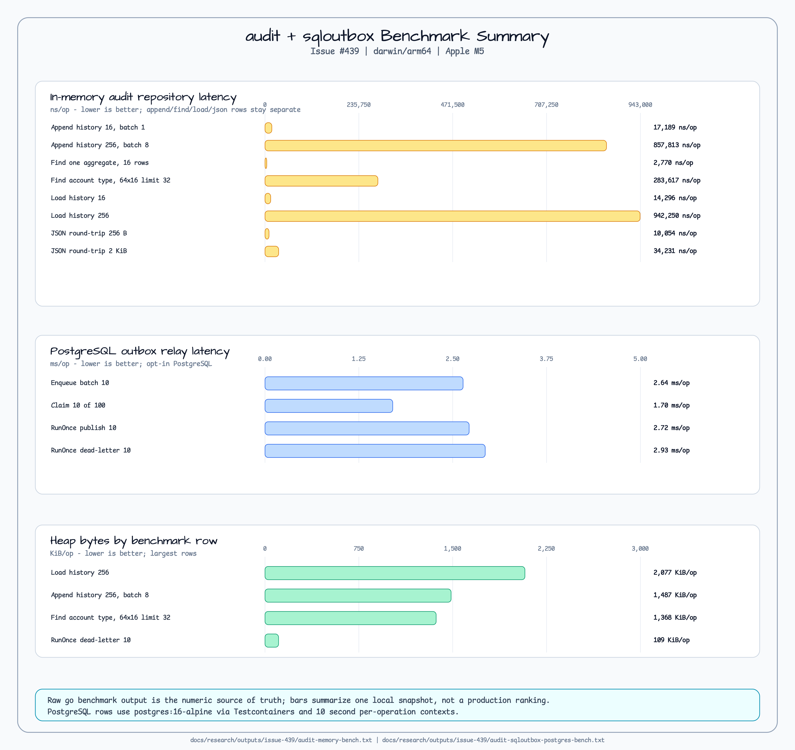

# audit

[English](README.md) | [한국어](README.ko.md)

Storage-neutral aggregate event and audit model values for service packages.

The package defines validated aggregate IDs, positive revisions, caller-owned
event IDs, idempotency keys, audit entries, snapshot/change metadata, a
goroutine-safe pending-event recorder, deterministic history reconstruction,
storage-neutral repository interfaces, and a non-durable in-memory repository
for tests and examples. It does not publish outbox messages, define SQL/Redis/
Kafka/NATS adapters, or compute JaVers-style object diffs.

## Diagrams


## Import

```go
import "github.com/bluetape4k/bluetape-go/audit"
```

## Minimal Usage

```go
aggregate, err := audit.NewAggregateID("account", "42")
if err != nil {
	return err
}

recorder, err := audit.NewAggregateRecorder(aggregate)
if err != nil {
	return err
}

event, err := recorder.Record(audit.EventRecord{
	EventID:        audit.EventID("evt-001"),
	EventType:      audit.EventType("AccountDebited"),
	OccurredAt:     time.Now().UTC(),
	IdempotencyKey: "command-001",
	Payload:        json.RawMessage(`{"amount":"10.00"}`),
})
if err != nil {
	return err
}

entry, err := audit.NewEntry(audit.EntryOptions{
	Author: "billing-service",
	Event:  event,
})
if err != nil {
	return err
}
```

## Validated Decode

Use `DecodeEntryJSON` for already-bounded JSON bytes from trusted storage
or transport layers. Repository and outbox adapters must enforce byte/depth
limits before reading untrusted input.

```go
entry, err := audit.DecodeEntryJSON(data)
if err != nil {
	return err
}
```

Direct `json.Unmarshal` into `Entry` also validates the entry, nested
event, aggregate ID, snapshot metadata, and change metadata. Unsupported schema
versions are rejected.

## Recorder Handoff

`PendingEvents` returns a defensive snapshot and does not clear events. Call
`AckThrough` only after the source write and durable audit commit both succeed.

```go
pending := recorder.PendingEvents()
if len(pending) == 0 {
	return nil
}
if err := writeSource(ctx, aggregate, pending); err != nil {
	return err
}
if err := writeAudit(ctx, pending); err != nil {
	// The events remain pending and can be read again for retry.
	return err
}
return recorder.AckThrough(pending[len(pending)-1].Revision)
```

This keeps a failure-then-success retry path explicit: failed persistence leaves
events pending; successful durable audit commit advances the acknowledgment
boundary.

This is only an in-process retry pattern. Source writes and audit commits must
be transactionally coupled, rolled back on audit failure, or recovered through a
durable outbox/reconciliation mechanism. In-memory pending events are not crash
recovery.

## Repository Queries

`Repository` combines all-or-nothing append with `HistoryReader` queries. All
methods accept `context.Context`; canceled contexts return the caller-owned
context error.

```go
repo := audit.NewMemoryRepository()
if err := repo.Append(ctx, entry); err != nil {
	return err
}

history, ok, err := repo.LoadHistory(ctx, aggregate)
if err != nil {
	return err
}
if !ok {
	return nil
}
_ = history.HeadRevision()
```

`Find` uses append order by default and reverses that order with
`NewestFirst`. `Limit` is applied after filtering and ordering. Revision and
recorded-time bounds are inclusive.

```go
entries, err := repo.Find(ctx, audit.Query{
	Aggregate:     &aggregate,
	FromRevision:  audit.Revision(2),
	ToRevision:    audit.Revision(4),
	NewestFirst:   true,
	Limit:         10,
})
if err != nil {
	return err
}
```

`Latest`, `LatestSnapshot`, and `PreviousSnapshot` return `(Entry, bool, error)`
so missing history remains non-exceptional.

`MemoryRepository` is goroutine-safe and copies entries on write and read. It is
not durable and is intended for tests, examples, and adapter conformance.

Adapter packages can reuse the repository contract through:

```go
audittest.RunRepositoryConformance(t, func(testing.TB) audit.Repository {
	return audit.NewMemoryRepository()
})
```

## JaVers Migration Notes

| JaVers/Kotlin concept | Go package shape | Boundary |
|---|---|---|
| Aggregate root identity | `AggregateID` | Caller domain objects do not implement a package-owned root interface. |
| Domain event | `DomainEvent` | Event IDs and idempotency keys are caller supplied. |
| Audit entry/snapshot | `Entry`, `SnapshotMetadata`, `ChangeMetadata` | JSON validation is local; storage schema is external. |
| Event recording | `AggregateRecorder` | Pending events clear only after explicit ack. |
| Repository history queries | `Repository`, `HistoryReader`, `Query` | #57 owns storage-neutral contracts and in-memory conformance only. |
| Repository event publishing | Later outbox issues | SQL, Redis, Kafka, NATS, and transaction choreography remain out of scope. |
| Object diffing | Out of scope | Callers may store change metadata, but this package does not diff objects. |

## Durable Outbox

Issue #58 selects a SQL outbox store and relay contract as the first durable
publisher target. The design is recorded in
[`docs/research/2026-06-27-issue-58-audit-outbox-design.md`](../docs/research/2026-06-27-issue-58-audit-outbox-design.md).
The first implementation lives in
[`audit/sqloutbox`](sqloutbox/README.md).
Its publisher contract covers at-least-once retry, caller context cancellation,
stable event/idempotency-key handoff, and duplicate-safe adapter behavior.
Deterministic publisher helpers for tests and local examples live in
[`audit/sqloutbox/sqloutboxtest`](sqloutbox/sqloutboxtest/README.md).

Kafka, NATS, Redis Streams, RabbitMQ, Redpanda, and Pulsar remain deferred
publisher/projection adapters until the durable SQL outbox contract is proven.
Applications still own source transaction choreography, migrations, broker
topology, redaction, PII policy, and consumer idempotency.

## Workshop Adoption

The package-local [`examples/audit`](../examples/audit/README.md) service proves
the library contract in this repository. Workshop scenario adoption is tracked
separately in issues
[#35](https://github.com/bluetape4k/bluetape-go-workshop/issues/35),
[#56](https://github.com/bluetape4k/bluetape-go-workshop/issues/56),
[#57](https://github.com/bluetape4k/bluetape-go-workshop/issues/57),
[#58](https://github.com/bluetape4k/bluetape-go-workshop/issues/58),
[#68](https://github.com/bluetape4k/bluetape-go-workshop/issues/68), and
[#150](https://github.com/bluetape4k/bluetape-go-workshop/issues/150).

## Boundaries

- Revisions are positive and start at `InitialRevision()`.
- `NewHistory` rejects empty, mixed-aggregate, duplicated, non-contiguous, or
  non-initial histories.
- `Append` rejects mixed aggregate batches, non-contiguous continuations,
  duplicate event IDs, and duplicate idempotency keys.
- `Find` returns partial `[]Entry` results; `History` remains full and
  contiguous from the initial revision.
- Constructors and JSON decode paths copy metadata and payloads before
  returning values.
- Callers own redaction, PII policy, payload size limits, and persistence
  transaction boundaries.
- Kafka, NATS, Redis Streams, direct Redis audit storage, and examples remain
  later `0.9.0` or follow-up issues.

## Benchmark



Issue [#439](https://github.com/bluetape4k/bluetape-go/issues/439) records the
current local benchmark snapshot for in-memory repository operations and
PostgreSQL-backed outbox relay paths. Detailed tables, raw output paths, and
interpretation notes are in
[`docs/research/2026-07-09-issue-439-audit-outbox-benchmark.md`](../docs/research/2026-07-09-issue-439-audit-outbox-benchmark.md).

Lower `ns/op`, `ms/op`, `B/op`, and `allocs/op` are better. PostgreSQL rows are
serial and opt-in because they start Testcontainers.

```bash
go test -run '^$' -bench 'Benchmark(MemoryRepository|AuditEntryJSONRoundTrip)' -benchmem ./audit
BLUETAPE_AUDIT_SQL_OUTBOX_BENCH=1 go test -p 1 -run '^$' -bench '^BenchmarkAuditSQLOutboxPostgres' -benchtime=100x -benchmem ./audit/sqloutbox
```

## Tests

```bash
go test -count=1 ./audit
go test -count=1 ./audit/sqloutbox
go test -race -count=1 ./audit ./audit/audittest
go test -run '^$' -bench 'BenchmarkAggregateRecorder(Record|PendingEvents|AckThrough)' -benchmem ./audit
go test -run '^$' -bench 'Benchmark(MemoryRepository|AuditEntryJSONRoundTrip)' -benchmem ./audit
```
