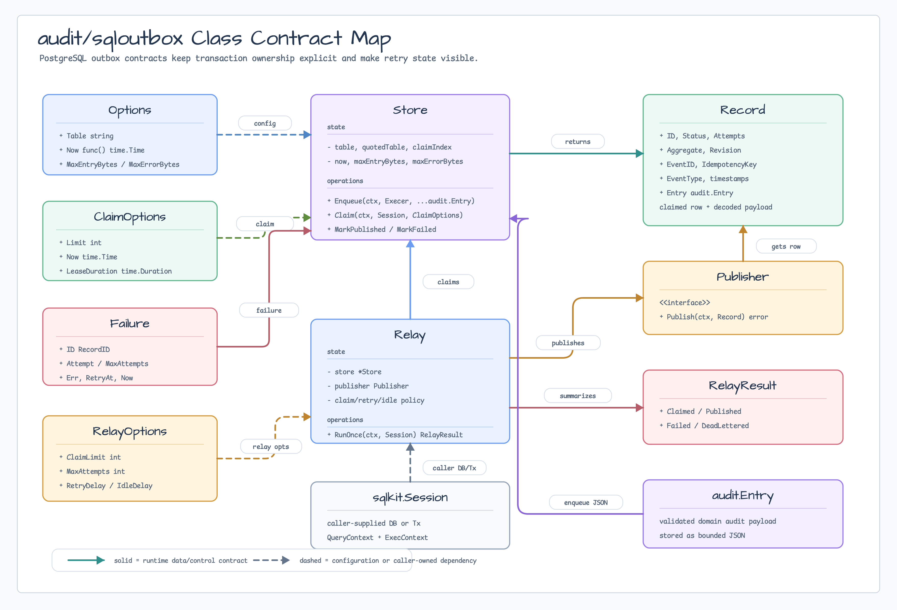
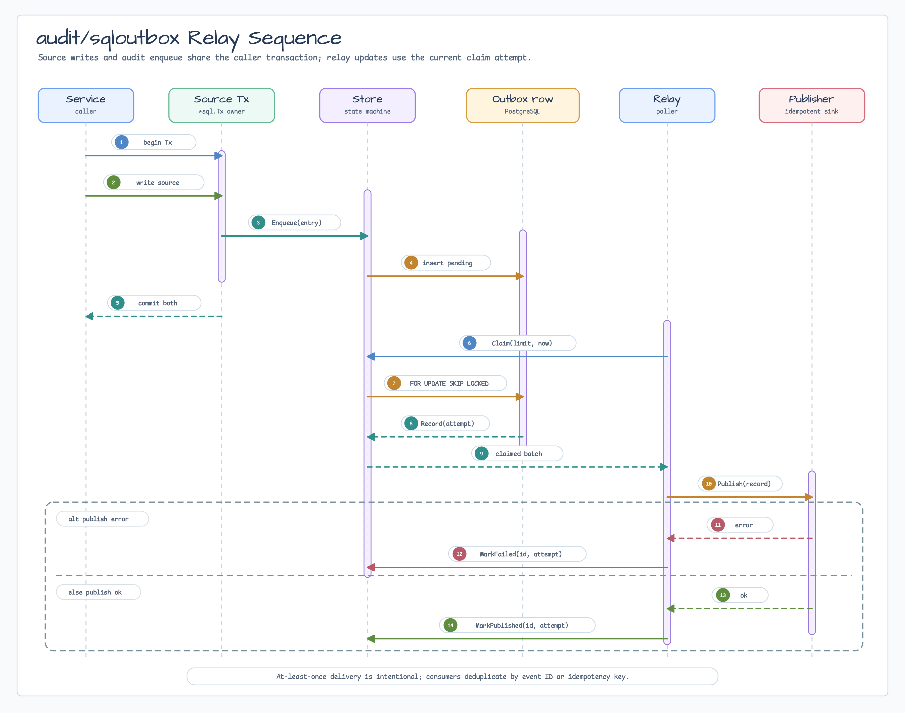

# audit/sqloutbox

[English](README.md) | [한국어](README.ko.md)

PostgreSQL-backed audit outbox store and relay for `audit.Entry` values.

The package keeps transaction ownership explicit. Callers pass the
`database/sql` session for each operation, so source writes can use the same
`*sql.Tx` as `Store.Enqueue` without hidden transaction hooks.

## Diagrams





## Import

```go
import "github.com/bluetape4k/bluetape-go/audit/sqloutbox"
```

## Store

```go
store, err := sqloutbox.NewStore(sqloutbox.Options{})
if err != nil {
	return err
}

// Use explicit migrations in production. CreateSchema is provided for local
// setup, tests, and applications that choose package-owned DDL.
if err := store.CreateSchema(ctx, db); err != nil {
	return err
}

err = sqlkit.WithTx(ctx, db, nil, func(ctx context.Context, tx *sql.Tx) error {
	if err := writeSource(ctx, tx, aggregate, command); err != nil {
		return err
	}
	return store.Enqueue(ctx, tx, auditEntry)
})
```

`Claim` uses PostgreSQL `FOR UPDATE SKIP LOCKED`, sets a bounded claim lease,
and can reclaim expired claimed rows. It does not claim a later revision for an
aggregate while an earlier revision remains pending or claimed. That preserves
per-aggregate ordering where the store can enforce it without promising global
ordering.

## Relay

```go
relay, err := sqloutbox.NewRelay(store, publisher, sqloutbox.RelayOptions{
	ClaimLimit:  10,
	MaxAttempts: 3,
	RetryDelay:  time.Second,
})
if err != nil {
	return err
}

result, err := relay.RunOnce(ctx, db)
```

`RunOnce` is useful for scheduler-owned polling. `Run` loops until the context
is cancelled and is intended for service-owned worker lifecycles.

Delivery is at-least-once. Publishers and consumers must treat duplicate
publish attempts as possible and use the stable audit event ID or idempotency
key for deduplication.

Publisher errors are part of the retry contract:

- If `Publisher.Publish` returns the caller-owned context cancellation or
  deadline error, `RunOnce` returns that error and leaves the claimed row
  untouched for lease-based recovery. Shutdown must not create retry or
  dead-letter state.
- Non-cancellation publish errors are stored through `MarkFailed` with bounded
  failure text. The row becomes retryable or dead-lettered according to
  `MaxAttempts`.
- A retry or expired claim can publish the same audit envelope again. Publisher
  adapters must preserve the stable `Record.EventID` and
  `Record.IdempotencyKey` handoff and rely on downstream idempotency.
- Adapters may use caller-owned logging, metrics, or hooks, but this package
  does not provide a global logger. Returned errors should be bounded and
  redacted because failure text is persisted for operators.

## Test Publishers

Use [`sqloutboxtest`](sqloutboxtest/README.md) for deterministic publisher
helpers in tests, local examples, and workshop adoption:

- `DiscardPublisher` accepts records without retaining or transporting them.
- `PublisherFunc` adapts a function to the `Publisher` interface.
- `RecordingPublisher` records every publish attempt and can inject
  deterministic per-event failures for retry/dead-letter assertions.

The helper package intentionally adds no broker topology. Durable transports
such as Kafka, NATS, Redis Streams, RabbitMQ, Redpanda, and Pulsar remain later
adapter scopes.

## Boundaries

- PostgreSQL is the first concrete SQL target.
- `Store` stores the validated audit entry JSON plus event ID, idempotency key,
  aggregate identity, revision, event type, timestamps, schema version, attempt
  state, and bounded failure text.
- Claimed rows use `available_at` as the lease deadline and can be reclaimed
  after `ClaimOptions.LeaseDuration`.
- Publish and failure marks require the current claim attempt from the returned
  `Record`, so stale workers cannot overwrite a reclaimed row.
- `audit.DecodeEntryJSON` is used only after the package bounds stored bytes.
- `CreateSchema` is explicit and optional; the package does not hide migrations.
- Callers own source transaction choreography, PII policy, redaction, schema
  migration rollout, publisher idempotency, and operator replay tooling.
- Publishers own external transport topology, authentication, TLS, retention,
  consumer replay, and idempotent duplicate handling.
- Kafka, NATS, Redis Streams, RabbitMQ, Redpanda, Pulsar, and direct Redis audit
  storage remain later adapter scopes.

## Tests

```bash
go test -count=1 ./audit/sqloutbox
go test -race -count=1 ./audit/sqloutbox
go test -count=1 ./audit/sqloutbox -run 'RelayRunOnce(PublisherContextCancellationDoesNotRetry|RetriesDuplicatePublishWithStableEnvelope|ConcurrentStressPublishesEachRecordOnce)'
```

The relay tests use `AsyncJobTester` for cancellation-driven worker lifecycle
coverage and `GoroutineStressTester` for concurrent `RunOnce` claim/publish
coverage.
