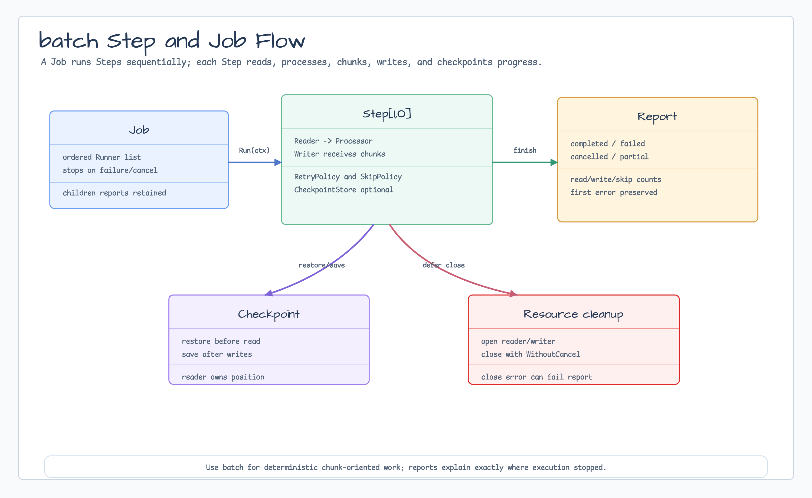

# batch

[English](README.md) | 한국어

`batch`는 context-aware batch processing을 위한 작은 core입니다. `Step`은 item을
읽고, 하나씩 처리하거나 걸러낸 뒤, 남은 item을 chunk 단위로 쓰며, 필요하면
checkpoint를 저장합니다. `Job`은 여러 step을 순서대로 실행하고 첫 실패나 취소에서
멈춥니다.



## 가져오기

```go
import "github.com/bluetape4k/bluetape-go/batch"
```

## 사용 예

```go
step, err := batch.NewStep(batch.StepOptions[string, string]{
    Name:      "normalize-users",
    ChunkSize: 100,
    Reader:    reader,
    Processor: batch.ProcessorFunc[string, string](func(ctx context.Context, value string) (string, bool, error) {
        if err := ctx.Err(); err != nil {
            return "", false, err
        }
        return strings.TrimSpace(value), value != "", nil
    }),
    Writer: writer,
    RetryPolicy: batch.RetryPolicy{
        MaxAttempts: 3,
    },
    CheckpointStore: batch.NewMemoryCheckpointStore(),
})
if err != nil {
    return err
}

report := step.Run(ctx)
if !report.IsSuccess() {
    return report.Err
}
```

여러 step은 하나의 순차 job으로 묶을 수 있습니다.

```go
job, err := batch.NewJob("nightly-import", extractStep, publishStep)
if err != nil {
    return err
}
report := job.Run(ctx)
```

## 동작

- `Step`은 reader와 writer resource를 열고, checkpoint store가 있으면 checkpoint를
  복원한 뒤 reader가 끝나거나 context가 취소될 때까지 반복합니다.
- `Processor`는 `keep=false`로 item을 실패 없이 filter할 수 있습니다.
- `RetryPolicy`는 processor와 writer error에 대해 skip/fail 처리 전에 적용됩니다.
- `SkipPolicy`는 processor error를 skip할 수 있습니다. Checkpoint가 켜진 상태에서
  writer chunk skip은 안전한 committed item boundary를 알 수 없어 거부됩니다.
- `Report`는 status, counter, 시작/종료 시각, child report, terminal error를
  담습니다.

## 운영 경계

- 이 패키지는 control flow, counter, retry, skip, chunking, checkpoint coordination을
  담당합니다. Database, queue, file adapter는 제공하지 않습니다.
- `MemoryCheckpointStore`는 test와 local job에 적합합니다. Production checkpoint
  durability는 caller가 별도 store로 책임져야 합니다.
- Resource close는 `context.WithoutCancel`로 실행되어 caller cancellation 이후에도
  cleanup이 수행됩니다.

## 테스트

```bash
go test -count=1 ./batch
```
