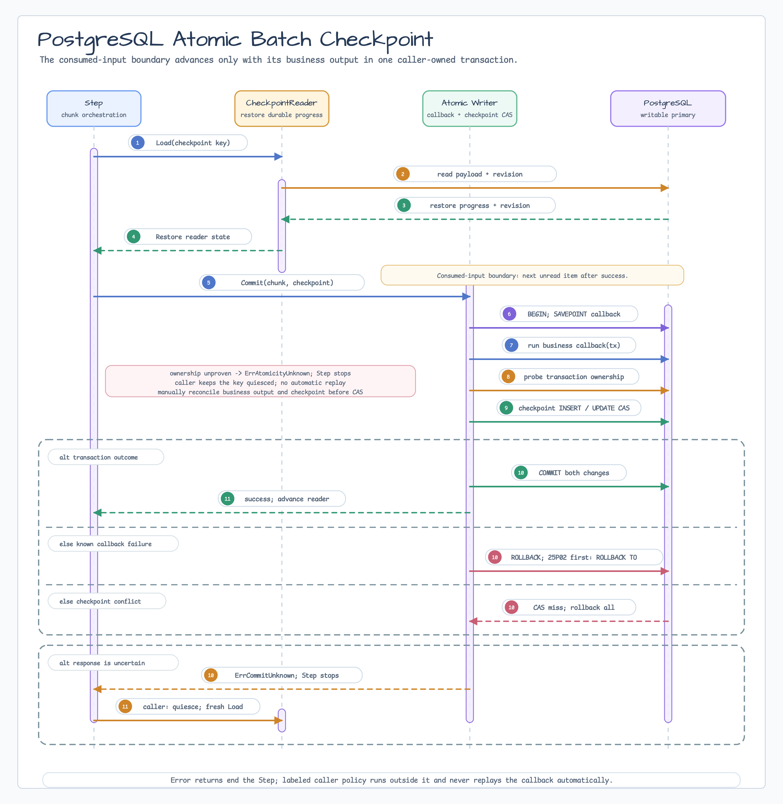

# batch/sqlcheckpoint

[English](README.md) | 한국어

`batch/sqlcheckpoint`는 `batch.NewAtomicStep`의 output chunk와 reader checkpoint를
하나의 PostgreSQL transaction에서 commit하는 opt-in provider입니다. Business callback과
revision CAS가 모두 성공해야 transaction을 commit하므로, legacy `Writer +
CheckpointStore` 경로의 두 번의 독립된 write 사이에 생기는 crash window를 없앱니다.
이 패키지는 scheduler, distributed lock, migration engine이 아닙니다.



## 구조와 선택 기준

`NewAtomicStep`은 기존 `NewStep`에 영향을 주지 않는 additive constructor입니다.
`Step`은 시작할 때 `AtomicCheckpointWriter.Load`로 checkpoint와 fencing revision을 읽고,
consumed-input chunk boundary마다 output, 최신 checkpoint, expected revision을
`AtomicCheckpointWriter.Commit`에 전달합니다. Provider는 caller의 business callback,
checkpoint CAS, provider-owned `Commit`을 같은 `sql.Tx`에서 순서대로 실행합니다.

- PostgreSQL business row와 checkpoint를 함께 commit해야 하면 atomic 경로를 사용합니다.
- 다른 database, queue, file, HTTP API 같은 외부 side effect는 이 transaction에 포함되지
  않습니다. 그런 topology는 idempotency와 별도 reconciliation이 필요합니다.
- 기존 `Writer + CheckpointStore` 경로는 그대로 지원됩니다. At-least-once replay를
  수용하거나 business write와 checkpoint storage가 다른 경우에 적합합니다.

## 설치

```go
import (
    "github.com/bluetape4k/bluetape-go/batch"
    "github.com/bluetape4k/bluetape-go/batch/sqlcheckpoint"
)
```

## Pool 소유권과 schema bootstrap

Migration pool과 runtime pool은 caller-owned입니다. `New`는 validation만 수행하며
database I/O, `SchemaSQL` 실행, pool 설정 변경이나 close를 하지 않습니다. Runtime traffic을
열기 전에 다음 순서를 지킵니다.

1. 배포 전용 deployer login, non-login migration owner, 별도 runtime role을 만듭니다.
   Owner와 runtime은
   `NOSUPERUSER NOCREATEDB NOCREATEROLE NOREPLICATION NOBYPASSRLS`로 생성합니다.
   Owner는 승인된 deployer에게만
   `WITH INHERIT FALSE, SET TRUE, ADMIN FALSE`로 grant하며, 그 밖의 inbound/outbound
   membership은 허용하지 않습니다.
   migration role은 이 non-login owner입니다. 통제된 1회성 ownership transfer로 deployer가
   `ALTER SCHEMA public OWNER TO sqlcheckpoint_migration_owner`를 실행합니다. Role name만으로는
   `public schema ownership prerequisite`가 충족되지 않습니다.
2. `SET LOCAL ROLE` 전에 `public` owner가 여전히
   `sqlcheckpoint_migration_owner`인지 fail closed로 검증합니다. 통제된 배포 경로에서는
   deployer login만 이 owner role을 사용할 수 있습니다.
3. Caller-owned migration pool에서 bounded transaction을 열고 `SET LOCAL lock_timeout`,
   `SET LOCAL statement_timeout`, `SET LOCAL ROLE`을 적용합니다. 이어서 `PUBLIC`의 schema
   `CREATE`를 revoke하고 migration owner로 `SchemaSQL`을 실행합니다.
4. pre-grant catalog/ACL validation에서 relation owner, permanent ordinary table, exact
   column/type/nullability/order, fixed constraint/PK, RLS/policy/trigger/rewrite rule 부재,
   schema/table/column ACL과 zero runtime grants를 검증합니다. `IF NOT EXISTS`는 이 gate를
   대체하지 않습니다. 이것이 runtime grant 전 preflight입니다.
5. Runtime에는 schema `USAGE`와 table `SELECT`, `INSERT`, `UPDATE`만 exact grant하고 grant
   option은 주지 않습니다.
6. post-grant effective privilege validation에서 이 권한만 존재하는지 확인하고
   `LOGIN NOINHERIT`, inbound/outbound `role membership 없음`(zero role membership),
   zero inheritance, cluster-level privileged role attribute 부재, no grant option을 commit 전에
   검증합니다. Owner에는 정확히 승인된 deployer membership 하나만 남아야 하며 owner와
   deployer 모두 다른 membership edge를 가지면 안 됩니다.

```go
migrationCtx, cancel := context.WithTimeout(ctx, 30*time.Second)
defer cancel()
if err = verifyPublicSchemaOwnedByMigrationOwner(migrationCtx, migrationDB); err != nil {
    return err
}
migrationTx, err := migrationDB.BeginTx(migrationCtx, nil)
if err != nil {
    return err
}
defer migrationTx.Rollback()

for _, statement := range []string{
    "set local lock_timeout = '5s'",
    "set local statement_timeout = '10s'",
    "set local role sqlcheckpoint_migration_owner",
    "revoke create on schema public from public",
    sqlcheckpoint.SchemaSQL,
} {
    if _, err = migrationTx.ExecContext(migrationCtx, statement); err != nil {
        return err
    }
}
if err = validateCheckpointCatalogAndACLs(migrationCtx, migrationTx, false); err != nil {
    return err // application-supplied pre-grant gate; zero runtime grants를 요구합니다.
}
for _, grant := range []string{
    "grant usage on schema public to app_runtime",
    "grant select, insert, update on public.bluetape_batch_checkpoints to app_runtime",
} {
    if _, err = migrationTx.ExecContext(migrationCtx, grant); err != nil {
        return err
    }
}
if err = validateCheckpointCatalogAndACLs(migrationCtx, migrationTx, true); err != nil {
    return err // application-supplied post-grant effective privilege gate
}
return migrationTx.Commit()
```

여기서 `migrationDB`는 deployer login의 caller-owned migration pool이고
`verifyPublicSchemaOwnedByMigrationOwner`는 owner를 fail closed로 검사합니다. 1회성 ownership
transfer는 library가 자동 실행하는 동작이 아니라 deployer prerequisite입니다.
`validateCheckpointCatalogAndACLs`는 application이 구현하고 위의 pre-grant/post-grant gate를
모두 검증해야 합니다.
고정 relation은 `public.bluetape_batch_checkpoints`입니다. Custom schema/table name과
auto-migration은 지원하지 않습니다. Runtime role은 table/schema owner나 migration-owner
member가 아니어야 합니다. `pg_auth_members`는 양방향을 검사해야 합니다. Runtime에 grant된
role만 검사하면 runtime, owner 또는 승인된 deployer를 grant받은 role을 놓칩니다.

```sql
grant usage on schema public to app_runtime;
grant select, insert, update
on table public.bluetape_batch_checkpoints to app_runtime;
```

Runtime role에 schema `CREATE`, table `ALTER`, `DROP`, `DELETE`, `TRUNCATE`,
`REFERENCES`, `TRIGGER`, grant option을 주지 않습니다. Inherited role과 `PUBLIC`을 통한
권한도 preflight에서 거부해야 합니다. Callback business table 권한은 application이 별도로
관리합니다.

## JSON codec과 atomic step 구성

Checkpoint type과 storage encoding은 caller가 선택합니다. 아래 예는 caller-owned runtime
pool, JSON codec, tx-bound business insert, `NewAtomicStep`을 함께 구성합니다. Migration
pool로 `SchemaSQL`을 먼저 적용한 뒤 runtime pool을 provider에 전달해야 합니다.

```go
type checkpoint struct {
    Offset int64 `json:"offset"`
}

codec := sqlcheckpoint.Codec[checkpoint]{
    Encode: func(value checkpoint) ([]byte, error) {
        return json.Marshal(value)
    },
    Decode: func(payload []byte) (checkpoint, error) {
        var value checkpoint
        err := json.Unmarshal(payload, &value)
        return value, err
    },
}

atomicWriter, err := sqlcheckpoint.New(
    runtimeDB,
    sqlcheckpoint.Options{Namespace: "orders-v2"},
    codec,
    func(ctx context.Context, tx sqlkit.Session, orders []Order) error {
        for _, order := range orders {
            if _, err := tx.ExecContext(ctx,
                "insert into processed_orders (id, amount) values ($1, $2)",
                order.ID, order.Amount,
            ); err != nil {
                return err
            }
        }
        return nil
    },
)
if err != nil {
    return err
}

step, err := batch.NewAtomicStep(batch.AtomicStepOptions[Input, Order]{
    Name:          "persist-orders",
    ChunkSize:     100,
    Reader:        checkpointReader,
    Processor:     processor,
    AtomicWriter:  atomicWriter,
    CheckpointKey: "tenant:blue",
})
```

Compile-checked 전체 구성과 recovery 코드는
[`example_test.go`](example_test.go)에 있습니다.

## Callback transaction 계약

Output item이 있는 commit에서 provider는 fixed private `SAVEPOINT`를 만들고 callback을
정확히 한 번 호출한 뒤 transaction ownership을 검사합니다. Output이 없는
checkpoint-only commit은 callback과 `SAVEPOINT`를 모두 생략합니다.

- Callback은 전달받은 tx-bound `sqlkit.Session`만 사용합니다.
- Captured `*sql.DB`, 별도 transaction, goroutine으로 session/item escape, network나 외부
  side effect를 사용하면 atomic guarantee 밖입니다.
- Callback은 checkpoint relation, role/search path/security state를 변경하지 않고 item
  slice를 호출 중 read-only로 취급합니다.
- Raw `BEGIN`, `COMMIT`, `ROLLBACK`, `SAVEPOINT`, `SET TRANSACTION`, procedure 기반의
  equivalent transaction control을 실행하지 않습니다.
- Callback/session을 반환 이후 보관하지 않습니다. Context cancellation을 그대로
  반환하고 자체 retry를 수행하지 않습니다.

Ownership probe가 원래 transaction을 증명하지 못하면 checkpoint CAS나 provider-owned
commit을 진행하지 않고 fail closed합니다. Positive lifecycle evidence가 있으면
`ErrCallbackContractViolation`에도 match합니다.

## Progress, revision, conflict

Identity는 변환하지 않은 raw byte의 정확한 `(namespace, key)` pair입니다. Empty namespace는
`default`이고 namespace는 최대 128 bytes이며 key는 non-empty여야 합니다. Default key
limit은 512 bytes, hard ceiling은 1024 bytes입니다. NUL과 invalid UTF-8도 byte-for-byte
보존합니다. Namespace와 key는 authorization 경계가 아닙니다. Caller가 인증·인가와 bounded
canonical key 생성을 책임지며, trust boundary가 다른 checkpoint identity는 별도 database
role 또는 database로 분리합니다.

Missing checkpoint의 expected revision은 0입니다. 첫 commit은 revision 1을 만들고 이후
성공할 때마다 1씩 증가합니다. Stale revision은 `ErrCheckpointConflict`, PostgreSQL bigint
maximum은 `ErrCheckpointVersionExhausted`입니다. Conflict/exhaustion에는 business write와
checkpoint advance가 없으며 old expected revision으로 blind retry하지 않습니다.

Filter/processor skip도 consumed-input progress에 포함됩니다. Boundary에 pending output이
있으면 output과 checkpoint를 함께 commit하고, 없을 때만 checkpoint-only transaction을
실행합니다. Empty input과 exact-multiple EOF는 불필요한 revision을 추가하지 않습니다.

같은 `(namespace, key)`의 `Load`부터 run 종료 및 unknown reconciliation까지 caller가
직렬화해야 합니다. 같은 key의 actor를 반드시 externally serialize하며, CAS는 accidental
overlap을 막는 마지막 fencing guard일 뿐 distributed lock이나 scheduler가 아닙니다.

## Payload, codec, encryption

Provider는 codec, schema version, compression, payload migration을 선택하지 않습니다.
Default encoded payload limit은 1 MiB, hard ceiling은 16 MiB입니다. Encode는 transaction
전에 실행되고, oversized stored payload는 bytes를 Go process로 가져오거나 decode하지 않고
거부됩니다. `CodecError`는 `errors.Is`/`errors.As`용 cause를 보존하지만 error string에는
payload나 raw codec cause를 넣지 않습니다.

Stored payload를 신뢰하지 말고 malformed input을 fail closed하는 stable codec을 사용합니다.
민감한 checkpoint에는 TLS/database encryption만으로 충분한지 검토하고, 필요하면
caller-owned authenticated codec/encryption과 key rotation/migration을 적용합니다. 이
provider는 application-level encryption이나 key management를 제공하지 않습니다.

## Policy 경계

Atomic step의 `RetryPolicy`와 `SkipPolicy`는 **processor failures only**에 적용됩니다.
`AtomicCheckpointWriter.Commit`, business callback, checkpoint CAS, context/transport error,
`ErrCommitUnknown`, `ErrAtomicityUnknown` 같은 unknown-outcome error에는 두 policy를 절대로
적용하지 않습니다. 자동 replay가 duplicate business write나 stale checkpoint advance를
만들 수 있기 때문입니다.

## Error와 recovery

| 조건 | Durable state와 caller 조치 |
|---|---|
| Callback/checkpoint server failure 뒤 ownership과 rollback 확인 | Business row와 checkpoint가 모두 rollback되었습니다. 원인을 고친 뒤 fresh run을 시작합니다. |
| `ErrCheckpointConflict` | Stale transaction 전체가 rollback되었습니다. Actor를 quiesce하고 fresh `Load`부터 시작합니다. |
| `ErrCheckpointVersionExhausted` | Row는 변하지 않았습니다. Quiesce/reconcile 뒤 새 key 또는 namespace로 migrate합니다. |
| `ErrCommitUnknown`만 match | Provider-owned commit이 성공했을 수도 있습니다. Same-key exclusivity를 유지하고 fresh `Load`로 authoritative resume position을 읽습니다. Old expected revision을 replay하지 않습니다. |
| `ErrAtomicityUnknown`도 match | Business/checkpoint 귀속을 증명할 수 없습니다. Automatic fresh-run replay를 금지하고 `quiesceCheckpointKey` 뒤 `reconcileCheckpoint`로 manual reconciliation합니다. |
| `AtomicityPanic` | Top-level supervisor가 recover해야 하는 atomicity-unknown panic입니다. Generic restart보다 먼저 sentinel을 검사합니다. |

Provider-owned commit-unknown에서만, 그리고 같은 key의 다른 actor가 개입하지 않았을 때만
fresh `Load`가 안전한 resume position을 제공합니다. 구체적으로 error가
`ErrCommitUnknown`에 match하고 `ErrAtomicityUnknown`에는 match하지 않으며,
`errors.As`로 얻은 `*sqlcheckpoint.OpError`의 `Operation() == "commit"`일 때만 이 분기로
들어갑니다. Bare joined sentinel은 provider-owned commit 증거가 아닙니다.

```go
var operationErr *sqlcheckpoint.OpError
if errors.Is(commitErr, batch.ErrCommitUnknown) &&
    !errors.Is(commitErr, batch.ErrAtomicityUnknown) &&
    errors.As(commitErr, &operationErr) &&
    operationErr.Operation() == "commit" {
    quiesceCheckpointKey(checkpointKey)
    checkpoint, exists, err := atomicWriter.Load(freshCtx, checkpointKey)
    // Reconcile exists/checkpoint while same-key intake remains quiesced.
    _, _, _ = checkpoint, exists, err
}
```

Callback panic 때 ownership이 확인되면 원래 panic value가 그대로 전달됩니다. 확인되지
않으면 `*sqlcheckpoint.AtomicityPanic`이 re-panic하고 `ErrAtomicityUnknown`과
`ErrCommitUnknown`에 match합니다. Trusted top-level recovery만 `PanicValue()`를 민감한
진단값으로 검사할 수 있습니다. `AtomicityPanic.PanicValue`를 log, metric, trace, 외부 응답에
절대로 출력하지 않습니다.

```go
defer func() {
    recovered := recover()
    recoveredErr, ok := recovered.(error)
    var atomicityPanic *sqlcheckpoint.AtomicityPanic
    if ok && errors.As(recoveredErr, &atomicityPanic) &&
        errors.Is(recoveredErr, batch.ErrAtomicityUnknown) {
        quiesceCheckpointKey(checkpointKey)
        reconcileCheckpoint(checkpointKey)
        return
    }
    if recovered != nil {
        panic(recovered)
    }
}()
```

`quiesceCheckpointKey`와 `reconcileCheckpoint`는 application이 공급해야 하는 fail-closed
hook입니다. Hook이 없거나 실패하면 재시작하지 않습니다. `ErrAtomicityUnknown`만 감싼 일반
error panic은 `AtomicityPanic`이 아니므로 그대로 re-panic합니다.

`OpError.KeyID`는 sampled internal diagnostic correlation을 위한 pseudonymous 값입니다.
`KeyID`는 authorization 식별자, secret, enumeration defense, 외부 trust-boundary value가
아니며 metric label로 사용하면 안 됩니다. Raw key, namespace, payload, SQL, DSN, endpoint,
provider cause도 log하지 않습니다.

## Rollout, rollback, retention

Legacy job 전환은 option toggle이 아닙니다. Intake와 old run을 quiesce하고 legacy
checkpoint와 business state를 reconcile한 뒤 exact namespace/key와 codec으로 SQL row를
seed하고 read-back 검증합니다. Mixed old/new binary를 막고 canary에는 isolated
namespace/key와 business cohort를 사용하여 정확히 하나의 provider만 활성화합니다.
Authoritative position을 증명할 수 없으면 in-place seed 대신 승인된 idempotent replay 또는
새 cohort restart를 선택합니다.

Rollback도 atomic run을 quiesce하고 SQL/business state를 legacy store로 export/reconcile한
뒤 진행합니다. Observation window가 끝날 때까지 table, grant, old state를 보존합니다.
Checkpoint retention과 row 삭제는 caller-owned job lifecycle 정책이며, 해당 key의 run과
unknown reconciliation을 모두 quiesce/join한 maintenance window에서만 수행합니다.

## 운영과 지원 topology

[v0.19.0 provider conformance rollout runbook](../../docs/release/v0.19.0-provider-conformance-runbook.md#sql-batch-checkpoint-배포-gate)은
catalog ownership, 최소 권한 grant, recovery drill, telemetry, canary promotion, rollback,
retention을 포함한 production gate입니다.

- Writable PostgreSQL primary와 transaction affinity가 유지되는 connection만 지원합니다.
  Read replica, multi-primary, statement/transaction replay proxy, transaction-pooling으로
  affinity를 깨는 proxy는 지원하지 않습니다.
- Caller는 bounded run/commit context, chunk size, `lock_timeout`, `statement_timeout`,
  `idle_in_transaction_session_timeout`을 설정합니다.
- Shutdown은 intake stop, run cancel/join, unknown reconciliation, transaction drain 확인,
  마지막에 caller-owned pool close 순서입니다.
- Monitoring은 bounded outcome category, conflict/exhaustion/unknown count, latency,
  `sql.DBStats`, relation/dead tuple, WAL/autovacuum/replication lag를 사용합니다. Raw key와
  `KeyID`를 metric label로 넣지 않습니다.

## 검증

PostgreSQL Testcontainers test는 다른 Docker suite와 겹치지 않게 직렬로 실행합니다.

```bash
go test -count=1 ./batch ./batch/sqlcheckpoint -run 'Example|README|Readme'
go test -count=1 ./batch/sqlcheckpoint -run 'TestPostgres'
go test -count=20 ./batch/sqlcheckpoint -run 'Concurrent|Conflict|Cancellation|Ownership'
go test -race -count=1 ./batch ./batch/sqlcheckpoint
make ci
```

Production promotion 전에는 catalog/privilege preflight와 commit-unknown,
atomicity-unknown recovery drill도 별도로 통과해야 합니다.
