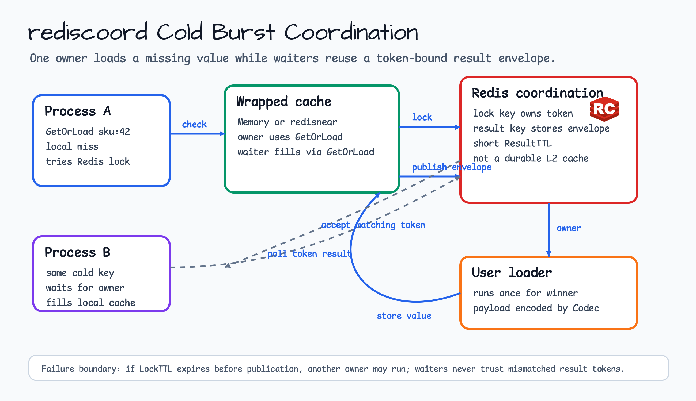
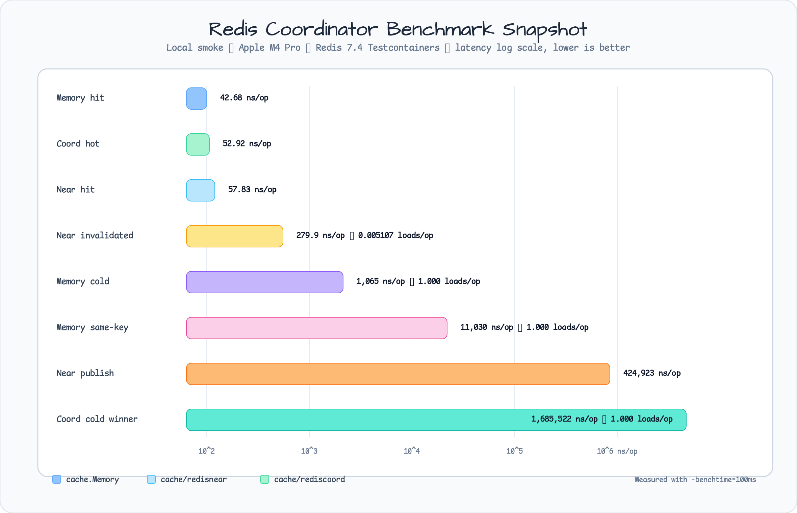

# cache/rediscoord

[English](README.md) | [한국어](README.ko.md)

`cache/rediscoord`는 process 사이의 cache stampede를 막기 위해 선택적으로
붙이는 Redis coordination wrapper입니다. `cache/redisnear.NearCache`를 포함한
기존 `cache.LoadingCache[string,V]`를 감싸고, cold burst 동안 waiter가 winning
loader의 결과를 재사용하게 합니다.

이 패키지는 durable Redis L2 cache가 아닙니다. Redis에는 active load attempt를 위한 짧은 수명의 owner-token result envelope만 저장됩니다.

## 다이어그램



## 가져오기

```go
import "github.com/bluetape4k/bluetape-go/cache/rediscoord"
```

## 사용 예

```go
client := redis.NewClient(&redis.Options{Addr: "localhost:6379"})

near, err := redisnear.NewPubSub[string](ctx, redisnear.Options[string]{
    Client:    client,
    Namespace: "catalog",
})
if err != nil {
    return err
}
defer near.Close()

coordinated, err := rediscoord.NewStampedeCache[string](rediscoord.Options[string]{
    Client:    client,
    Cache:     near,
    Namespace: "catalog",
    Codec:     rediscoord.JSONCodec[string]{},
})
if err != nil {
    return err
}

value, err := coordinated.GetOrLoad(ctx, "sku:42", time.Minute,
    func(ctx context.Context, key string) (string, error) {
        return loadCatalogValue(ctx, key)
    },
)
```

## 동작

- `Get`, `Set`, `Delete`, `Clear`는 감싼 cache로 위임합니다.
- `GetOrLoad`는 먼저 감싼 cache를 확인합니다.
- Cold miss에서는 한 process가 Redis owner-token load lease를 획득합니다.
- Winner는 감싼 cache를 통해 user loader를 실행하고 짧은 수명의 result envelope를 게시합니다.
- Waiter는 관찰한 load owner와 token이 일치하는 envelope만 수락합니다.
- Waiter는 `Set`이 아니라 감싼 `GetOrLoad`로 local cache를 채우므로 `redisnear`가 우발적인 invalidation을 게시하지 않습니다.

## 운영 경계

- Redis는 encoded payload byte를 볼 수 있습니다. 민감한 payload에는 ACL/TLS와 namespace isolation을 사용하세요.
- Result envelope는 일시적인 coordination metadata이며 durable cache value가 아닙니다.
- Mutual exclusion은 `LockTTL`로 제한됩니다. Loader가 lease보다 오래 실행되면 다른 process가 load lease를 획득해 loader를 실행할 수 있습니다.
- Benchmark는 `make bench-cache`로 opt-in 실행합니다. 일반 `make ci`는 benchmark workload를 실행하지 않습니다.

## 테스트

```bash
go test -count=1 ./cache/rediscoord
```

## 벤치마크

```bash
go test -run '^$' -bench '^BenchmarkStampedeCache' -benchmem ./cache/rediscoord
```

## 벤치마크 스냅샷

아래 수치는 local smoke number이며 production capacity ranking이 아닙니다. 실행 환경은 macOS arm64 Apple M4 Pro, `-benchtime=100ms`였고 Redis-backed benchmark는 Testcontainers Redis 7.4를 사용했습니다. 낮은 `ns/op`가 더 좋습니다. Local hit path와 Redis coordination path의 차이가 커서 chart는 log scale을 사용합니다.



| Benchmark | ns/op | B/op | allocs/op | Extra |
|---|---:|---:|---:|---:|
| `BenchmarkMemoryGetHit` | 42.68 | 0 | 0 |  |
| `BenchmarkStampedeCacheGetOrLoadHot` | 52.92 | 16 | 1 |  |
| `BenchmarkNearCacheGetLocalHit` | 57.83 | 16 | 1 |  |
| `BenchmarkNearCacheGetOrLoadUnderInvalidation` | 279.9 | 43 | 2 | `0.005107 loads/op` |
| `BenchmarkMemoryGetOrLoadCold` | 1065 | 784 | 10 | `1.000 loads/op` |
| `BenchmarkMemoryGetOrLoadSameKeyConcurrent` | 11030 | 4189 | 57 | `1.000 loads/op` |
| `BenchmarkNearCacheSetPublish` | 424923 | 1209 | 29 |  |
| `BenchmarkStampedeCacheGetOrLoadColdWinner` | 1685522 | 2692 | 58 | `1.000 loads/op` |
