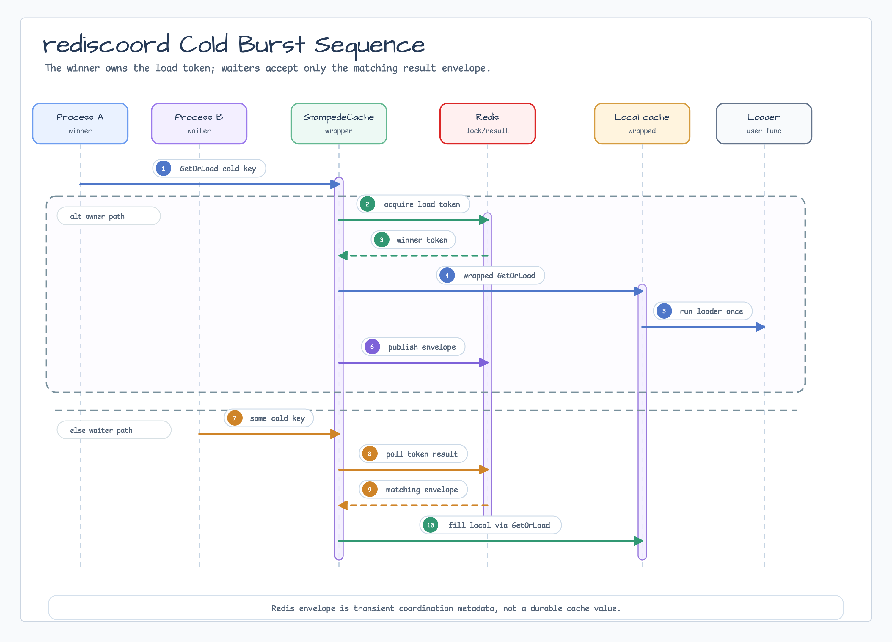

# cache/rediscoord

[English](README.md) | [한국어](README.ko.md)

`cache/rediscoord` is an opt-in Redis coordination wrapper for cross-process
cache stampede protection. It wraps an existing
`cache.LoadingCache[string,V]`, including `cache/redisnear.NearCache`, and lets
waiters reuse the winning loader result for a cold burst.

This package is not a durable Redis L2 cache. Redis stores only a short-lived
owner-token result envelope for the active load attempt.

## Diagram




## Import

```go
import (
    "github.com/apache/fory/go/fory"
    "github.com/bluetape4k/bluetape-go/cache/rediscoord"
    rediscoordfory "github.com/bluetape4k/bluetape-go/cache/rediscoord/fory"
)
```

## Usage

```go
client := redis.NewClient(&redis.Options{Addr: "localhost:6379"})

near, err := redisnear.NewPubSub[string](ctx, redisnear.Options[string]{
    Client:    client,
    Namespace: "catalog",
})
if err != nil {
    return err
}
defer func() { _ = near.Close() }()

coordinated, err := rediscoord.NewStampedeCache[string](rediscoord.Options[string]{
    Client:    client,
    Cache:     near,
    Namespace: "catalog",
    Codec:     rediscoord.JSONCodec[string]{},
    MaxResultBytes: 2 << 20,
})
if err != nil {
    return err
}

value, err := coordinated.GetOrLoad(ctx, "sku:42", time.Minute,
    func(ctx context.Context, key string) (string, error) {
        return loadCatalogValue(ctx, key)
    },
)
```

## Go-native Apache Fory Codec

For trusted internal Go-only coordination payloads, import
`cache/rediscoord/fory` and select a profile explicitly:

```go
codec, err := rediscoordfory.NewNativeFast[CatalogValue](rediscoordfory.Options{
    Register: func(runtime *fory.Fory) error {
        return runtime.RegisterStructByName(CatalogValue{}, "catalog.ValueV1")
    },
})
if err != nil {
    return err
}

coordinated, err := rediscoord.NewStampedeCache[CatalogValue](rediscoord.Options[CatalogValue]{
    Client: client, Cache: localCache, Namespace: "catalog:fory-native-fast:schema-v1",
    Codec: codec, MaxResultBytes: 2 << 20,
})
```

`NewNativeFast` is for fixed schemas. `NewNativeCompatible` permits Fory's
compatible field evolution, but does not make semantic or incompatible type
changes safe. Both constructors disable xlang and reference tracking. They
accept bool, integer, unsigned integer, floating-point, struct, string, and
`[]byte` roots; pointer, complex, map, array, non-byte slice, interface,
function, channel, and unsafe-pointer roots are rejected.

The bounded defaults are 1 MiB payloads, depth 20, 512 fields, 4096 bytes of
type metadata, 10 schema versions per type, and 3 average schema versions per
type. `CodecError` exposes stable operation, profile, and reason labels without
formatting payload or provider details. Reasons include `configuration`,
`uninitialized`, `registration`, `payload-too-large`, `invalid-magic`,
`unsupported-version`, `profile-mismatch`, `length-mismatch`,
`unsupported-value`, and `fory-failure`.

Fory is not encryption. Redis operators can observe the bytes. Use Redis ACL,
TLS, and namespace isolation for sensitive values.

### Rollout And Rollback

Every process sharing a namespace must use the same codec profile,
registration set, `MaxResultBytes`, and Fory resource limits. Use a namespace such as
`catalog:fory-native-fast:schema-v1`; never mix JSON, native-fast, or
native-compatible values in one namespace. Switch readers and writers together,
then retain the old namespace for at least `LockTTL + ResultTTL + safety
margin`. Rollback switches back to the prior codec/namespace pair. Cleanup must
use bounded, TTL-aware `SCAN MATCH`, never `KEYS`. Scan lock and result keys
separately with `bluetape:cache:coord:<namespace>:lock:*` and
`bluetape:cache:coord:<namespace>:result:*`.

## Behavior

- `Get`, `Set`, `Delete`, and `Clear` delegate to the wrapped cache.
- `GetOrLoad` checks the wrapped cache first.
- On a cold miss, one process acquires a Redis owner-token load lease.
- The winner runs the user loader through the wrapped cache and publishes a
  short-lived result envelope.
- Waiters accept only an envelope whose token matches the observed load owner.
- Waiters fill their local cache through the wrapped `GetOrLoad`, not `Set`, so
  `redisnear` does not publish accidental invalidations.

## Operational Boundaries

- Redis can see encoded payload bytes. Use ACL/TLS and namespace isolation for
  sensitive payloads.
- The result envelope is transient coordination metadata, not a durable cache
  value.
- Mutual exclusion is bounded by `LockTTL`. If a loader runs past the lease,
  another process may acquire the load lease and run a loader.
- Direct Redis command failures retain their cause for `errors.Is` and expose
  a typed `redis.OpError` for `errors.As`; formatted diagnostics redact raw
  Redis keys, owner tokens, payloads, and provider text.
- `MaxResultBytes` bounds the encoded JSON/base64 owner-result envelope before
  Redis publication and before JSON decoding. Zero preserves unlimited legacy
  behavior.
- Benchmarks are opt-in through `make bench-cache`; normal `make ci` does not
  run benchmark workloads.

## Test

```bash
go test -count=1 ./cache/rediscoord
```

## Benchmarks

```bash
go test -run '^$' -bench '^BenchmarkStampedeCache' -benchmem ./cache/rediscoord
```

## Benchmark Snapshot

These are local smoke numbers, not production capacity rankings. The run used
macOS arm64 on Apple M4 Pro with `-benchtime=100ms`; Redis-backed benchmarks use
Testcontainers Redis 7.4. Lower `ns/op` is better. The chart uses a log scale
because local hit paths and Redis coordination paths differ by orders of
magnitude.


| Benchmark | ns/op | B/op | allocs/op | Extra |
|---|---:|---:|---:|---:|
| `BenchmarkMemoryGetHit` | 42.68 | 0 | 0 |  |
| `BenchmarkStampedeCacheGetOrLoadHot` | 52.92 | 16 | 1 |  |
| `BenchmarkNearCacheGetLocalHit` | 57.83 | 16 | 1 |  |
| `BenchmarkNearCacheGetOrLoadUnderInvalidation` | 279.9 | 43 | 2 | `0.005107 loads/op` |
| `BenchmarkMemoryGetOrLoadCold` | 1065 | 784 | 10 | `1.000 loads/op` |
| `BenchmarkMemoryGetOrLoadSameKeyConcurrent` | 11030 | 4189 | 57 | `1.000 loads/op` |
| `BenchmarkNearCacheSetPublish` | 424923 | 1209 | 29 |  |
| `BenchmarkStampedeCacheGetOrLoadColdWinner` | 1685522 | 2692 | 58 | `1.000 loads/op` |

### Issue #599 Fory profile comparison

The complete coordination path is also measured against JSON, `NativeFast`, and
`NativeCompatible` with the same value fixture. The approved three-sample
snapshot reports `ColdWinner` medians of `710,174 ns/op` (JSON), `744,297`
(`NativeFast`), and `712,784` (`NativeCompatible`). The local `Hot` path is about
`81 ns/op` because the wrapped in-memory cache is already populated; it is not a
Redis lock/result measurement.


See the [benchmark report](../../docs/benchmarks/2026-08-07-issue-599-fory-redis.md),
[raw output](../../docs/research/outputs/issue-599/benchmark.txt), and
[parsed summary](../../docs/research/outputs/issue-599/summary.json) plus the
[capture manifest](../../docs/research/outputs/issue-599/environment.md) for the
environment, wire-byte layer definitions, schema-evolution check, and mutex
versus pool contention analysis.
