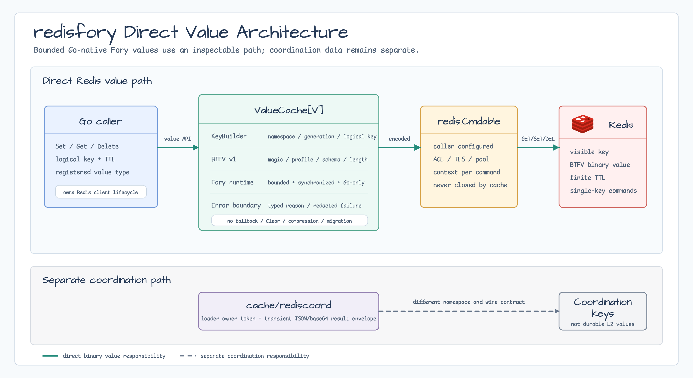

# cache/redisfory

[English](README.md) | [한국어](README.ko.md)

`cache/redisfory`는 신뢰할 수 있는 Go 전용 서비스에서 bounded Apache Fory
binary value를 Redis에 직접 저장합니다. 명시적인 fast/compatible profile,
검사 가능한 `BTFV` envelope, schema generation 기반 key 격리, sanitized error를
제공합니다. Redis에 일시적인 load coordination state를 저장하는
`cache/rediscoord`와는 독립된 패키지입니다.

## Diagram



## Import

```go
import "github.com/bluetape4k/bluetape-go/cache/redisfory"
```

## Usage

```go
ctx, cancel := context.WithTimeout(context.Background(), 2*time.Second)
defer cancel()
client := redis.NewClient(&redis.Options{
    Addr:         "localhost:6379",
    DialTimeout:  2 * time.Second,
    ReadTimeout:  2 * time.Second,
    WriteTimeout: 2 * time.Second,
})
defer client.Close() // client lifecycle은 caller가 소유합니다

values, err := redisfory.NewNativeFast[CatalogValue](redisfory.Options{
    Client:           client,
    Namespace:        "catalog.products",
    SchemaGeneration: 1,
    Register: func(runtime *fory.Fory) error {
        return runtime.RegisterStructByName(CatalogValue{}, "catalog.Value")
    },
})
if err != nil {
    return err
}

if err := values.Set(ctx, "sku:42", value, time.Minute); err != nil {
    return err
}
loaded, err := values.Get(ctx, "sku:42")
if errors.Is(err, cache.ErrCacheMiss) {
    // application policy로 load합니다
}
err = values.Delete(ctx, "sku:42")
```

`Set`은 최소 1 millisecond의 TTL을 요구합니다. Redis가 key 부재 또는 만료를
보고할 때만 `Get`이 `cache.ErrCacheMiss`를 반환합니다. `Delete`는
idempotent입니다. Loading fallback, `Clear`, compression, migration, Redis client
소유권은 의도적으로 제공하지 않습니다.

## Profiles

| Constructor | Profile | 용도 |
|---|---|---|
| `NewNativeFast` | `native-fast` | 고정 Go schema와 가장 작은 native metadata surface. |
| `NewNativeCompatible` | `native-compatible` | 하나의 등록된 Go model 안에서 compatible field evolution. |

두 profile 모두 xlang과 reference tracking을 비활성화하며 cross-language
호환성을 약속하지 않습니다. 같은 Fory registration contract를 사용하는 Go
process끼리만 사용합니다. Compatible mode도 semantic change, incompatible field
change, type rename을 안전하게 만들지는 않습니다.

지원하는 generic root는 bool, signed/unsigned integer, float, string, struct,
`[]byte`입니다. Pointer, map, array, non-byte slice, complex, interface, function,
channel, unsafe-pointer root는 생성 시 거부합니다.

## Options And Limits

| Option | 요구사항 또는 default |
|---|---|
| `Client` | 필수 non-nil `redis.Cmdable`; caller-owned. |
| `Namespace` | 필수 colon-separated structural segment; 각 segment는 `[A-Za-z0-9._-]+`와 일치. |
| `SchemaGeneration` | 필수 positive `uint32`; 모든 physical key에 포함. |
| `Register` | 필수 deterministic Fory type registration function. |
| `MaxPayloadBytes` | `1 MiB`; 14-byte `BTFV` header 제외. |
| `MaxDepth` | `20`. |
| `MaxTypeFields` | `512`. |
| `MaxTypeMetaBytes` | `4096` bytes. |
| `MaxSchemaVersionsPerType` | `10`. |
| `MaxAverageSchemaVersionsPerType` | `3`. |

Limit의 zero value는 bounded default를 선택하고 negative value는 invalid입니다.
Data를 공유하는 모든 process는 동일한 profile, registration name, schema
generation, resource limit을 사용해야 합니다.

## Storage Contract

Physical key는 다음처럼 보입니다.

```text
bluetape:cache:fory:<namespace segments>:g<generation>:<logical key>
```

Logical key는 non-empty validation 뒤 그대로 보존됩니다. 패키지는 Redis Cluster
hash tag를 삽입하지 않습니다. Multi-key atomicity가 필요한 application은 별도 key
design이 필요하며 이 cache는 single-key command만 실행합니다.

Value는 정확한 `BTFV v1` envelope를 사용합니다.

| Offset | Bytes | 의미 |
|---:|---:|---|
| `0` | 4 | ASCII `BTFV`. |
| `4` | 1 | Envelope version `1`. |
| `5` | 1 | Format `1` fast 또는 `2` compatible. |
| `6` | 4 | Big-endian schema generation. |
| `10` | 4 | Big-endian Fory payload length. |
| `14` | N | Native Fory payload. |

Fory decode 전에 total input bound, magic, version, format, generation, declared
length, 정확한 trailing length를 모두 검사합니다. 저장 value는 JSON/base64가
아닌 binary입니다. Fory는 encryption이 아니므로 Redis operator가 key와 byte를
관찰할 수 있습니다.

`Get`은 Redis response를 configured payload, envelope header, overflow detection
1 byte로 제한합니다. Oversized stored value는 client가 전체 value를 materialize하기
전에 거부합니다.

## Errors And Telemetry

`CacheError`는 `Operation`, `Profile`, `Reason` accessor를 제공합니다. Stable
reason value는 다음과 같습니다.

- `configuration`
- `uninitialized`
- `registration`
- `payload-too-large`
- `invalid-magic`
- `unsupported-version`
- `format-mismatch`
- `schema-mismatch`
- `length-mismatch`
- `unsupported-value`
- `fory-failure`

Redis command failure는 `github.com/bluetape4k/bluetape-go/redis`의
`*btredis.OpError`를 사용하며 formatted/unwrapped error에 raw logical key, payload,
server address, provider message를 노출하지 않습니다. Caller cancellation과
deadline은 `errors.Is`로 계속 검사할 수 있습니다. Telemetry에는
operation/profile/reason과 `(*btredis.OpError).KeyID()`만 low-cardinality label로
사용하고 logical key나 payload를 label로 사용하지 마세요.

Raw provider failure는 cause로 보존하지 않고 의도적으로 교체합니다. Caller-owned
go-redis hook을 client boundary에 설치해 authentication, topology, network, TLS
failure를 sanitized metric으로 분류하세요. Hook에서도 raw provider error text를
log하지 마세요.

## Security And Operations

- 필요한 `GET`, `SET`, `DEL` key만 허용하는 Redis ACL을 적용합니다.
- 신뢰된 local network 밖에서는 TLS와 authenticated connection을 사용합니다.
- Fory registration과 cached byte를 신뢰된 Go service input으로 취급하며 범용
  untrusted deserialization protocol로 사용하지 않습니다.
- TTL을 유한하게 유지하고 Redis memory policy에 맞는 size limit을 사용합니다.
- Redis client 생성, 설정, monitoring, close는 caller가 담당합니다. Bounded command
  context와 finite dial/read/write timeout을 사용합니다.

## Rollout And Rollback

새 profile이나 incompatible schema는 새 namespace 또는 `SchemaGeneration`으로
배포합니다. Reader와 writer를 함께 이동하고 한 generation에 old/new profile을
섞지 않습니다. Rollback은 이전 TTL window가 남아 있는 동안 application을 이전
profile/generation으로 전환합니다.

이전 최대 TTL과 safety margin이 지난 뒤 bounded `SCAN MATCH`, dry-run count,
bounded `DEL` batch, final re-scan으로 obsolete key를 정리합니다. `KEYS`는 사용하지
않습니다. Standalone Redis에서는 이 절차를 한 번 실행합니다. Redis Cluster에서는
모든 primary에서 독립 실행하고 각 primary의 dry-run, deletion, re-scan count를
기록합니다. 예를 들어 obsolete structural prefix
`bluetape:cache:fory:catalog.products:g1:*`만 match합니다.

## Benchmarks

Issue #599가 Fory profile과 alternative Redis value provider의 비교 benchmark를
담당합니다. 해당 작업은 raw output, environment/revision metadata, 결과 표, chart,
written analysis를 보존하고 mutex와 pool contention도 분석해야 합니다. 이 feature는
benchmark 결과를 주장하지 않습니다.

## Test

```bash
go test -p 1 -count=1 ./cache/redisfory
go test -race -p 1 -count=1 ./cache/redisfory
```
