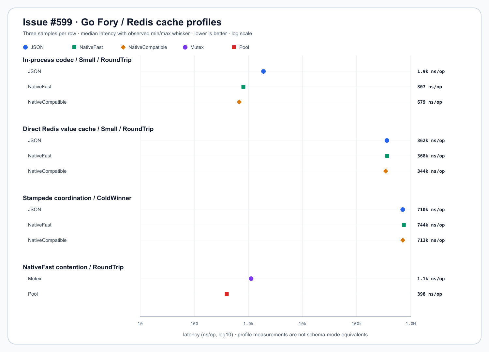

# cache/redisfory

[English](README.md) | [한국어](README.ko.md)

`cache/redisfory` stores bounded Apache Fory binary values directly in Redis
for trusted Go-only services. It provides explicit fast and compatible
profiles, an inspectable `BTFV` envelope, schema-generation key isolation, and
sanitized errors. It is independent from `cache/rediscoord`, whose Redis data
is transient load-coordination state.

## Diagram


## Import

```go
import "github.com/bluetape4k/bluetape-go/cache/redisfory"
```

## Usage

```go
ctx, cancel := context.WithTimeout(context.Background(), 2*time.Second)
defer cancel()
client := redis.NewClient(&redis.Options{
    Addr:         "localhost:6379",
    DialTimeout:  2 * time.Second,
    ReadTimeout:  2 * time.Second,
    WriteTimeout: 2 * time.Second,
})
defer client.Close() // the caller owns the client

values, err := redisfory.NewNativeFast[CatalogValue](redisfory.Options{
    Client:           client,
    Namespace:        "catalog.products",
    SchemaGeneration: 1,
    Register: func(runtime *fory.Fory) error {
        return runtime.RegisterStructByName(CatalogValue{}, "catalog.Value")
    },
})
if err != nil {
    return err
}

if err := values.Set(ctx, "sku:42", value, time.Minute); err != nil {
    return err
}
loaded, err := values.Get(ctx, "sku:42")
if errors.Is(err, cache.ErrCacheMiss) {
	// load through application policy
	return err
}
if err != nil {
	return err
}
_ = loaded // consume the cached value
if err := values.Delete(ctx, "sku:42"); err != nil {
	return err
}
```

`Set` requires a TTL of at least one millisecond. `Get` returns
`cache.ErrCacheMiss` only when Redis reports an absent or expired key. `Delete`
is idempotent. There is deliberately no loading fallback, `Clear`, compression,
migration, or Redis client ownership.

## Profiles

| Constructor | Profile | Use |
|---|---|---|
| `NewNativeFast` | `native-fast` | Fixed Go schemas and the smallest native metadata surface. |
| `NewNativeCompatible` | `native-compatible` | Compatible field evolution within one registered Go model. |

Both profiles disable xlang, reference tracking, and cross-language promises.
They are only for Go processes using the same Fory registration contract.
Compatible mode does not make semantic changes, incompatible field changes, or
type renames safe.

Supported generic roots are bool, signed/unsigned integer, float, string,
struct, and `[]byte`. Pointer, map, array, non-byte slice, complex, interface,
function, channel, and unsafe-pointer roots are rejected during construction.

## Options And Limits

| Option | Requirement or default |
|---|---|
| `Client` | Required non-nil `redis.Cmdable`; caller-owned. |
| `Namespace` | Required colon-separated structural segments; each segment matches `[A-Za-z0-9._-]+`. |
| `SchemaGeneration` | Required positive `uint32`; included in every physical key. |
| `Register` | Required deterministic Fory type registration function. |
| `MaxPayloadBytes` | `1 MiB`; excludes the 14-byte `BTFV` header. |
| `MaxDepth` | `20`. |
| `MaxTypeFields` | `512`. |
| `MaxTypeMetaBytes` | `4096` bytes. |
| `MaxSchemaVersionsPerType` | `10`. |
| `MaxAverageSchemaVersionsPerType` | `3`. |

Zero limit values select bounded defaults; negative values are invalid. All
processes sharing data must use the same profile, registration names, schema
generation, and resource limits.

## Storage Contract

Physical keys are visible as:

```text
bluetape:cache:fory:<namespace segments>:g<generation>:<logical key>
```

The logical key is preserved verbatim after non-empty validation. The package
does not inject Redis Cluster hash tags. Applications that require multi-key
atomicity need a separate key design; this cache issues only single-key
commands.

Values use the exact `BTFV v1` envelope:

| Offset | Bytes | Meaning |
|---:|---:|---|
| `0` | 4 | ASCII `BTFV`. |
| `4` | 1 | Envelope version `1`. |
| `5` | 1 | Format `1` fast or `2` compatible. |
| `6` | 4 | Big-endian schema generation. |
| `10` | 4 | Big-endian Fory payload length. |
| `14` | N | Native Fory payload. |

The total input bound, magic, version, format, generation, declared length,
and exact trailing length are validated before Fory decoding. Stored values
are binary, not JSON or base64. Fory is not encryption: Redis operators can
observe keys and bytes.

`Get` bounds the Redis response to the configured payload plus the envelope
header and one overflow-detection byte. Oversized stored values are rejected
before the client materializes the full value.

## Errors And Telemetry

`CacheError` exposes `Operation`, `Profile`, and `Reason` accessors. Stable
reason values are:

- `configuration`
- `uninitialized`
- `registration`
- `payload-too-large`
- `invalid-magic`
- `unsupported-version`
- `format-mismatch`
- `schema-mismatch`
- `length-mismatch`
- `unsupported-value`
- `fory-failure`

Redis command failures use `*btredis.OpError` from
`github.com/bluetape4k/bluetape-go/redis`; formatted and unwrapped errors do not
expose raw logical keys, payloads, server addresses, or provider messages.
Caller cancellation and deadlines remain inspectable with `errors.Is`. Use
operation/profile/reason and `(*btredis.OpError).KeyID()` as low-cardinality
telemetry labels. Never use logical keys or payloads as labels.

Raw provider failures are deliberately replaced instead of retained as causes.
Install caller-owned go-redis hooks at the client boundary to classify
authentication, topology, network, and TLS failures into sanitized metrics. Do
not log raw provider error text from those hooks.

## Security And Operations

- Require Redis ACLs that permit only `GETRANGE`, `EXISTS`, `SET`, and `DEL`
  for this cache's key prefix.
- Use TLS and authenticated connections outside a trusted local network.
- Treat Fory registration and cached bytes as trusted Go-service inputs, not a
  general untrusted deserialization protocol.
- Keep TTLs finite and size limits appropriate for Redis memory policy.
- The caller creates, configures, monitors, and closes the Redis client. Use
  bounded command contexts and finite dial, read, and write timeouts.

## Rollout And Rollback

Deploy a new profile or incompatible schema with a new namespace or
`SchemaGeneration`. Move readers and writers together; do not mix old and new
profiles in one generation. Rollback switches the application to the previous
profile/generation while its TTL window remains available.

After the old maximum TTL plus a safety margin, clean obsolete keys with
bounded `SCAN MATCH`, a dry-run count, bounded `DEL` batches, and a final
re-scan. Never use `KEYS`. On standalone Redis, run this sequence once. On
Redis Cluster, run it independently on every primary and record each primary's
dry-run, deletion, and re-scan counts. Match only the obsolete structural
prefix, for example `bluetape:cache:fory:catalog.products:g1:*`.

## Benchmarks

Issue #599 records a reproducible comparison of JSON, `NativeFast`, and
`NativeCompatible` across the in-process codec, direct Redis value cache, and
complete stampede-coordination paths. It also records a benchmark-only
shared-mutex versus codec-pool contention comparison. The snapshot is local
evidence, not a production capacity ranking; profile modes are not schema
equivalents.

```bash
go test -run '^$' -bench '^BenchmarkIssue599' -benchmem -count=3 ./cache/redisfory
python3 scripts/parse-issue-599-benchmark.py \
  --input docs/research/outputs/issue-599/benchmark.txt \
  --output docs/research/outputs/issue-599/summary.json
```

The [Korean benchmark report](../../docs/benchmarks/2026-08-07-issue-599-fory-redis.md)
contains the exact host/module/image metadata, raw output, parsed table,
schema-evolution and malformed-payload checks, and the written interpretation.



| Path / fixture | JSON | NativeFast | NativeCompatible |
|---|---:|---:|---:|
| Codec Small RoundTrip (`ns/op`) | 1,897 | 807 | 679 |
| Codec Medium RoundTrip (`ns/op`) | 19,473 | 2,336 | 2,198 |
| Direct Redis Small RoundTrip (`ns/op`) | 362,419 | 368,433 | 343,563 |
| Direct Redis Medium RoundTrip (`ns/op`) | 416,319 | 397,376 | 389,708 |
| Coordination ColdWinner (`ns/op`) | 710,174 | 744,297 | 712,784 |

Direct Redis `wire-bytes` are measured from the stored value/envelope; codec and
coordination rows report the codec payload. The raw snapshot is
[benchmark.txt](../../docs/research/outputs/issue-599/benchmark.txt) and its
validated [summary.json](../../docs/research/outputs/issue-599/summary.json);
the capture manifest is [environment.md](../../docs/research/outputs/issue-599/environment.md).

## Test

The package test starts Redis 7.4 through Testcontainers, so Docker must be
available. Run the commands serially because they share Docker resources.

```bash
go test -p 1 -count=1 ./cache/redisfory
go test -race -p 1 -count=1 ./cache/redisfory
```
