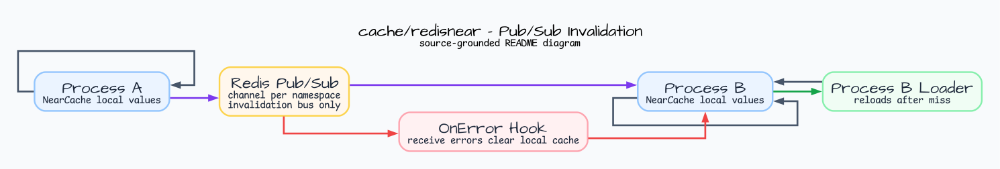

# cache/redisnear

[English](README.md) | [한국어](README.ko.md)

`cache/redisnear` adds Redis Pub/Sub invalidation around a process-local
`cache.LoadingCache[string,V]`. Redis is the invalidation bus only; values stay
inside each process-local cache.

## Diagram



## Import

```go
import "github.com/bluetape4k/bluetape-go/cache/redisnear"
```

## Usage

```go
client := redis.NewClient(&redis.Options{Addr: "localhost:6379"})

near, err := redisnear.NewPubSub[string](ctx, redisnear.Options[string]{
    Client:    client,
    Namespace: "catalog",
})
if err != nil {
    return err
}
defer func() { _ = near.Close() }()

value, err := near.GetOrLoad(ctx, "item:1", time.Minute,
    func(ctx context.Context, key string) (string, error) {
        return loadCatalogValue(ctx, key)
    },
)
```

## Behavior

- `Set`, `Delete`, and `Clear` mutate the local cache and publish peer
  invalidation.
- Peer caches delete affected entries, then refill with their own loader on the
  next miss.
- `GetOrLoad` fills only the local cache and does not publish invalidation.
- Receive errors clear local values and are reported through the optional
  `OnError` hook.
- `Close` is idempotent; operations after close return `ErrClosed`.

## Operational Boundaries

- Redis Pub/Sub messages are invalidation commands, not an authentication
  boundary. Use Redis ACL/TLS and namespace/channel separation in production.
- Local mutations are not rolled back when Redis publish fails.
- Delete and clear do not cancel an already running loader.

## Test

```bash
go test -count=1 ./cache/redisnear
```

## Benchmarks

```bash
go test -run '^$' -bench '^BenchmarkNearCache' -benchmem ./cache/redisnear
```
