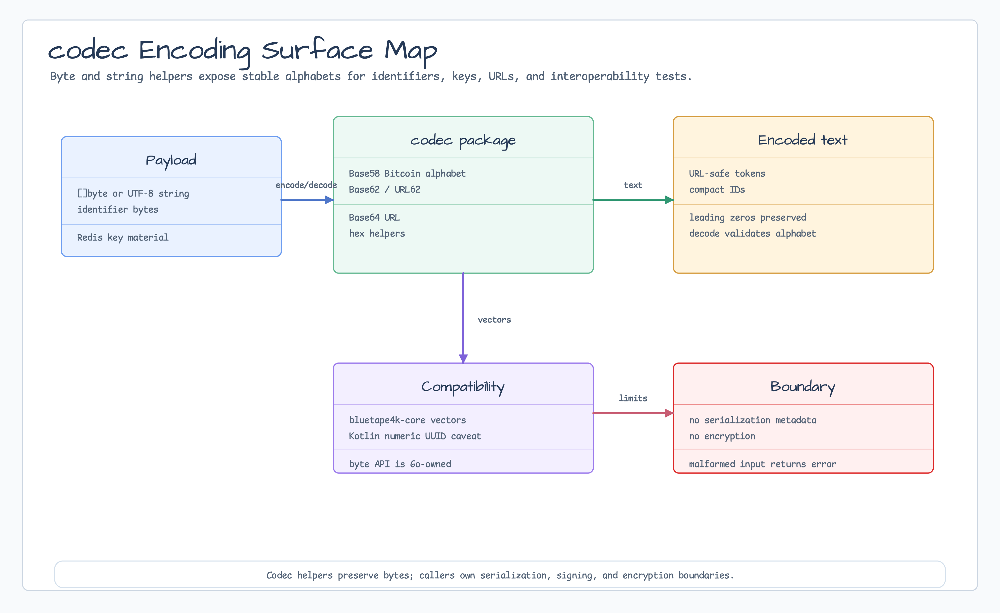

# codec

[English](README.md) | [한국어](README.ko.md)

`codec` contains small string and byte encoders used by bluetape-go packages.
Base64 and hex wrap the Go standard library, while Base58 and Base62 cover
identifier and key formats that are not provided by the standard library.



## Import

```go
import "github.com/bluetape4k/bluetape-go/codec"
```

## Usage

```go
encoded := codec.EncodeBase62String("bluetape-go")
decoded, err := codec.DecodeBase62String(encoded)
if err != nil {
    return err
}

token := codec.EncodeBase64URL([]byte{251, 255, 255})
payload, err := codec.DecodeBase64URL(token)

compactID, err := codec.EncodeUUIDURL62("24738134-9d88-6645-4ec8-d63aa2031015")
uuidText, err := codec.DecodeUUIDURL62(compactID)
```

## Behavior

- Decode helpers validate input alphabets and return errors for malformed data.
- Base58 uses the same Bitcoin alphabet as bluetape4k-core and preserves
  leading zero bytes as `1`.
- Base62 uses the same `0-9A-Z-a-z` alphabet as bluetape4k-core. Go exposes a
  byte-oriented API, so leading zero bytes are preserved; Kotlin's
  `Base62`/`Url62` helpers are `BigInteger`/UUID-oriented and do not carry
  extra byte-array leading zeros.
- `EncodeURL62` uses the same alphabet as Base62 because it is already URL-safe.
  It remains a byte-oriented alias and preserves leading zero bytes.
- `EncodeUUIDURL62` and `DecodeUUIDURL62` provide Kotlin `Url62`-compatible
  compact UUID text rendering. They normalize UUID bytes as a 128-bit big-endian
  number, so high-order zero bytes are not carried in the compact string.
- UUID URL62 rendering belongs to `codec`. UUID generation belongs to `id`, and
  UUID text validation belongs to `core`.
- String helpers convert between UTF-8 strings and byte encodings without
  adding serialization metadata.
- Decode string helpers are UTF-8 text helpers and return an error wrapping
  `core.ErrInvalidUTF8` when the decoded bytes are not valid UTF-8.
- No-error encode string helpers convert strings to bytes before encoding and
  cannot report invalid UTF-8.
- Binary payloads should use byte helpers such as `DecodeBase64`,
  `DecodeBase64URL`, `DecodeHex`, `DecodeBase58`, `DecodeBase62`, or
  `DecodeURL62`.

## bluetape4k-core compatibility

| Surface | Compatible | Notes |
|---|---|---|
| Base58 alphabet | Yes | Uses the Bitcoin alphabet `123456789ABCDEFGHJKLMNPQRSTUVWXYZabcdefghijkmnopqrstuvwxyz`. |
| Base58 leading zeros | Yes | Leading zero bytes encode as leading `1` characters. |
| Base62 alphabet | Yes | Uses `0123456789ABCDEFGHIJKLMNOPQRSTUVWXYZabcdefghijklmnopqrstuvwxyz`. |
| Base62 numeric vectors | Yes | Big-endian numeric bytes match Kotlin `BigInteger` vectors, for example `123456789 -> 8M0kX`. |
| URL62 UUID helpers | Yes | `EncodeUUIDURL62`/`DecodeUUIDURL62` match Kotlin `Url62` numeric UUID behavior, including high-order zero normalization. |
| URL62 byte helpers | Go-specific | `EncodeURL62`/`DecodeURL62` are Base62 byte aliases and preserve leading zero bytes. |
| Extra byte-array leading zeros | Go-specific | Go preserves them because the API is byte-oriented; Kotlin `BigInteger`/UUID helpers normalize them away. |
| Empty input decode | Go-specific | Go decodes `""` to empty bytes for byte round trips; Kotlin rejects blank text inputs. |
| Base62 decode bit limit | Go-specific | Go decodes arbitrary byte payloads and does not enforce Kotlin's default 128-bit `BigInteger`/UUID limit. |

## Test

```bash
go test -count=1 ./codec
```
