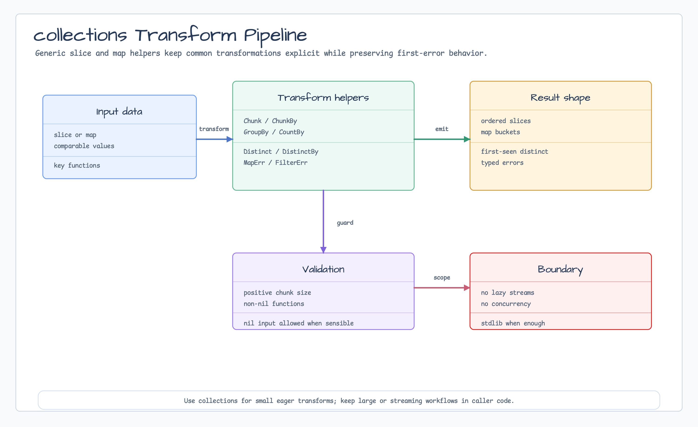

# collections

[English](README.md) | [한국어](README.ko.md)

`collections`는 chunking, grouping, distinct-by-key, counting, error-aware map/filter pipeline 같은 일반적인 slice/map 변환을 위한 focused generic helper를 제공합니다. bounded stack, ring buffer, page metadata, lazy permutation을 위한 작은 collection primitive도 제공합니다.



## 가져오기

```go
import "github.com/bluetape4k/bluetape-go/collections"
```

## 사용 예

```go
groups, err := collections.GroupBy([]string{"api", "app", "job"}, func(value string) byte {
    return value[0]
})
if err != nil {
    return err
}

chunks, err := collections.Chunk([]int{1, 2, 3, 4, 5}, 2)
if err != nil {
    return err
}

_ = groups
_ = chunks

stack, err := collections.NewBoundedStack[string](2)
if err != nil {
    return err
}
stack.PushAll("old", "new", "latest")
_ = stack.Values() // []string{"latest", "new"}
```

## 동작

- `Chunk`는 0 이하 size를 거부합니다.
- `ChunkBy`, `DistinctBy`, `GroupBy`, `CountBy`는 nil key/predicate function을
  거부합니다.
- `MapErr`, `FilterErr`, `FilterMap`은 nil mapper/predicate function을
  거부합니다.
- `Distinct`는 comparable value에 대해 first-seen order를 보존합니다.
- `BoundedStack`은 최신 값을 유지하고 top-to-bottom snapshot을 반환합니다.
  `RingBuffer`는 가장 오래된 값을 덮어쓰고 oldest-to-newest snapshot을
  반환합니다.
- `PageOf`는 0-based page number를 사용하고 items를 snapshot하며,
  `Items`는 shallow copy를 반환합니다.
- `Permutations`는 lazy iterator입니다. 호출 시 입력을 복사하고 각 결과를
  fresh shallow snapshot으로 반환하며, 결과 수는 입력 크기에 대해 factorial로
  증가합니다. 큰 입력에서는 early stop을 사용하세요.
- Mutable container는 goroutine-safe가 아니며 blocking queue도 아닙니다.
- Kotlin/JVM collection extension parity, Java stream, broad sequence DSL은
  의도적으로 제외합니다.

## 테스트

```bash
go test -count=1 ./collections
```
