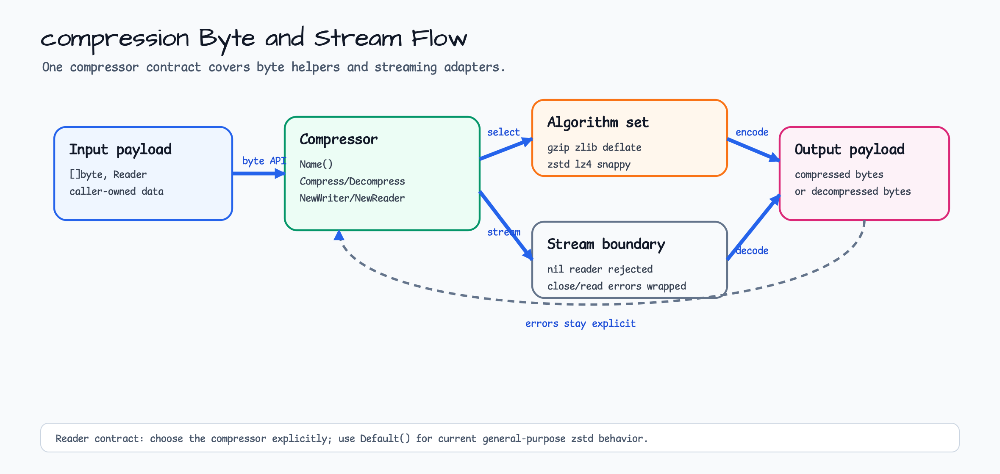

# compression

[English](README.md) | [한국어](README.ko.md)

`compression`은 byte slice와 stream을 하나의 compressor 계약으로 다룹니다.
gzip, zlib, raw deflate는 Go 표준 라이브러리를 사용하고, zstd, lz4, snappy는
각 알고리즘에 맞는 Go dependency를 같은 인터페이스 뒤에 숨깁니다.

## 가져오기

```go
import "github.com/bluetape4k/bluetape-go/compression"
```

## 사용 예



```go
compressor := compression.Default()
compressed, err := compressor.Compress(payload)
if err != nil {
    return err
}

decompressed, err := compressor.Decompress(compressed)
if err != nil {
    return err
}
```

외부에서 받은 compressed byte는 expanded output을 제한하세요:

```go
decompressed, err := compression.DecompressLimit(compressor, compressed, 8<<20)
if err != nil {
    return err
}
```

## 동작

- `Default()`는 현재 zstd를 반환합니다.
- `All()`은 gzip, zlib, deflate, zstd, lz4, snappy를 안정적인 순서로 반환합니다.
- `Decompress`는 이미 크기가 제한된 payload 또는 신뢰할 수 있는 payload용입니다.
  신뢰할 수 없는 byte-slice 입력에는 `DecompressLimit`를 사용하세요.
- Stream API는 nil reader/writer를 거부합니다.
- gzip, zlib, deflate, zstd에는 압축 레벨을 지정하는 constructor가 있습니다.

## 테스트

```bash
go test -count=1 ./compression
```

## 벤치마크

```bash
go test -run '^$' -bench '^BenchmarkCompressors' -benchmem ./compression
```

Benchmark runner는 `All()`이 반환하는 compressor 전체에 대해 결정적 JSON,
text, binary, random byte payload를 다룹니다. 0.14.0 SerDe baseline의 raw
output artifact를 수집할 때는
`docs/benchmarks/2026-07-07-issue-400-go-serde-runners.md`를 기준으로 삼으세요.
