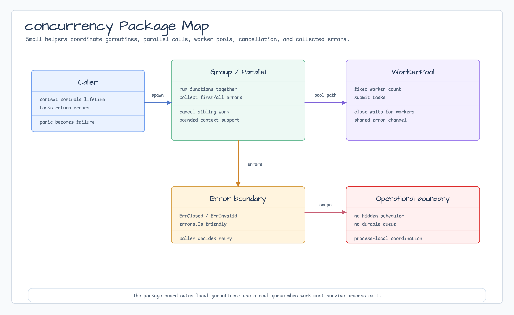

# concurrency

[English](README.md) | [한국어](README.ko.md)

`concurrency`는 `golang.org/x/sync/errgroup` 기반 context-aware goroutine helper를
제공합니다. Task group, bounded parallel map/for-each, 간단한 worker pool,
goroutine-safe round-robin counter, panic-to-error conversion을 포함합니다.



## 가져오기

```go
import "github.com/bluetape4k/bluetape-go/concurrency"
```

## 사용 예

```go
values, err := concurrency.Map(ctx, []int{1, 2, 3}, 2,
    func(ctx context.Context, value int) (int, error) {
        return value * value, ctx.Err()
    },
)
if err != nil {
    return err
}

pool, err := concurrency.NewWorkerPool[int](4, func(ctx context.Context, value int) error {
    return process(ctx, value)
})
if err != nil {
    return err
}
err = pool.Run(ctx, jobs)

roundRobin, err := concurrency.NewRoundRobin(4)
nextShard := roundRobin.Next()
```

## 동작

- `Group`, `ForEach`, `Map`, `WorkerPool`은 context cancellation을 전파합니다.
- Task panic은 `PanicError`로 반환되어 caller가 goroutine failure를 같은 error
  path에서 처리할 수 있습니다.
- Parallel helper는 positive limit 또는 worker count를 요구합니다.
- `Map`은 반환 result slice에서 input order를 보존합니다.
- `RoundRobin`은 sharding, slot selection, retry target rotation을 위한 작은
  goroutine-safe cyclic counter입니다. Goroutine을 scheduling하거나 resource를
  소유하지 않습니다.
- Java `Future`/`CompletableFuture`, virtual-thread, coroutine, Reactor,
  thread-factory, latch wrapper는 의도적으로 mirror하지 않습니다. `context`,
  channel, `Group`, `ForEach`, `Map`, `WorkerPool`을 직접 사용하세요.

## 테스트

```bash
go test -count=1 ./concurrency
go test -race -count=1 ./concurrency
```
