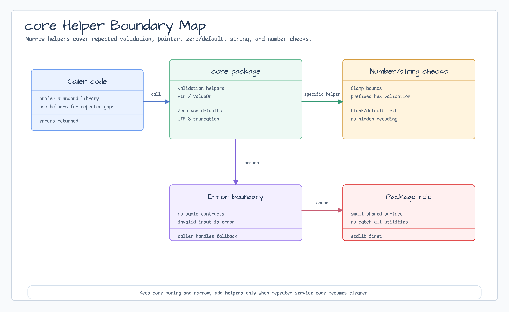

# core

[English](README.md) | [한국어](README.ko.md)

`core` contains narrow shared helpers used by bluetape-go packages. Prefer the
Go standard library when it already expresses the operation clearly; this
package is for repeated validation, pointer, zero/default, string, and small
numeric checks. It also contains small ordered range values when callers need
explicit open/closed boundary semantics.



## Import

```go
import "github.com/bluetape4k/bluetape-go/core"
```

## Usage

```go
name := core.BlankToDefault(input.Name, "anonymous")
limit, err := core.Clamp(input.Limit, 1, 100)
if err != nil {
    return err
}

owner := core.Ptr("worker-1")
_ = core.ValueOr(owner, "fallback")

window, err := core.ClosedOpenRange(10, 20)
if err != nil {
    return err
}
_ = window.Contains(10) // true
```

## Behavior

- Validation helpers return errors instead of panicking.
- `Range` constructors support `[lower, upper]`, `[lower, upper)`,
  `(lower, upper]`, and `(lower, upper)` notation through `ClosedRange`,
  `ClosedOpenRange`, `OpenClosedRange`, and `OpenOpenRange`.
- Invalid ranges and NaN float endpoints are rejected. The zero-value `Range`
  is safe and empty; use constructors for non-empty ranges.
- `Zero`, `IsZero`, `DefaultIfZero`, and `FirstNonZero` keep generic fallback
  behavior explicit.
- `TruncateUTF8Bytes` truncates at rune boundaries and rejects negative limits
  or invalid UTF-8 input.
- Hex helpers validate prefixed `0x` / `0X` strings without decoding them.
- Kotlin operator overloads and DSL-style range constructors are intentionally
  not part of this Go API.

## Test

```bash
go test -count=1 ./core
```
