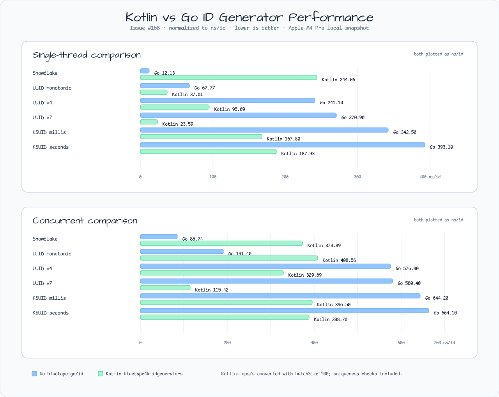

# Issue #168 ID Generator Benchmark Comparison

Issue: #168
Milestone: 0.6.1
Date: 2026-06-10
Work type: Research / benchmark comparison

## Research Question

How should `bluetape-go/id` compare its UUID, ULID, KSUID, KSUID millis, and
Snowflake generators against the sibling JVM `bluetape4k-idgenerators` library
without confusing runtime-specific benchmark results with API design decisions?

## Current Decision

Keep the comparison as a reproducible local snapshot, not a cross-runtime ranking.
Use Go package benchmarks for per-ID cost and the existing JVM
`kotlinx-benchmark` benchmark suite for `bluetape4k-idgenerators` batch
throughput and uniqueness checks. No follow-up implementation issue is justified
from this snapshot alone.

## Comparable Surface

| Concern | `bluetape-go/id` | `bluetape4k-idgenerators` | Comparison boundary |
|---|---|---|---|
| UUID v4 | `NewUUIDV4Generator`, `NewUUIDV4` | `Uuid.V4`, `UuidGenerator(Uuid.V4)` | Both produce random UUID v4. Go exposes reader injection; JVM exposes `Random` customization. |
| UUID v7 | `NewUUIDV7Generator`, `NewUUIDV7` | `Uuid.V7`, `UuidGenerator()` default | Both target time-ordered UUIDs. Go owns logical tick behavior and clock hooks; JVM uses the Java UUID Generator epoch strategy. |
| ULID random | `NewULIDGenerator`, `NewULID` | `ULID.randomULID()` / factory helpers | Go has an explicit random constructor; the JVM facade separates factory helpers from `UlidGenerator`. |
| ULID monotonic | `NewMonotonicULIDGenerator` | `UlidGenerator()`, `ULID.statefulMonotonic()` | Go splits random and monotonic constructors; JVM `UlidGenerator` defaults to stateful monotonic behavior. |
| KSUID seconds | `NewKSUIDGenerator`, `NewKSUID` | `Ksuid.Seconds`, `KsuidGenerator()` | Direct family match. |
| KSUID millis | `NewKSUIDMillisGenerator`, `NewKSUIDMillis` | `Ksuid.Millis`, `KsuidGenerator(Ksuid.Millis)` | Direct source-compatible family match; do not cross-parse or cross-compare with seconds KSUID. |
| Snowflake | `NewSnowflakeGenerator(machineID)` | `SnowflakeGenerator`, `Snowflakers.default/global` | Go requires caller-owned machine IDs; JVM includes default/global variants. |

## Commands

### Go

```bash
make bench-id
go test -count=1 ./id
go test -race -count=1 ./id
go test -run '^$' -bench '^Benchmark(UUIDV4|UUIDV4Parallel|UUIDV7|UUIDV7Parallel|ULIDRandom|ULIDRandomParallel|ULIDMonotonic|ULIDMonotonicParallel|KSUIDNextString|KSUIDNextStringParallel|KSUIDMillisNextString|KSUIDMillisNextStringParallel|SnowflakeNextInt64|SnowflakeNextInt64SameMillisecond|SnowflakeNextInt64Parallel)$' -benchmem ./id
```

### JVM

The sibling project uses `kotlinx-benchmark` with the JMH JVM backend.

```bash
cd /Users/debop/work/bluetape4k/bluetape4k-projects
./gradlew :bluetape4k-idgenerators:singleThreadBenchmark
./gradlew :bluetape4k-idgenerators:concurrentBenchmark
```

The generated Gradle task list also exposes suffixed task names such as
`:bluetape4k-idgenerators:benchmarkSingleThreadBenchmark` and
`:bluetape4k-idgenerators:benchmarkConcurrentBenchmark`, but the shorter
configuration task names above are valid on the current build.

## Environment

Raw environment and benchmark outputs are stored under
`docs/research/outputs/issue-168/`.

| File | Purpose |
|---|---|
| `environment.txt` | Host, OS, Go version, CPU, logical CPU count. |
| `java-version.txt` | JVM version used for the sibling benchmark. |
| `revisions.txt` | Local `bluetape-go` and sibling `bluetape4k-projects` branch/commit IDs. |
| `go-id-test.txt` | Go `id` package test output, including goroutine uniqueness stress coverage. |
| `go-id-race-test.txt` | Go `id` package race-detector output for the same package. |
| `go-id-bench-100ms.txt` | Short Go smoke benchmark. |
| `go-id-bench-1s.txt` | Main Go local snapshot. |
| `jvm-idgenerators-single-thread.txt` | JVM `singleThreadBenchmark` raw output. |
| `jvm-idgenerators-concurrent.txt` | JVM `concurrentBenchmark` raw output. |

Observed local environment:

- macOS arm64, Apple M4 Pro, 12 logical CPUs.
- Go 1.26.4.
- Oracle GraalVM Java 25.0.3.

## Chart Summary

The chart below compares the same ID generator families across Go and Kotlin
using one normalized unit: `ns/id`, where lower is better. Go rows use package
benchmark `ns/op` directly. Kotlin rows convert `kotlinx-benchmark` throughput
with `1e9 / (ops/s * batchSize)` using the `batchSize=100` rows. The chart shows
both single-thread and concurrent measurements so the comparison covers simple
generation cost and shared-generator contention.



### Normalized Single-Thread Comparison

| Generator | Go ns/id | Kotlin ns/id | Kotlin source |
|---|---:|---:|---|
| Snowflake | 12.13 | 244.06 | `snowflake`, batch 100 |
| ULID monotonic | 67.77 | 37.01 | `ulid`, batch 100 |
| UUID v4 | 241.10 | 95.09 | `uuidV4`, batch 100 |
| UUID v7 | 270.90 | 23.59 | `uuidV7`, batch 100 |
| KSUID millis | 342.50 | 167.80 | `ksuidMillis`, batch 100 |
| KSUID seconds | 393.10 | 187.93 | `ksuidSeconds`, batch 100 |

### Normalized Concurrent Comparison

| Generator | Go ns/id | Kotlin ns/id | Kotlin source |
|---|---:|---:|---|
| Snowflake | 85.74 | 373.89 | `snowflake`, batch 100 |
| ULID monotonic | 191.40 | 408.56 | `ulid`, batch 100 |
| UUID v4 | 576.80 | 329.69 | `uuidV4`, batch 100 |
| UUID v7 | 580.40 | 115.42 | `uuidV7`, batch 100 |
| KSUID millis | 644.20 | 396.50 | `ksuidMillis`, batch 100 |
| KSUID seconds | 664.10 | 388.70 | `ksuidSeconds`, batch 100 |

## Go Snapshot

Validation and stress/race evidence:

```bash
go test -count=1 ./id
go test -race -count=1 ./id
```

The `./id` test package includes goroutine uniqueness stress coverage for UUID
v4/v7, ULID random/monotonic, KSUID seconds/millis, and Snowflake. The raw
outputs above are retained with the benchmark artifacts.

Command:

```bash
go test -run '^$' -bench '^Benchmark(UUIDV4|UUIDV4Parallel|UUIDV7|UUIDV7Parallel|ULIDRandom|ULIDRandomParallel|ULIDMonotonic|ULIDMonotonicParallel|KSUIDNextString|KSUIDNextStringParallel|KSUIDMillisNextString|KSUIDMillisNextStringParallel|SnowflakeNextInt64|SnowflakeNextInt64SameMillisecond|SnowflakeNextInt64Parallel)$' -benchmem ./id
```

| Benchmark | ns/op | B/op | allocs/op |
|---|---:|---:|---:|
| `BenchmarkSnowflakeNextInt64-12` | 12.13 | 0 | 0 |
| `BenchmarkSnowflakeNextInt64SameMillisecond-12` | 12.46 | 0 | 0 |
| `BenchmarkULIDMonotonic-12` | 67.77 | 48 | 2 |
| `BenchmarkSnowflakeNextInt64Parallel-12` | 85.74 | 0 | 0 |
| `BenchmarkULIDRandom-12` | 108.4 | 48 | 2 |
| `BenchmarkULIDMonotonicParallel-12` | 191.4 | 48 | 2 |
| `BenchmarkUUIDV4-12` | 241.1 | 112 | 3 |
| `BenchmarkUUIDV7-12` | 270.9 | 112 | 3 |
| `BenchmarkULIDRandomParallel-12` | 302.2 | 48 | 2 |
| `BenchmarkKSUIDMillisNextString-12` | 342.5 | 104 | 3 |
| `BenchmarkKSUIDNextString-12` | 393.1 | 48 | 2 |
| `BenchmarkUUIDV4Parallel-12` | 576.8 | 112 | 3 |
| `BenchmarkUUIDV7Parallel-12` | 580.4 | 112 | 3 |
| `BenchmarkKSUIDMillisNextStringParallel-12` | 644.2 | 104 | 3 |
| `BenchmarkKSUIDNextStringParallel-12` | 664.1 | 48 | 2 |

## JVM Snapshot

The JVM benchmarks measure batch throughput. Each benchmark operation generates
`batchSize` IDs and checks uniqueness inside that batch or across the benchmark
trial. The table below records the current local `kotlinx-benchmark` / JMH
backend output.

### Single Thread

| Benchmark | Batch | Throughput ops/s |
|---|---:|---:|
| `uuidV7` | 100 | 423,830.666 |
| `ulid` | 100 | 270,204.172 |
| `uuidV4` | 100 | 105,158.728 |
| `ksuidMillis` | 100 | 59,593.488 |
| `ksuidSeconds` | 100 | 53,210.135 |
| `snowflake` | 100 | 40,973.126 |
| `flake` | 100 | 36,916.947 |
| `uuidV7` | 10000 | 4,163.944 |
| `ulid` | 10000 | 2,546.337 |
| `uuidV4` | 10000 | 1,031.892 |
| `ksuidMillis` | 10000 | 573.599 |
| `ksuidSeconds` | 10000 | 512.679 |
| `snowflake` | 10000 | 409.800 |
| `flake` | 10000 | 351.317 |

### Concurrent

| Benchmark | Batch | Throughput ops/s |
|---|---:|---:|
| `uuidV7` | 100 | 86,637.787 |
| `flake` | 100 | 31,977.885 |
| `uuidV4` | 100 | 30,331.895 |
| `snowflake` | 100 | 26,746.161 |
| `ksuidSeconds` | 100 | 25,726.586 |
| `ksuidMillis` | 100 | 25,220.817 |
| `ulid` | 100 | 24,476.006 |
| `uuidV7` | 10000 | 868.339 |
| `flake` | 10000 | 359.369 |
| `uuidV4` | 10000 | 298.486 |
| `ksuidMillis` | 10000 | 267.744 |
| `snowflake` | 10000 | 260.021 |
| `ksuidSeconds` | 10000 | 257.901 |
| `ulid` | 10000 | 243.299 |

## Interpretation Boundary

- Compare Go and Kotlin on the same axis only after normalizing Kotlin
  throughput to `ns/id` with `1e9 / (ops/s * batchSize)`.
- Kotlin batch results still include collection allocation and uniqueness
  verification that Go package benchmarks do not include.
- Go parallel benchmark coverage now includes UUID v4/v7, ULID random,
  monotonic ULID, KSUID seconds/millis, and Snowflake so concurrent chart rows
  compare the same generator families where both repos expose them.
- Go Snowflake benchmarks use deterministic clock hooks and a caller-provided
  machine ID. JVM Snowflake benchmarks use the sibling library's default
  generator setup.
- Go does not currently implement Flake or Hashids, so those JVM results are
  recorded only as sibling-library context.
- Go UUID v7 and JVM UUID v7 use different implementations and clock/entropy
  hooks. Performance differences should not be read as a standards compliance
  difference.
- KSUID seconds and KSUID millis are separate families in both repos. Keep them
  separate when parsing, comparing, or benchmarking.

## Conclusions

- The Go `id` benchmark suite now has a first-class `make bench-id` target and
  reports allocations consistently with other package benchmark suites.
- Go Snowflake is allocation-free in the measured hot paths.
- Go string ID generators allocate because they return string values and depend
  on entropy/encoding work; current allocation counts are visible and stable
  enough for future regression comparison.
- The sibling JVM benchmark remains useful for API-family comparison and
  concurrency uniqueness evidence, but not for raw throughput ranking against Go.
- No evidence-backed follow-up implementation issue is required from this run.

## Follow-Up Watch Items

- If future work wants a stricter cross-runtime benchmark, add a Go batch
  benchmark that mirrors the JVM uniqueness-check workload before comparing
  normalized throughput.
- If allocation pressure becomes a user-facing concern, evaluate byte-oriented or
  caller-provided-buffer APIs separately instead of changing the current simple
  string-returning constructors.
