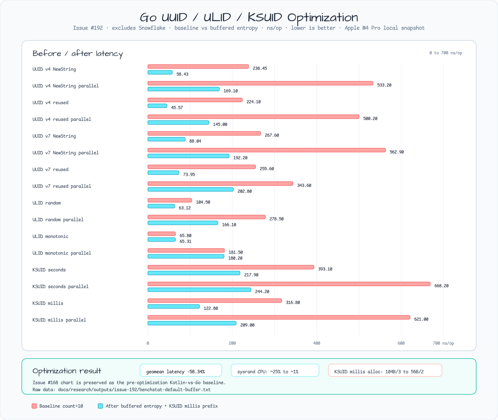
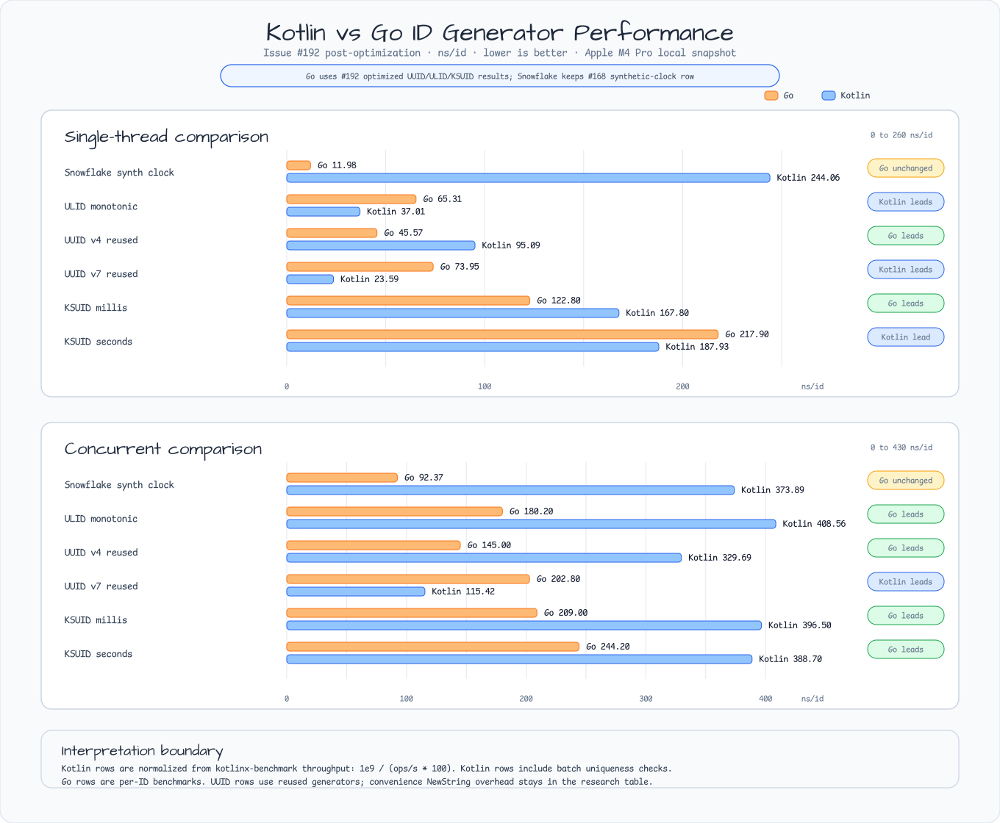

# Issue #192 ID generator performance optimization

## Scope

Issue #192 follows the Issue #168 Kotlin-vs-Go benchmark snapshot. The Issue
#168 chart and raw outputs remain the pre-optimization baseline. This note
records the Go-side optimization pass for UUID v4/v7, random ULID, monotonic
ULID, KSUID seconds, and Kotlin-compatible KSUID millis.

## Environment

- Raw environment: `outputs/issue-192/environment.txt`
- Baseline benchmark: `outputs/issue-192/go-id-baseline-count10.txt`
- Baseline CPU profile: `outputs/issue-192/id-baseline.cpu.pprof`
- Baseline memory profile: `outputs/issue-192/id-baseline.mem.pprof`
- Final benchmark: `outputs/issue-192/go-id-default-buffer-count10.txt`
- Final CPU profile: `outputs/issue-192/id-after-default-buffer.cpu.pprof`
- Final memory profile: `outputs/issue-192/id-after-default-buffer.mem.pprof`
- Before/after chart:
  `../images/readme-charts/id-generator-optimization-before-after.png`
- Post-optimization Kotlin-vs-Go chart:
  `../images/readme-charts/id-generator-kotlin-go-optimized-comparison.png`





## Commands

Baseline benchmark:

```bash
go test -run '^$' -bench 'Benchmark(UUID|ULID|KSUID)' -benchmem -count=10 ./id \
  | tee docs/research/outputs/issue-192/go-id-baseline-count10.txt
```

Baseline profile:

```bash
go test -run '^$' \
  -bench 'Benchmark(UUIDV4ReuseGenerator|UUIDV7ReuseGenerator|ULIDRandom|ULIDMonotonic|KSUIDNextString|KSUIDMillisNextString)$' \
  -benchmem -benchtime=3s \
  -cpuprofile docs/research/outputs/issue-192/id-baseline.cpu.pprof \
  -memprofile docs/research/outputs/issue-192/id-baseline.mem.pprof ./id \
  | tee docs/research/outputs/issue-192/go-id-baseline-profile-bench.txt
```

Final benchmark:

```bash
go test -run '^$' -bench 'Benchmark(UUID|ULID|KSUID)' -benchmem -count=10 ./id \
  | tee docs/research/outputs/issue-192/go-id-default-buffer-count10.txt
```

Final profile:

```bash
go test -run '^$' \
  -bench 'Benchmark(UUIDV4ReuseGenerator|UUIDV7ReuseGenerator|ULIDRandom|ULIDMonotonic|KSUIDNextString|KSUIDMillisNextString)$' \
  -benchmem -benchtime=3s \
  -cpuprofile docs/research/outputs/issue-192/id-after-default-buffer.cpu.pprof \
  -memprofile docs/research/outputs/issue-192/id-after-default-buffer.mem.pprof ./id \
  | tee docs/research/outputs/issue-192/go-id-after-default-buffer-profile-bench.txt
```

Comparison and profile summaries:

```bash
$(go env GOPATH)/bin/benchstat \
  docs/research/outputs/issue-192/go-id-baseline-count10.txt \
  docs/research/outputs/issue-192/go-id-default-buffer-count10.txt \
  | tee docs/research/outputs/issue-192/benchstat-default-buffer.txt

go tool pprof -top docs/research/outputs/issue-192/id-baseline.cpu.pprof \
  | tee docs/research/outputs/issue-192/id-baseline-cpu-top.txt

go tool pprof -top docs/research/outputs/issue-192/id-after-default-buffer.cpu.pprof \
  | tee docs/research/outputs/issue-192/id-after-default-buffer-cpu-top.txt
```

## Baseline Findings

`benchstat` over 10 runs showed that generator reuse alone was not the main
performance lever:

| Benchmark | Baseline ns/op | Baseline B/op | Baseline allocs/op |
|---|---:|---:|---:|
| UUID v4 reused | 224.10 | 64 | 2 |
| UUID v7 reused | 255.60 | 64 | 2 |
| ULID random | 104.50 | 48 | 2 |
| ULID monotonic | 65.80 | 48 | 2 |
| KSUID seconds | 393.10 | 48 | 2 |
| KSUID millis | 316.80 | 104 | 3 |

The baseline CPU profile attributed about one quarter of sampled time to
`io.ReadFull` through the crypto randomness path. The memory profile showed
stable string/allocation costs for UUID, ULID, KSUID, and an additional
allocation in the KSUID millis encoder.

## Accepted Changes

### Buffered crypto entropy

Default UUID, ULID, KSUID seconds, and KSUID millis generation now share a
package-local locked buffered reader over `crypto/rand`.

This keeps the default entropy source crypto-grade while reducing per-ID
randomness overhead. Generated IDs remain identifiers, not authentication or
authorization secrets. Callers that inject custom readers keep the previous
behavior and must still provide concurrency-safe readers when sharing a
generator.

### KSUID millis prefix encoding

KSUID millis `NextString` now encodes the required 27-character prefix into a
fixed local buffer instead of allocating a temporary output slice and then
truncating the resulting string.

## Rejected or Deferred Changes

- Reusing generator instances only: useful for API shape and allocations, but
  it did not explain the large gap by itself.
- Stack-buffering Segment KSUID string output: it regressed single-thread KSUID
  seconds by about 1.12% and did not reduce allocations.
- Treating ULID string marshaling as the main lever: direct `MarshalTextTo`
  slightly improved random ULID but did not reduce allocation counts. The larger
  ULID improvement came from entropy buffering.
- UUID v7 sharding or per-goroutine sequence allocation: still a possible
  follow-up for parallel UUID v7, but the first bottleneck was entropy reads.

## Final Result

Final `benchstat` against the baseline. `NewString` rows include convenience
generator construction, while `reused` rows measure an existing generator's
`NextString()` path:

| Benchmark | Baseline ns/op | Final ns/op | Change |
|---|---:|---:|---:|
| UUID v4 NewString | 238.45 | 58.43 | -75.50% |
| UUID v4 NewString parallel | 533.20 | 169.10 | -68.29% |
| UUID v4 reused | 224.10 | 45.57 | -79.67% |
| UUID v4 reused parallel | 500.20 | 145.00 | -71.01% |
| UUID v7 NewString | 267.60 | 88.04 | -67.10% |
| UUID v7 NewString parallel | 562.90 | 192.20 | -65.86% |
| UUID v7 reused | 255.60 | 73.95 | -71.07% |
| UUID v7 reused parallel | 343.60 | 202.80 | -40.98% |
| ULID random | 104.50 | 63.12 | -39.60% |
| ULID random parallel | 278.50 | 166.10 | -40.36% |
| ULID monotonic | 65.80 | 65.31 | -0.74% |
| ULID monotonic parallel | 181.50 | 180.20 | -0.74% |
| KSUID seconds | 393.10 | 217.90 | -44.58% |
| KSUID seconds parallel | 668.20 | 244.20 | -63.46% |
| KSUID millis | 316.80 | 122.80 | -61.23% |
| KSUID millis parallel | 621.00 | 209.00 | -66.35% |

Geomean latency improved by 58.34%. KSUID millis allocation improved from
`104 B/op, 3 allocs/op` to `56 B/op, 2 allocs/op`. Other string ID families
kept the same allocation count, which means the main improvement was read-path
latency rather than string allocation removal.

After the change, crypto/sysrand profile share dropped sharply, and the visible
hot spots shifted to string encoding, time access, UUID v7 ordering, and
dependency encoders. Those are separate follow-up optimization topics.

## Post-Optimization Kotlin Comparison

The Issue #168 Kotlin rows are retained as the JVM baseline and normalized from
`kotlinx-benchmark` throughput with `1e9 / (ops/s * 100)`. The Go UUID, ULID,
and KSUID rows below use the Issue #192 optimized local snapshot. Snowflake is
unchanged by this issue, so the Go row remains the Issue #168 synthetic-clock
hot-path value and should not be read as a production-equivalent cross-runtime
Snowflake verdict.

### Single Thread

| Generator | Go ns/id | Kotlin ns/id | Lower row |
|---|---:|---:|---|
| Snowflake synthetic clock | 11.98 | 244.06 | Go |
| ULID monotonic | 65.31 | 37.01 | Kotlin |
| UUID v4 reused generator | 45.57 | 95.09 | Go |
| UUID v7 reused generator | 73.95 | 23.59 | Kotlin |
| KSUID millis | 122.80 | 167.80 | Go |
| KSUID seconds | 217.90 | 187.93 | Kotlin |

### Concurrent

| Generator | Go ns/id | Kotlin ns/id | Lower row |
|---|---:|---:|---|
| Snowflake synthetic clock | 92.37 | 373.89 | Go |
| ULID monotonic | 180.20 | 408.56 | Go |
| UUID v4 reused generator | 145.00 | 329.69 | Go |
| UUID v7 reused generator | 202.80 | 115.42 | Kotlin |
| KSUID millis | 209.00 | 396.50 | Go |
| KSUID seconds | 244.20 | 388.70 | Go |

The updated chart changes the story materially: after buffering Go entropy,
Go leads UUID v4, KSUID millis, and the concurrent ULID/KSUID rows in this
local snapshot. Kotlin still leads UUID v7 and the single-thread monotonic ULID
row. UUID v7 remains the clearest Go follow-up because its parallel row still
shows ordering/lock cost after entropy overhead is reduced.

## Blog Seed

This issue is a good blog topic because the initial hypothesis was wrong in an
interesting way: Go was expected to dominate, generator reuse helped only a
little, and profiling showed that random entropy reads and string encoding were
the real constraints. Keep Issue #168's chart as the baseline visual, then add
Issue #192's before/after table as the optimization story.
