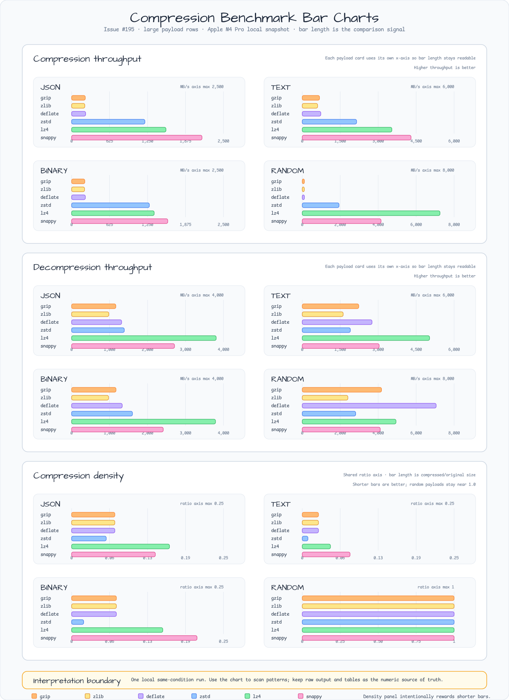

# Issue #195 Compression Benchmark Matrix 연구

Issue: #195
Milestone: 0.6.1
Date: 2026-06-12
Work type: Benchmark evidence

## 연구 질문

`bluetape-go/compression`은 compressor default를 바꾸거나 단일 local run을 과장하지
않으면서, Go 결과를 `bluetape-rs` 및 `bluetape4k-io`와 비교할 수 있도록 기존
compressor benchmark를 어떻게 확장해야 하는가?

## 현재 결정

benchmark는 opt-in package benchmark로 유지하고, output은 same-condition local
snapshot으로 다룬다. matrix는 이제 small, medium, large size의 JSON, text,
structured binary, low-compressibility random payload를 포함한다. 모든
`compression.All()` algorithm에 대해 compression과 decompression을 별도로 측정한다.

이 benchmark만으로 `compression.Default()`를 바꾸지 않는다. 향후 cross-ecosystem
report에서 recommendation이 필요하면 Go raw output을 sibling Rust 및 JVM output과
결합하고 runtime caveat를 보존해야 한다.

## Payload Matrix

| Kind | Small | Medium | Large | Shape |
|---|---:|---:|---:|---|
| JSON | about 1 KiB | about 48 KiB | about 768 KiB | service-event objects in a valid JSON document |
| Text | 1 KiB | 48 KiB | 768 KiB | deterministic UTF-8 service-log and prose lines |
| Binary | 1 KiB | 48 KiB | 768 KiB | deterministic mixed bytes with repeated low-entropy regions |
| Random | 1 KiB | 48 KiB | 768 KiB | deterministic PCG low-compressibility bytes |

benchmark는 map iteration 대신 stable payload slice를 사용하므로 local run 사이의
output order가 deterministic하다.

## Commands

```bash
go test -count=1 ./compression
go test -run '^$' -bench '^BenchmarkCompressors' -benchmem ./compression
```

raw environment와 benchmark output은 `docs/research/outputs/issue-195/` 아래에
저장한다.

| File | Purpose |
|---|---|
| `environment.txt` | Host, OS, Go version, CPU, logical CPU count, branch, base commit, and dirty tree state for the benchmarked PR diff. |
| `go-compression-bench.txt` | Full Go benchmark output for compression and decompression paths. |
| `../images/readme-charts/compression-large-payload-benchmark-bars.png` | Scan-friendly large-payload bar chart generated from the raw benchmark output. |

관찰된 local environment:

- macOS arm64, Apple M4 Pro, 12 logical CPUs.
- Go 1.26.4.
- Branch `issue/195-compression-benchmark-matrix`, based on
  `aba437a50d0a2a2246e1dd0e2271c6672458143f`, with the issue #195 working-tree
  diff recorded in `environment.txt`.

## Snapshot Highlights



아래 table은 raw output에서 representative large-payload row를 기록한다. 낮은 `ns/op`가
더 빠르고, 높은 `MB/s`가 더 높은 throughput이며, 낮은 `compressed/original`이 더 좋은
compression density다.

bar chart는 같은 raw output에서 생성되며 large JSON, text, binary, random payload에
대한 모든 `compression.All()` algorithm을 다룬다. 의도적으로 visual-first 형식이다.
bar length가 comparison signal을 전달하고, table과 raw output은 numeric source of
truth로 남는다.

### Compression - Large Payloads

| Payload | gzip ns/op | zstd ns/op | lz4 ns/op | snappy ns/op | Best density among listed |
|---|---:|---:|---:|---:|---|
| JSON large | 3,480,521 | 652,046 | 506,451 | 366,504 | zstd, 0.05706 |
| Text large | 1,149,411 | 365,913 | 221,996 | 182,951 | zstd, 0.009397 |
| Binary large | 3,603,652 | 614,392 | 578,394 | 496,773 | zstd, 0.01992 |
| Random large | 6,873,184 | 405,417 | 108,362 | 189,504 | no useful compression, about 1.000 |

### Decompression - Large Payloads

| Payload | gzip ns/op | zstd ns/op | lz4 ns/op | snappy ns/op | Fastest among listed |
|---|---:|---:|---:|---:|---|
| JSON large | 675,140 | 566,753 | 206,585 | 290,147 | lz4 |
| Text large | 352,075 | 413,314 | 156,334 | 258,709 | lz4 |
| Binary large | 671,708 | 490,537 | 207,478 | 325,814 | lz4 |
| Random large | 188,242 | 279,243 | 159,177 | 191,426 | lz4 |

## 해석 경계

- 이는 production ranking이 아니라 하나의 local run이다.
- Go benchmark는 package-level `ns/op`, throughput, allocations, compressed bytes,
  compressed/original ratio를 보고한다. JVM 및 Rust harness는 다른 allocation 또는
  runtime metric을 노출할 수 있다.
- 이 snapshot에서 Zstd는 structured payload에서 best compression density를 제공하는
  경우가 많고, lz4와 snappy는 여러 path에서 더 빠른 경향이 있다.
- random payload row는 data를 유의미하게 압축할 수 없을 때의 overhead를 보여 준다.
  default-algorithm winner로 해석하면 안 된다.
- cross-ecosystem comparison은 normalized summary를 제시하기 전에 각 runtime의 raw
  table을 분리해 유지해야 한다.

## 연결된 근거

- `bluetape-go` issue #76은 compressed byte 및 ratio metric을 갖춘 deterministic
  opt-in compression benchmark를 확립했다.
- `bluetape4k-projects` issue #746은 sibling JVM same-condition matrix를 추가했다.
- `bluetape-rs` issue #82는 더 넓은 cross-ecosystem comparison shape를 기록한다.
