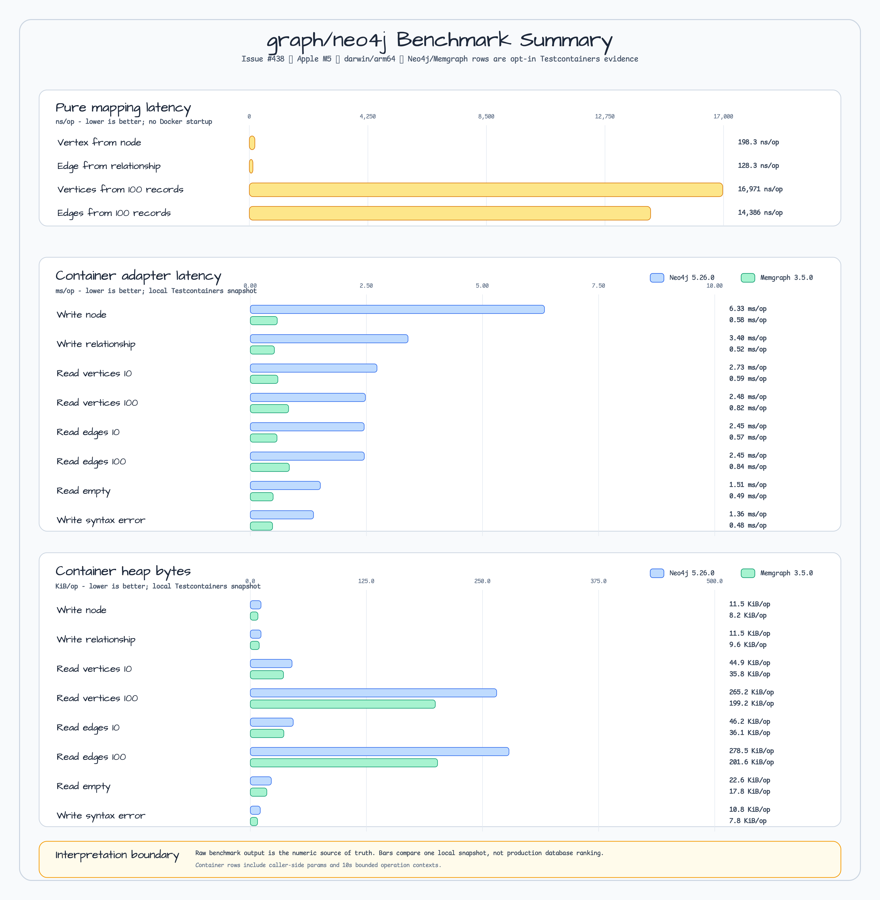

# Issue #438 Graph Neo4j/Memgraph Benchmark Evidence

Issue #438은 `graph/neo4j` adapter surface에 대한 measured benchmark evidence를 추가한다. 변경은 benchmark-only이며 graph
value type, Neo4j client semantics, driver ownership, Memgraph compatibility contract는 바꾸지 않는다.

## Artifacts

- pure mapping/default benchmark: `docs/research/outputs/issue-438/graph-neo4j-mapping-bench.txt`
- Neo4j/Memgraph Testcontainers opt-in benchmark: `docs/research/outputs/issue-438/graph-neo4j-containers-bench.txt`
- environment 및 Docker metadata: `docs/research/outputs/issue-438/environment.md`
- scan-friendly benchmark chart: `docs/images/readme-charts/graph-neo4j-benchmark-summary.png`

chart source files:

- SVG: `docs/images/readme-charts/graph-neo4j-benchmark-summary.svg`
- PNG: `docs/images/readme-charts/graph-neo4j-benchmark-summary.png`
- Vega-Lite data source: `docs/images/readme-charts/graph-neo4j-benchmark-summary.vl.json`
- Generator: `docs/images/readme-charts/generate-graph-neo4j-benchmark-summary.mjs`

## Commands

- local/default: `go test -run '^$' -bench . -benchmem ./graph/neo4j`
- Neo4j/Memgraph Testcontainers, serial and opt-in:
  `BLUETAPE_GRAPH_NEO4J_BENCH=1 go test -p 1 -run '^$' -bench '^BenchmarkGraphNeo4jContainers' -benchtime=100x -benchmem ./graph/neo4j`

container benchmark는 Docker와 `neo4j:5.26.0`, `memgraph/memgraph:3.5.0`이 필요하다. normal benchmark run은
`BLUETAPE_GRAPH_NEO4J_BENCH=1`이 없으면 container row를 skip한다.

## Pure Mapping Rows

| Case | Result |
|---|---:|
| `BenchmarkVertexFromNode` | `198.3 ns/op`, `400 B/op`, `3 allocs/op` |
| `BenchmarkEdgeFromRelationship` | `128.3 ns/op`, `336 B/op`, `2 allocs/op` |
| `BenchmarkVerticesFromRecords` | `16971 ns/op`, `37696 B/op`, `201 allocs/op` |
| `BenchmarkEdgesFromRecords` | `14386 ns/op`, `41792 B/op`, `201 allocs/op` |

해석: single-value mapping은 sub-microsecond에 머물고, record-batch mapping cost는 graph value construction과 shallow property
copying이 지배한다.

## Container Read/Write Rows

| Runtime | Case | Result |
|---|---|---:|
| Neo4j `neo4j:5.26.0` | `WriteNode` | `6333185 ns/op`, `11820 B/op`, `228 allocs/op` |
| Neo4j `neo4j:5.26.0` | `WriteRelationship` | `3396142 ns/op`, `11799 B/op`, `226 allocs/op` |
| Neo4j `neo4j:5.26.0` | `ReadVertices/Small10` | `2727240 ns/op`, `46024 B/op`, `691 allocs/op` |
| Neo4j `neo4j:5.26.0` | `ReadVertices/Medium100` | `2478667 ns/op`, `271583 B/op`, `4921 allocs/op` |
| Neo4j `neo4j:5.26.0` | `ReadEdges/Small10` | `2451548 ns/op`, `47312 B/op`, `681 allocs/op` |
| Neo4j `neo4j:5.26.0` | `ReadEdges/Medium100` | `2454960 ns/op`, `285177 B/op`, `4821 allocs/op` |
| Neo4j `neo4j:5.26.0` | `ReadEmptyResult` | `1507954 ns/op`, `23192 B/op`, `255 allocs/op` |
| Neo4j `neo4j:5.26.0` | `WriteSyntaxError` | `1360984 ns/op`, `11009 B/op`, `212 allocs/op` |
| Memgraph `memgraph/memgraph:3.5.0` | `WriteNode` | `579592 ns/op`, `8403 B/op`, `180 allocs/op` |
| Memgraph `memgraph/memgraph:3.5.0` | `WriteRelationship` | `518462 ns/op`, `9821 B/op`, `207 allocs/op` |
| Memgraph `memgraph/memgraph:3.5.0` | `ReadVertices/Small10` | `594059 ns/op`, `36621 B/op`, `566 allocs/op` |
| Memgraph `memgraph/memgraph:3.5.0` | `ReadVertices/Medium100` | `824707 ns/op`, `203936 B/op`, `3986 allocs/op` |
| Memgraph `memgraph/memgraph:3.5.0` | `ReadEdges/Small10` | `574915 ns/op`, `36973 B/op`, `556 allocs/op` |
| Memgraph `memgraph/memgraph:3.5.0` | `ReadEdges/Medium100` | `840016 ns/op`, `206407 B/op`, `3886 allocs/op` |
| Memgraph `memgraph/memgraph:3.5.0` | `ReadEmptyResult` | `491485 ns/op`, `18204 B/op`, `185 allocs/op` |
| Memgraph `memgraph/memgraph:3.5.0` | `WriteSyntaxError` | `478611 ns/op`, `7976 B/op`, `165 allocs/op` |

해석: 이것은 local Testcontainers snapshot이지 database 간 production ranking이 아니다. row에는 caller-side parameter map과
bounded context setup이 포함되어 있으며, 현재 caller-owned driver adapter boundary와 shared Cypher subset에 대한 regression
evidence로 유용하다.

## 결정

이 run에서 optimization issue를 열지 않는다. benchmark gap은 닫혔고, measured row는 `Client` 변경, backend-neutral repository
abstraction 추가, dedicated `graph/memgraph` package 추가를 정당화할 correctness 또는 public API 문제를 보이지 않는다.
