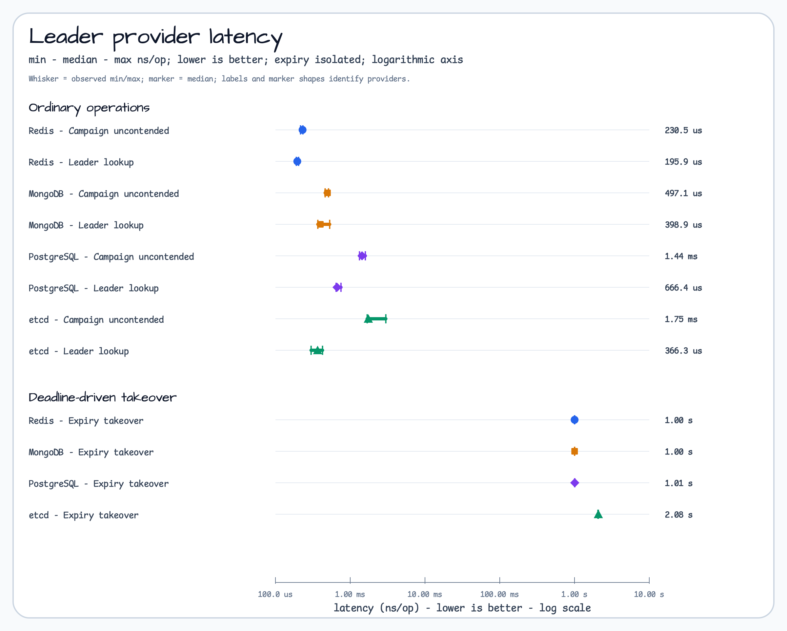
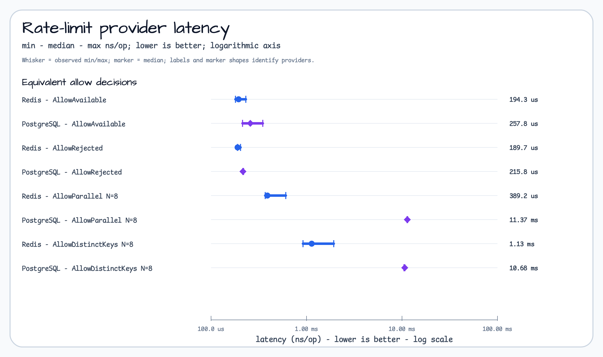
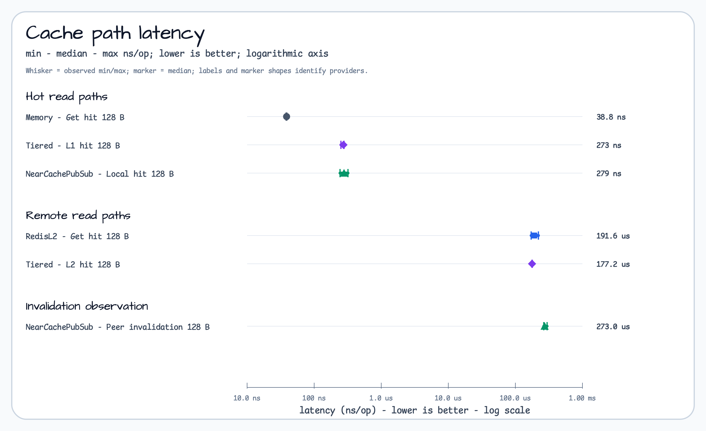
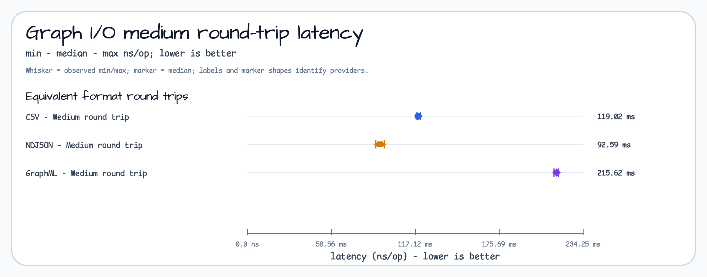
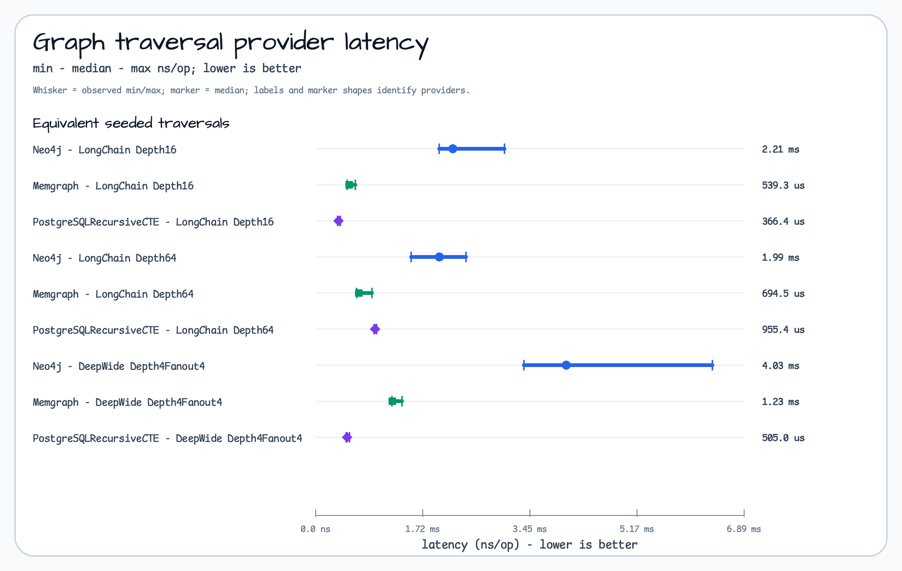

# Provider Benchmark Matrix for Issue 560

## Decision summary

This report compares only operations with matching semantics inside each family. It does not
produce a universal provider ranking. The measurements are a short local snapshot on the machine
recorded in [environment.md](outputs/issue-560/environment.md), from Git SHA
`ef3ef4f3070f516a3c75c2637f8e2bca231d9370`.

- Use local rows as API and implementation lower bounds, not as distributed-provider winners.
- Choose leader and rate-limit providers from operational requirements first; the measured
  latency shows the cost shape of this fixture, not production availability or durability.
- Preserve the cache boundary: L1 keeps reference objects, while L2 serialization and network
  work dominate remote paths.
- Choose graph I/O by interchange requirements before local round-trip latency.
- Keep PostgreSQL recursive CTE as a strong first-party traversal baseline; the snapshot does not
  justify adopting or rejecting a graph database universally.

All charts show observed min, median, and max `ns/op`. Lower is better. Allocation data and every
unselected row remain in the linked raw Go benchmark outputs.

## Reproduction and evidence

Run one family at a time:

```bash
scripts/capture-provider-benchmark.sh leader-local
scripts/capture-provider-benchmark.sh leader-containers
scripts/capture-provider-benchmark.sh leader-probes
scripts/capture-provider-benchmark.sh ratelimit-local
scripts/capture-provider-benchmark.sh ratelimit-containers
scripts/capture-provider-benchmark.sh cache-local
scripts/capture-provider-benchmark.sh cache-redis
scripts/capture-provider-benchmark.sh graphio
scripts/capture-provider-benchmark.sh graphdb
```

Each raw artifact records the exact `go test` command, timestamp, Git SHA, benchmark output, and
exit status. Container artifacts also record the provider-reported version and immutable image
reference. Failed development captures are retained separately with `-failed-` in their names and
are not report inputs.

## Leader election

### Workload and semantic boundary

The ranked rows time uncontended campaign, owned resignation, supported contention, leader lookup,
and lease-expiry takeover against disposable Redis, MongoDB, PostgreSQL, and etcd fixtures. The
chart selects uncontended campaign and lookup as ordinary operations and isolates expiry takeover
because its intentional lease wait is a different latency class. etcd contention is not ranked
because the deterministic same-process fixture cannot establish an equivalent multi-session
contention row.

- Local lower bound: [leader-local.txt](outputs/issue-560/leader-local.txt)
- Container commands and rows: [leader-containers.txt](outputs/issue-560/leader-containers.txt)
- Correctness/deadline probes: [leader-probes.txt](outputs/issue-560/leader-probes.txt)

Metric direction: lower `ns/op` is better for the same operation. Active-holder and renewal/deadline
probes are correctness evidence, not ranking inputs.

| Operation | Provider | Median | Observed min-max |
| --- | --- | ---: | ---: |
| Campaign uncontended | Redis | 230.5 us | 216.6-232.8 us |
| Campaign uncontended | MongoDB | 497.1 us | 461.9-512.7 us |
| Campaign uncontended | PostgreSQL | 1.44 ms | 1.33-1.59 ms |
| Campaign uncontended | etcd | 1.75 ms | 1.69-2.99 ms |
| Leader lookup | Redis | 195.9 us | 190.2-203.9 us |
| Leader lookup | MongoDB | 398.9 us | 368.9-531.4 us |
| Leader lookup | PostgreSQL | 666.4 us | 647.2-752.3 us |
| Leader lookup | etcd | 366.3 us | 299.7-426.2 us |
| Expiry takeover | Redis | 1.00 s | 1.00-1.00 s |
| Expiry takeover | MongoDB | 1.00 s | 1.00-1.00 s |
| Expiry takeover | PostgreSQL | 1.01 s | 1.01-1.01 s |
| Expiry takeover | etcd | 2.08 s | 2.06-2.09 s |



### Selection guidance

- Redis is suitable when the deployment already operates Redis and low local-network coordination
  latency matters more than adding another consensus system.
- MongoDB and PostgreSQL avoid a new provider when either database is already the operational
  authority; their different operation profiles should be evaluated against the application mix.
- etcd remains appropriate when its consensus and operational model are already required. This
  snapshot's expiry behavior includes provider semantics and polling/deadline behavior, not just a
  network round trip.

Not proven: failover availability, clock-skew tolerance, quorum loss, WAN behavior, renewal under
sustained load, or production fencing guarantees. Priority decision: keep the correctness probes
outside rankings and add multi-process/load evidence before changing a provider recommendation.

## Rate limiting

### Workload and semantic boundary

The provider rows compare the same single-key allow/reject decisions and the same eight-worker
parallel/distinct-key shapes for Redis and PostgreSQL. The local token bucket is only an API lower
bound and does not participate in the distributed ranking.

- Local lower bound: [ratelimit-local.txt](outputs/issue-560/ratelimit-local.txt)
- Container rows: [ratelimit-containers.txt](outputs/issue-560/ratelimit-containers.txt)

Metric direction: lower `ns/op` is better for an equivalent allow decision.

| Scenario | Redis median | PostgreSQL median |
| --- | ---: | ---: |
| Allow available | 194.3 us | 257.8 us |
| Allow rejected | 189.7 us | 215.8 us |
| Parallel, one key, N=8 | 389.2 us | 11.37 ms |
| Parallel, distinct keys, N=8 | 1.13 ms | 10.68 ms |



### Selection guidance

Redis had the lower median in this local snapshot, especially in the two eight-worker rows.
PostgreSQL remains a valid choice when transactional colocation and one operational datastore are
more important than this fixture's latency. The result is a profiling signal, not evidence that
the SQL contract is unsuitable.

Not proven: fairness under sustained arrival rates, multi-host lock contention, database pool
saturation, failover, cloud cost, or rate-limit accuracy during partitions. Follow-up issue draft:
profile the PostgreSQL parallel path with connection-pool telemetry and a controlled multi-client
arrival curve before making a high-contention recommendation.

## Cache

### Workload and semantic boundary

Local memory, Redis L2, tiered cache, and Pub/Sub near-cache rows preserve different boundaries.
L1 rows return reference objects without serialization. L2 and tiered-L2 rows include remote access
and serialization. Pub/Sub peer invalidation includes publication plus observed peer eviction.
RESP3 client tracking remains an experimental spike and is not the production near-cache row.

- Local memory and serialization baselines: [cache-local.txt](outputs/issue-560/cache-local.txt)
- Redis, tiered, and Pub/Sub near-cache rows: [cache-redis.txt](outputs/issue-560/cache-redis.txt)

Metric direction: lower `ns/op` is better only within the same cache-path semantics.

| Path, 128 B payload | Median | Observed min-max |
| --- | ---: | ---: |
| Memory get hit | 38.8 ns | 38.1-39.1 ns |
| Tiered L1 hit | 273.3 ns | 250.4-278.8 ns |
| Pub/Sub near-cache local hit | 278.7 ns | 243.0-319.2 ns |
| Redis L2 get hit | 191.6 us | 171.8-220.4 us |
| Tiered L2 hit | 177.2 us | 176.9-178.7 us |
| Pub/Sub peer invalidation observed | 273.0 us | 264.9-297.1 us |



### Selection guidance

- Use the memory cache for process-local reference semantics and the lowest hot-read overhead.
- Use tiered cache when a local reference-object L1 plus serialized Redis L2 matches the consistency
  model. Treat the two layers as different semantic and performance boundaries.
- Use the Pub/Sub near cache when peer invalidation is required and eventual invalidation semantics
  are acceptable. The production row is Pub/Sub, not the RESP3 spike.

Batch put is `N/A: no public bulk mutation contract`. Not proven: eviction under memory pressure,
subscriber loss/recovery, cluster failover, WAN invalidation lag, hot-key amplification, or a
production SLO.

## Graph I/O

### Workload and semantic boundary

CSV, NDJSON, and GraphML use the same generated graph shapes and separately time write, read,
round-trip, and record-construction baselines. The chart compares only the medium
`10000V-20000E-5P` round trip. It does not mix throughput, allocations, or construction baselines
into the latency axis.

- Exact command and all rows: [graphio.txt](outputs/issue-560/graphio.txt)

Metric direction: lower `ns/op` is better for the same graph shape and round-trip operation.

| Format | Median | Observed min-max |
| --- | ---: | ---: |
| CSV | 119.02 ms | 118.24-120.78 ms |
| NDJSON | 92.59 ms | 89.56-95.41 ms |
| GraphML | 215.62 ms | 213.82-216.90 ms |



### Selection guidance

NDJSON had the lowest medium round-trip median in this snapshot. CSV remains useful for simple
tabular interchange, while GraphML preserves a graph-oriented interchange contract. Choose the
format from interoperability and fidelity requirements before using this local latency ordering.

Graph-store construction is `N/A: no shared construction API`. Not proven: streaming backpressure,
compressed transport, malformed-input behavior at scale, disk I/O, cross-language compatibility,
or production dataset skew.

## Graph traversal providers

### Workload and semantic boundary

Neo4j, Memgraph, and PostgreSQL recursive CTE fixtures receive the same generated long-chain and
deep-wide shapes. Setup, seeding, version queries, and verification stay outside the timer. The
ranked operation is traversal only.

- Exact command and all rows: [graphdb.txt](outputs/issue-560/graphdb.txt)

Metric direction: lower `ns/op` is better for an equivalent seeded traversal.

| Shape | Neo4j median | Memgraph median | PostgreSQL CTE median |
| --- | ---: | ---: | ---: |
| Long chain, depth 16 | 2.21 ms | 539.3 us | 366.4 us |
| Long chain, depth 64 | 1.99 ms | 694.5 us | 955.4 us |
| Deep-wide, depth 4 fanout 4 | 4.03 ms | 1.23 ms | 505.0 us |



### Selection guidance

PostgreSQL recursive CTE had the lowest median for depth-16 and deep-wide rows; Memgraph had the
lowest median for depth 64. Neo4j was slower in these three local shapes. These results justify
keeping the relational baseline and measuring the application's real query mix; they do not prove
that a provider is universally better.

Not proven: Cypher feature breadth, transactional graph updates, index strategy, concurrent mixed
read/write load, cluster behavior, operational tooling, or production-scale datasets. Priority
decision: do not add a new graph provider from these rows alone; require workload-specific
capability and operational evidence.

## Global limitations

One local Docker snapshot does not establish production SLOs, cloud cost, WAN behavior, failure
recovery, or a universal winner. The immutable images and provider-reported versions make this
snapshot auditable, not timeless. Re-run the same commands on the deployment-relevant architecture
and preserve a new environment manifest before changing an operational recommendation.
