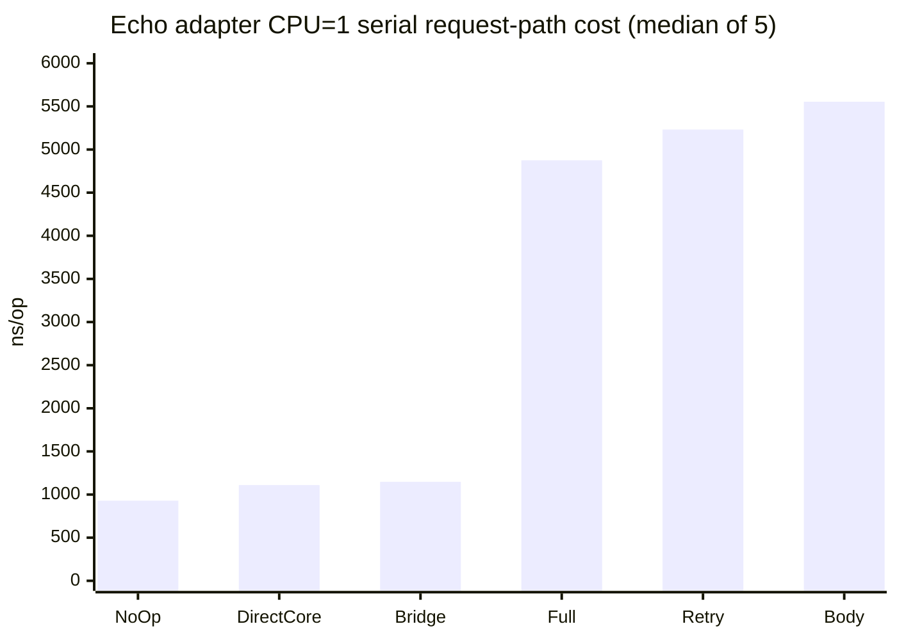

# Issue #544 Echo adapter request-path benchmark

## 실행 조건

- 실행일: 2026-08-16
- benchmark 코드 커밋: `da708a6a658319e9fd14959d03e518624f5ebcd9`
- raw 명령: `go test -run '^$' -bench '^BenchmarkEchoAdapter$' -benchtime=100ms -benchmem -count=5 -cpu=1 ./web/echo`
- 전체 확인 명령: `go test -run '^$' -bench '^BenchmarkEchoAdapter' -benchtime=100ms -benchmem -count=5 -cpu=1,2,4 ./web/echo`
- 전체 확인 결과: PASS, 58.694s
- 런타임: `go1.26.6 darwin/arm64`, macOS Darwin 25.6.0, Apple M5
- 원본: [`bench-output.txt`](bench-output.txt)

이 측정은 startup 시간이 아니라 Echo request-path에서 context extraction,
rate-limit, JWT, RFC 9457 response 경계, resilience hook 조합의 비용을 비교하는
local baseline이다. raw 명령은 CPU=1에서 5회 반복한 `Serial`/`Parallel` 결과를
보존하고, 전체 확인 명령은 CPU=1/2/4의 방향성을 추가로 확인한다. 서로 다른
호스트 간 회귀 판정이나 universal framework 선택에는 사용하지 않는다.

## 결과 요약

아래 표는 raw 명령의 CPU=1 `Serial` 5회 중앙값이다. `ns/op`, `B/op`,
`allocs/op`는 낮을수록 request-path 비용이 낮다.

| 시나리오 | ns/op | B/op | allocs/op | 측정 의미 |
| --- | ---: | ---: | ---: | --- |
| NoOp | 929.1 | 5,360 | 13 | HTTP handler 하한 |
| DirectCore | 1,110 | 5,840 | 18 | net/http core context 경로 |
| Bridge | 1,148 | 5,952 | 19 | Echo ↔ core context bridge |
| FullAdapter | 4,875 | 11,833 | 97 | context + rate-limit + JWT + resilience 성공 경로 |
| FullAdapterRetry | 5,232 | 12,385 | 106 | 첫 시도 실패 후 GET 재시도 |
| ReplayableBody | 5,554 | 13,553 | 114 | 첫 시도 실패 후 POST 본문 재생 |



## 해석과 사용 범위

- `Bridge`는 `DirectCore`보다 약 38 ns/op 높아 request context를 Echo
  middleware 경계로 옮기는 비용이 작게 관찰된다.
- `FullAdapter`는 인증·rate-limit·resilience·request context를 모두 실행하므로
  `NoOp`보다 약 3.9 µs 높다. 이는 기능 조합 비용의 baseline이지 결함 판정이 아니다.
- `FullAdapterRetry`는 첫 번째 GET 시도에서 의도적으로 transient error를 반환하고
  두 번째 시도에서 성공한다. `ReplayableBody`는 같은 실패 패턴을 POST 본문에
  적용하고 `GetBody`로 매 시도 본문이 복원되는지 검증한다.
- `ReplayableBody`의 추가 비용은 resilience request clone, 본문 read, 두 번째
  handler 실행을 포함한다. 본문 크기나 retry 횟수를 바꾼 threshold는 별도
  workload에서 정의해야 한다.
- CPU 1/2/4와 Serial/Parallel 행은 동시성 방향을 확인하는 참고값이며, CI
  threshold나 Gin과의 승패 비교는 동일 fixture·호스트·반복 수를 맞춘 별도
  benchmark matrix에서만 수행한다.

## 재현

```bash
go test -run '^$' -bench '^BenchmarkEchoAdapter$' \
  -benchtime=100ms -benchmem -count=5 -cpu=1 ./web/echo

go test -run '^$' -bench '^BenchmarkEchoAdapter' \
  -benchtime=100ms -benchmem -count=5 -cpu=1,2,4 ./web/echo
```
