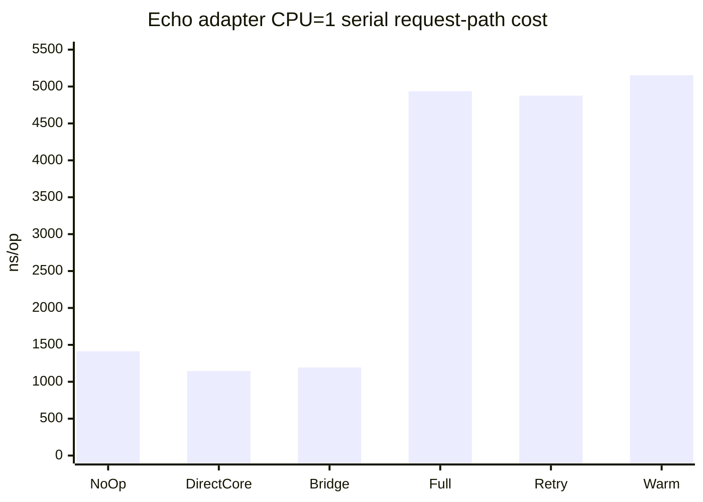

# Issue #544 Echo adapter request-path benchmark

## 실행 조건

- 실행일: 2026-08-16
- 커밋: `b417c6ab9da896cf534e7d428a512974c4fe2001`
- 명령: `go test -run '^$' -bench '^BenchmarkEchoAdapter($|WarmRequest$)' -benchtime=100ms -benchmem -count=1 -cpu=1,2,4 ./web/echo`
- 런타임: `go1.26.6 darwin/arm64`, macOS Darwin 25.6.0, Apple M5
- 원본: [`bench-output.txt`](bench-output.txt)

이 측정은 startup 시간이 아니라 Echo request-path에서 context extraction,
rate-limit, JWT, RFC 9457 response 경계, resilience hook 조합의 비용을 비교하는
local baseline이다. `-benchtime=100ms`, `-count=1`이므로 서로 다른 호스트 간
회귀 판정이나 universal framework 선택에 사용하지 않는다.

## 결과 요약

아래 표는 같은 실행의 `Serial`/`CPU=1` 행이다. `ns/op`, `B/op`, `allocs/op`는
낮을수록 request-path 비용이 낮다.

| 시나리오 | ns/op | B/op | allocs/op |
| --- | ---: | ---: | ---: |
| NoOp | 1,414 | 5,360 | 13 |
| DirectCore | 1,145 | 5,840 | 18 |
| Bridge | 1,193 | 5,952 | 19 |
| FullAdapter | 4,936 | 11,833 | 97 |
| FullAdapterRetry | 4,876 | 11,865 | 98 |
| WarmRequest | 5,152 | 11,833 | 97 |



## 해석과 사용 범위

- `Bridge`는 `DirectCore`보다 약 48 ns/op 높아 request context를 Echo
  middleware 경계로 옮기는 비용이 작게 관찰된다.
- `FullAdapter`는 인증·rate-limit·resilience·request context를 모두 실행하므로
  `NoOp`보다 약 3.5 µs 높다. 이는 기능 조합 비용의 baseline이지 결함 판정이 아니다.
- `FullAdapterRetry`는 성공한 첫 시도만 측정하므로 실제 재시도 비용을 의미하지
  않는다. 실패·재시도 횟수별 비용은 별도 resilience workload로 측정해야 한다.
- CPU 1/2/4와 Serial/Parallel 행은 동시성 방향을 확인하는 참고값이며, CI
  threshold나 Gin과의 승패 비교는 동일 fixture·호스트·반복 수를 맞춘 별도
  benchmark matrix에서만 수행한다.

## 재현

```bash
go test -run '^$' -bench '^BenchmarkEchoAdapter($|WarmRequest$)' \
  -benchtime=100ms -benchmem -count=1 -cpu=1,2,4 ./web/echo
```
