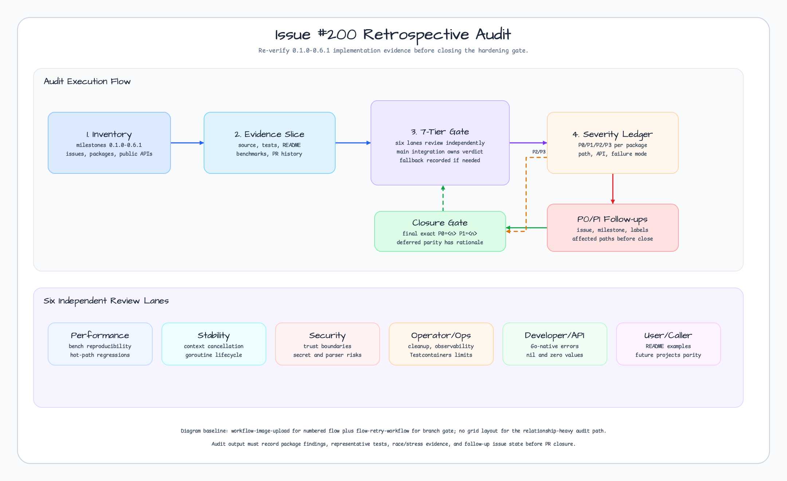

# Issue #200 Retrospective Audit Design

## Goal

Run a hard re-verification audit across completed and still-open work from
milestones `0.1.0` through `0.6.1`, under the stricter Superpowers and
bluetape4k review discipline. The output is an evidence-backed audit artifact,
not implementation fixes in the same branch.

The final audit must record package-by-package findings with P0/P1/P2/P3
severity and close with the exact gate line:

```text
P0=<n> P1=<n>
```

## Source Evidence

- GitHub issue: #200 `audit: Re-verify 0.1.0-0.6.1 implementation under superpowers discipline`
- Parent epic: #199 `0.6.2 Retrospective implementation hardening for completed milestones`
- Milestone: `0.6.2`
- Labels: `priority: p0`, `type: task`, `area: testing`, `area: docs`
- Baseline command:

```bash
go test -count=1 ./...
```

Baseline result on 2026-06-14:

```text
PASS: all packages, including Testcontainers-backed packages
```

## Brainstorming Summary

### Approach 1: Evidence-Led Audit Ledger

Build a source-derived inventory, map historical issues to packages, review each
package through six independent lanes, then integrate findings into one
severity ledger. File P0/P1 follow-up issues before closure and document P2/P3
deferment rationale.

Chosen because it matches #200 acceptance criteria and prevents the audit branch
from hiding behavior changes inside review work.

### Approach 2: Audit And Fix In One Branch

Review packages and immediately patch every finding.

Rejected because it blurs the audit gate. Large fixes would make P0/P1 counts,
follow-up issue state, and PR review harder to validate.

### Approach 3: Docs-Only Inventory

Create a package list and mark broad risks without code/test inspection.

Rejected because #200 explicitly requires source, tests, README, examples,
benchmarks, PR history, cancellation, race, cleanup, nil/error, and parity
checks.

## Chosen Approach

Use Approach 1.

The audit branch will create one primary artifact:

```text
docs/audits/2026-06-14-issue-200-retrospective-audit.md
```

The artifact must include:

- Milestone and issue inventory for `0.1.0` through `0.6.1`.
- Issue-to-package map for the issue list named in #200.
- Package-by-package review records.
- Six-lane findings: performance, stability, security, operator/Ops,
  developer/API, and user/caller.
- Main integration verdict.
- Representative validation commands and results.
- P0/P1 follow-up issue URLs when P0/P1 findings exist.
- Deferred parity gap rationale and target milestone.
- Final exact gate line `P0=<n> P1=<n>`.

## Decision Diagram



Diagram assets:

- Final assets:
  - `docs/images/readme-diagrams/issue-200-retrospective-audit-flow.svg`
  - `docs/images/readme-diagrams/issue-200-retrospective-audit-flow.png`
- Catalog baseline:
  - `workflow-image-upload` for numbered main flow plus lower support band.
  - `flow-retry-workflow` for branch-heavy severity and closure gates.
- Geometry gate:
  - `nodes=12 routes=7 segments=9`
  - `badEndpointAngle=0 badBends=0 interiorCrossings=0 nodeOverlaps=0 laneClearance=0`
  - `margins=L48/R48/T48/B48 titleGap=76`
- Visual gate:
  - Rendered PNG inspected.
  - Main flow, six review lanes, route labels, and footer notes have no visible overlap or text overflow.

## Audit Scope

The audit covers current implementation evidence across:

- `core`
- `collections`
- `serialization`
- `codec`
- `compression`
- `concurrency`
- `testing`
- `testing/concurrency`
- `leader`
- `leader/redis`
- `cache`
- `cache/rediscoord`
- `cache/redisnear`
- `lock/redis`
- `ratelimit`
- `ratelimit/redis`
- `resilience`
- `workflow`
- `state`
- `batch`
- `id`
- `jwt`
- `jwt/redis`
- `measure`
- `money`
- `probabilistic`
- `probabilistic/redis`
- `testcontainers/kafka`
- `testcontainers/mysql`
- `testcontainers/nats`
- `testcontainers/postgres`
- `testcontainers/redis`
- `workreport`

## Review Lanes

Every package record must use the same lane set:

| Lane | Required Checks |
|---|---|
| Performance | Benchmark surfaces, accidental allocation growth, hot-path regressions, and reproducible run notes. |
| Stability | `context.Context`, cancellation, deadline handling, cleanup, goroutine lifecycle, and stress-test coverage. |
| Security | Trust boundaries, JWT/key handling, parser input, Redis key ownership, secret exposure, and unsafe defaults. |
| Operator/Ops | Testcontainers cleanup, logs/metrics/runbook cues, resource limits, and reproducible CI commands. |
| Developer/API | Go-native API shape, docs on exported identifiers, sentinel/typed error behavior, nil and zero-value results. |
| User/Caller | README examples, Korean/English parity when public behavior changes, benchmark/chart clarity, and future projects parity. |

Main integration must synthesize those lanes into one package verdict.

## Severity Rules

| Severity | Meaning | Required Action |
|---|---|---|
| P0 | Security, correctness, data loss, race, leak, or API break that can harm normal use now. | File follow-up issue before #200 closes; milestone and labels required. |
| P1 | High-risk reliability, cancellation, cleanup, or documented contract gap with plausible user impact. | File follow-up issue before #200 closes; milestone and labels required. |
| P2 | Meaningful hardening, parity, docs, test, or benchmark gap that does not block closure. | Record rationale and target milestone. |
| P3 | Nice-to-have cleanup, docs polish, or future inspection note. | Record only if it helps future work. |

## Validation Requirements

The audit must record fresh evidence for:

```bash
go test -count=1 ./...
go test -race -count=1 ./...
make ci
git diff --check
```

The audit must also include targeted stress or race evidence for packages with
concurrency, lifecycle, shared-state, or cancellation behavior. The minimum
target set is:

```bash
go test -count=1 ./testing/concurrency ./concurrency
go test -race -count=1 ./cache/rediscoord ./cache/redisnear ./leader/redis ./lock/redis ./ratelimit/redis ./probabilistic/redis ./jwt ./jwt/redis
```

If a command is skipped, the audit artifact must record the reason and the
next-best check that was run.

## Out Of Scope

- Implementing fixes for findings inside #200.
- Closing P0/P1 findings without filed follow-up issues.
- Moving IMF or Bloomberg provider work into this audit.
- Rewriting public APIs unless a follow-up issue is created and separately approved.

## Step DoD

| Step | Action | Expected DoD |
|---|---|---|
| Step 2 | Write this spec with diagram and baseline evidence. | Spec committed with Step 2-R review and `P0=0 P1=0`. |
| Step 3 | Write implementation plan under `docs/superpowers/plans`. | Plan lists package slices, audit commands, artifact schema, and review gates. |
| Step 4 | Execute audit inventory and package review. | Audit artifact records findings and validation evidence. |
| Step 5 | File P0/P1 follow-up issues when needed. | Each P0/P1 has issue URL, milestone, labels, and affected paths. |
| Step 6 | Run 7-Tier code/artifact review. | Step 6-R review records six lanes plus main integration verdict. |
| Step 7 | Open PR and run PR gate. | PR body verified live with final `## DoD Status`; Step 7-R review passes. |
