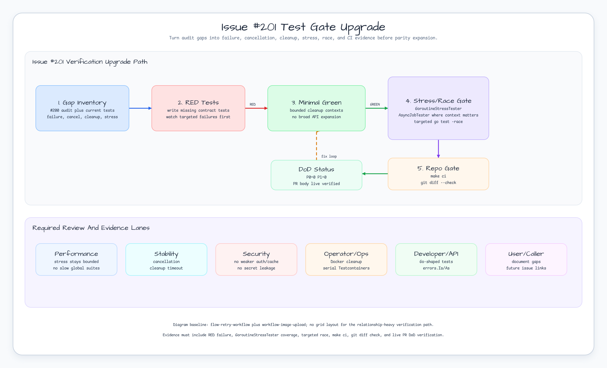

# Issue #201 Test Gate Upgrade Design

## Goal

Strengthen the verification gates requested by issue #201 before the remaining
`0.6.x` parity work expands more public surface. This branch turns the
retrospective audit's broad evidence into targeted tests and repeatable gates
for failure, cancellation, timeout, cleanup, stress, and race behavior.

## Source Evidence

- GitHub issue: #201 `test: Upgrade missing failure cancellation race and cleanup gates`
- Parent epic: #199 `0.6.2 Retrospective implementation hardening for completed milestones`
- Milestone: `0.6.2`
- Labels: `priority: p0`, `type: task`, `area: testing`, `area: concurrency`
- Baseline command on this worktree:

```bash
go test -count=1 ./...
```

Baseline result on 2026-06-14:

```text
PASS: all packages
```

## Brainstorming Summary

### Approach 1: Audit-Gap Test Gate Upgrade

Use #200's package audit as the source of truth, identify the narrow contracts
where explicit failure/cancellation/cleanup/stress tests still add signal, then
write RED tests first and make only the minimal production changes needed for
those tests to pass.

Chosen because #201 is a P0 test-hardening task, not a new feature task. It
also avoids re-opening every completed feature.

### Approach 2: Blanket Test Expansion Across Every Package

Add one or more new tests to every package listed in #201.

Rejected because #200 already proved many packages have targeted stress,
cancellation, and race evidence. A blanket pass would create noisy, low-signal
tests and slow CI without addressing the strongest remaining gap.

### Approach 3: Documentation-Only Gate Matrix

Record which packages already have tests and file follow-up issues for the
rest, without changing tests or code.

Rejected because #201 explicitly asks to upgrade missing failure,
cancellation, race, and cleanup gates. A docs-only matrix belongs in #202, not
this P0 test-hardening issue.

## Chosen Approach

Use Approach 1.

The implementation will focus on contracts where current evidence points to a
meaningful gap:

1. Testcontainers helper cleanup currently terminates containers with
   unbounded `context.Background()` inside `t.Cleanup`. Add a small first-party
   cleanup helper with bounded timeout, then cover it with unit tests that do
   not require Docker.
2. Keep Testcontainers-backed integration tests serial and unchanged in scope,
   but update each helper to use the bounded cleanup helper.
3. Re-check `testing/concurrency` helper semantics with explicit RED tests
   where behavior is currently implicit: invalid options, nil tasks,
   caller-cancelled runs, timeout collection, and bounded max concurrency.
4. Add package-level review evidence that existing runtime packages already use
   `GoroutineStressTester` or `AsyncJobTester`, rather than duplicating weak
   tests everywhere.

## Decision Diagram



Diagram assets:

- Generator: `scripts/generate-issue-201-test-gates-diagram.mjs`
- Final assets:
  - `docs/images/readme-diagrams/issue-201-test-gates-flow.svg`
  - `docs/images/readme-diagrams/issue-201-test-gates-flow.png`
- Graphviz evidence:
  - `docs/images/readme-diagrams/issue-201-test-gates-flow.dot`
  - `docs/images/readme-diagrams/issue-201-test-gates-flow.plain`
  - `docs/images/readme-diagrams/issue-201-test-gates-flow-graphviz.svg`
  - `docs/images/readme-diagrams/issue-201-test-gates-flow-graphviz.png`
- Catalog baseline:
  - `workflow-image-upload` for the numbered execution flow.
  - `flow-retry-workflow` for the RED/GREEN/fix-loop gate.
- Geometry gate:
  - `nodes=12 routes=6 segments=7`
  - `badEndpointAngle=0 badBends=0 interiorCrossings=0 nodeOverlaps=0 laneClearance=0`
  - `margins=L48/R48/T48/B48 titleGap=78`

## Scope

In scope:

- `testing/concurrency`
- `testcontainers/kafka`
- `testcontainers/mysql`
- `testcontainers/nats`
- `testcontainers/postgres`
- `testcontainers/redis`
- A tracked review artifact under `docs/superpowers/reviews`
- A lesson under `docs/lessons`

Out of scope:

- IMF or Bloomberg providers.
- README parity for `batch`, `probabilistic/redis`, or `jwt/redis`; those are
  user-facing/docs gaps better handled by #202 or a follow-up docs task.
- Broad public API changes or package rewrites.
- Adding new dependencies.

## Test Strategy

Use TDD for behavior changes:

1. Write failing tests for the new Testcontainers bounded cleanup helper.
2. Write failing tests for any missing `testing/concurrency` option and
   cancellation edge that is not already directly covered.
3. Implement the minimal code needed to pass.
4. Run targeted package tests.
5. Run targeted race tests for `testing/concurrency` and affected packages.
6. Run `make ci` and `git diff --check`.

Required commands:

```bash
go test -count=1 ./testing/concurrency
go test -race -count=1 ./testing/concurrency
go test -count=1 ./testcontainers/kafka ./testcontainers/mysql ./testcontainers/nats ./testcontainers/postgres ./testcontainers/redis
go test -count=1 ./...
go test -race -count=1 ./...
make ci
git diff --check
```

The plan may narrow targeted commands during RED/GREEN cycles, but the final
verification must include the broader gates unless an environment blocker is
recorded precisely.

## 7-Tier Review Contract

Steps 2-R, 3-R, 6-R, and 7-R use the same shape:

- Performance lane: test runtime stays bounded; no new slow global Docker loop.
- Stability lane: cancellation, timeout, cleanup, race, and goroutine lifecycle.
- Security lane: no weaker JWT/cache/security contract and no secret leakage.
- Operator/Ops lane: Docker/Testcontainers cleanup and serial execution.
- Developer/API lane: Go-shaped APIs, typed errors, and focused helper surface.
- User/Caller lane: issue acceptance criteria and future milestone usability.
- Main integration review: synthesize all six lanes and record `P0=<n> P1=<n>`.

Native subagents are preferred when stable. If they stall in this session, the
main session must role-switch through the six lanes, record the fallback, and
continue without long blocking waits.

## Step DoD

| Step | Action | Expected DoD |
|---|---|---|
| Step 2 | Write this spec with diagram and baseline evidence. | Spec and diagram assets exist; Step 2-R records `P0=0 P1=0`. |
| Step 3 | Write implementation plan under `docs/superpowers/plans`. | Plan lists exact files, RED/GREEN steps, commands, and review gates. |
| Step 4 | Implement via TDD. | RED failures observed before production changes; targeted tests pass. |
| Step 5 | Run verification gates. | Targeted tests, race gates, `make ci`, and `git diff --check` recorded. |
| Step 6 | Run 7-Tier code review. | Six lanes plus main integration verdict; `P0=0 P1=0`. |
| Step 7 | Lessons, commit, PR, and PR review. | PR body verified live with final `## DoD Status`; Step 7-R passes. |
