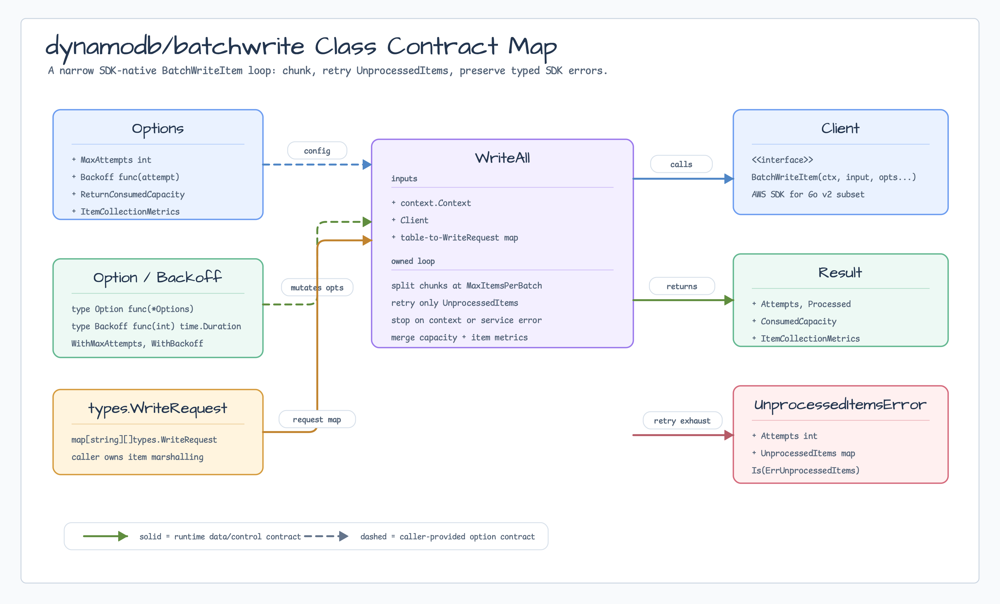
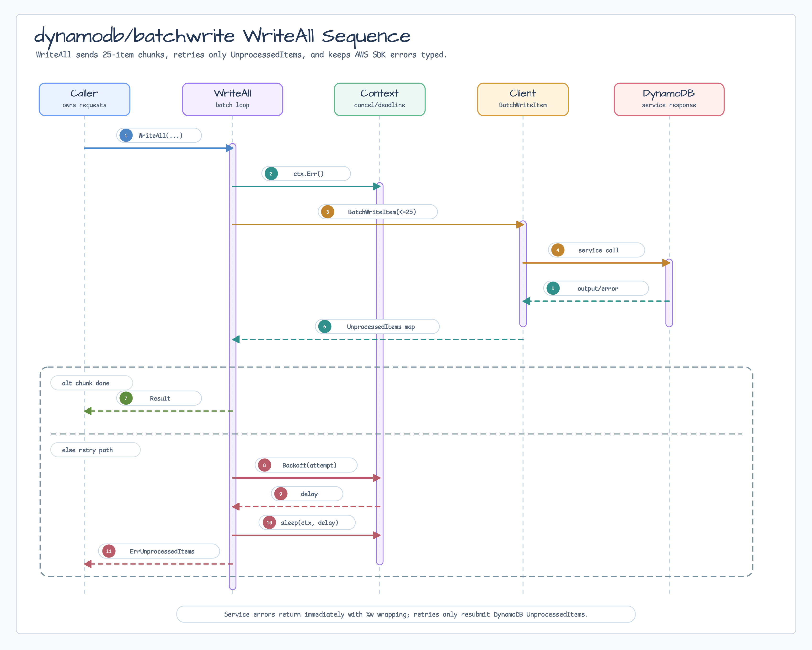

# dynamodb/batchwrite

[English](README.md) | [한국어](README.ko.md)

`dynamodb/batchwrite`는 AWS SDK for Go v2 `BatchWriteItem` loop만 좁게
담당하는 helper입니다. caller는 SDK-native `types.WriteRequest` map을 그대로
사용하고, 이 package는 DynamoDB 운영 계약만 처리합니다:

- write를 25개 단위 request로 나눕니다.
- DynamoDB가 반환한 `UnprocessedItems`를 재시도합니다.
- caller `context.Context` cancellation/deadline을 존중합니다.
- AWS SDK service error는 typed error가 유지되도록 반환합니다.

Repository abstraction, mapper, transaction layer, DAX wrapper, 범용 DynamoDB
client facade가 아닙니다.

## Diagrams





## 사용

```go
ctx, cancel := context.WithTimeout(context.Background(), 30*time.Second)
defer cancel()
client := dynamodb.NewFromConfig(cfg)

items := map[string][]types.WriteRequest{
    "orders": {
        {
            PutRequest: &types.PutRequest{
                Item: map[string]types.AttributeValue{
                    "id":     &types.AttributeValueMemberS{Value: "order-1"},
                    "status": &types.AttributeValueMemberS{Value: "created"},
                },
            },
        },
    },
}

result, err := batchwrite.WriteAll(ctx, client, items,
    batchwrite.WithMaxAttempts(5),
    batchwrite.WithBackoff(func(attempt int) time.Duration {
        return time.Duration(attempt) * 100 * time.Millisecond
    }),
)
```

`WriteAll`을 호출하기 전에 AWS SDK `attributevalue` package나 명시적인
`types.AttributeValue` 값으로 item을 구성하세요. Conditional write와 optimistic
locking은 일반 DynamoDB `PutItem`, `UpdateItem`, transaction API를 사용합니다.
`BatchWriteItem`은 item별 condition을 지원하지 않습니다.

## Error

- `ErrNilClient`: DynamoDB client가 없습니다.
- `ErrEmptyRequestItems`: write request가 없습니다.
- `ErrInvalidMaxAttempts`: retry attempt가 0 이하입니다.
- `ErrUnprocessedItems`: retry를 모두 사용했지만 DynamoDB가 여전히
  `UnprocessedItems`를 반환했습니다.

Service error는 `%w`로 attempt context를 붙여 반환하므로 caller는 AWS SDK typed
error에 대해 `errors.As`를 계속 사용할 수 있습니다.

## Smoke Test

Floci smoke test는 Docker가 필요하므로 opt-in입니다:

```bash
BLUETAPE_DYNAMODB_BATCHWRITE_SMOKE=1 go test -p 1 -count=1 ./dynamodb/batchwrite
```
