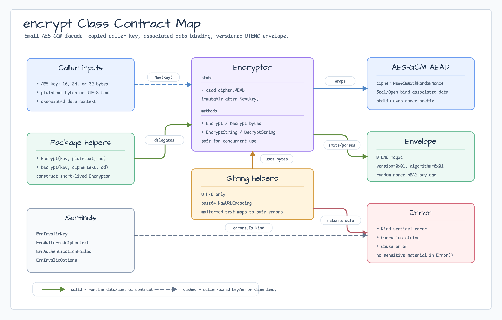
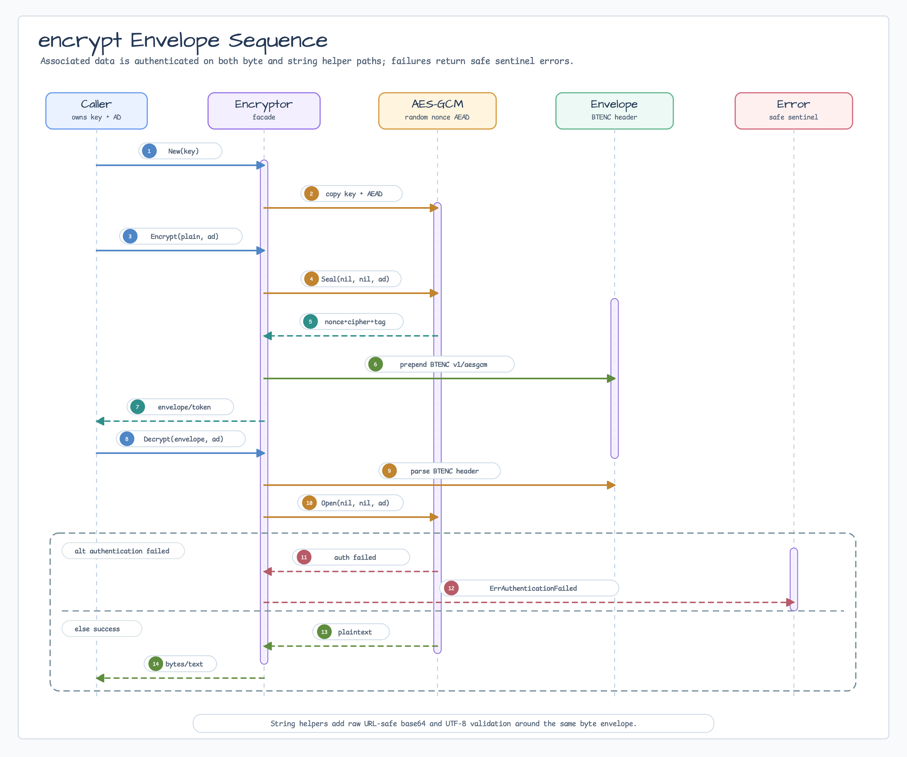

# encrypt

[English](README.md) | [한국어](README.ko.md)

`encrypt`는 local service data를 위한 작은 standard-library AES-GCM facade입니다.
Random 96-bit nonce와 16-byte authentication tag를 사용하고 ciphertext를
versioned envelope로 감쌉니다.

## Diagrams






## 가져오기

```go
import "github.com/bluetape4k/bluetape-go/encrypt"
```

## 사용 예

```go
key := loadPersistedAESKey()
ad := []byte("tenant=blue:entity=invoice:column=payload")

ciphertext, err := encrypt.Encrypt(key, []byte("secret payload"), ad)
if err != nil {
    return err
}

plaintext, err := encrypt.Decrypt(key, ciphertext, ad)
```

UTF-8 text에는 URL-safe raw base64를 반환하는 string helper를 사용합니다.

```go
encryptor, err := encrypt.New(key)
if err != nil {
    return err
}

token, err := encryptor.EncryptString("secret text", ad)
text, err := encryptor.DecryptString(token, ad)
```

String helper는 invalid UTF-8을 거부합니다. 임의의 binary payload에는 byte helper를
사용하십시오.

Provider 조합

`Encryptor.EncryptDetached`와 `DecryptDetached`는 nonce를 outer envelope에 저장하는
provider를 위한 low-level 조합 surface입니다. 두 method는 12-byte nonce와 AES-GCM sealed
bytes(plaintext와 16-byte tag 포함)를 분리해서 주고받습니다. 일반 caller는 계속
`Encrypt`와 `Decrypt`를 사용하십시오. 이 facade는
`BTENC | version | algorithm | nonce | ciphertext+tag` wire layout을 유지합니다.

## Key material

- Key는 AES-128, AES-192, AES-256 material인 16, 24, 32 byte여야 합니다.
- Key 생성, 저장, 회전, 백업, 접근 제어는 caller 책임입니다.
- 재시작 후에도 읽어야 하거나 다른 process가 읽어야 하는 ciphertext에 대해
  fresh process-local key를 생성하지 마십시오.
- `New`는 encryptor를 만들기 전에 key를 복사합니다. Caller slice를 보관하지
  않습니다.

## Associated data

Associated data는 암호화하지 않는 context를 ciphertext에 묶습니다. Tenant, entity,
column, message type, protocol version 같은 안정적인 값을 사용하십시오. 복호화에는
동일한 associated data가 필요하며, 다른 값은 `ErrAuthenticationFailed`를 반환합니다.

## SQL 컬럼 연동

`sqlkit.NewEncryptedBytesColumn`은 바이너리 `BTENC` envelope를 BYTEA/BLOB
컬럼에 저장합니다. `sqlkit.NewEncryptedStringColumn`은 같은 envelope를 패딩 없는
URL-safe base64로 바꿔 TEXT/VARCHAR 컬럼에 저장합니다. 두 constructor 모두
associated data를 복사합니다.

Tenant, entity, column, protocol version처럼 안정적인 associated data를 사용하면
암호문을 다른 context로 옮겼을 때 인증이 실패합니다. Key 저장, 접근 제어, 회전,
회전 후 기존 row를 복호화하는 방법은 caller가 계속 소유합니다.

Random nonce를 사용하므로 ciphertext를 equality, ordering, filtering query에 사용할
수 없습니다. 검색이 실제 요구사항이면 별도의 blind-index 설계를 검토해야 합니다.
Nonce를 고정해서 해결하면 안 됩니다. Cloud KMS와 envelope encryption은 별도
provider가 담당합니다.

## Envelope

Byte ciphertext는 다음 envelope를 사용합니다.

```text
BTENC | version=0x01 | algorithm=0x01 | random-nonce AES-GCM ciphertext
```

AES-GCM payload는 `cipher.NewGCM`으로 만들고 `crypto/rand.Reader`에서 random 96-bit nonce를
생성합니다. 16-byte authentication tag도 추가되므로 `BTENC` facade는 plaintext 길이에
nonce와 tag를 합친 28 byte overhead를 더합니다. 기존 `BTENC` bytes도 계속 읽을 수 있습니다.

String ciphertext는 같은 byte envelope를 raw URL-safe base64로 인코딩한 값입니다.

## Errors

Error는 다음 sentinel에 대해 `errors.Is`를 지원합니다.

- `ErrInvalidKey`
- `ErrMalformedCiphertext`
- `ErrAuthenticationFailed`
- `ErrInvalidOptions`

Error string은 log에 남겨도 안전하며 plaintext, ciphertext, key byte, associated
data를 포함하지 않습니다.

## 경계

이 package는 local byte/string authenticated encryption에 사용합니다. 다음 문제는
다른 도구를 사용하십시오.

- Direct stdlib: caller가 lower-level AEAD contract와 nonce/envelope 호환성을 모두
  직접 소유해야 할 때.
- Tink: keyset, registry-managed primitive, deterministic AEAD가 핵심 요구사항일 때.
- age: recipient 또는 password-derived identity 기반 file/stream encryption.
- KMS/envelope encryption: data key, encryption context, cloud policy, audit, retry
  동작이 cloud adapter 책임일 때.
- Password hashing: reversible encryption이 아니라 password-hashing package를
  사용해야 합니다.
- MAC/digest: plaintext 비밀성이 필요 없고 integrity-only primitive가 필요할 때.
- JWT: signed token과 key rotation은 `jwt` package를 사용합니다.

## 테스트

```bash
go test -count=1 ./encrypt
go test -race -count=1 ./encrypt
```
