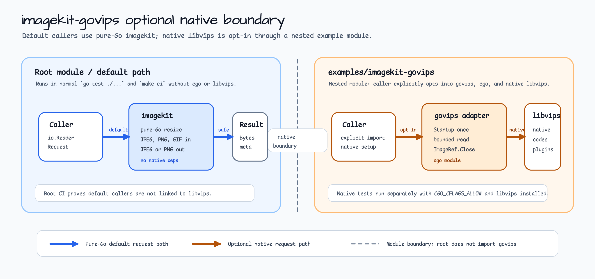

# imagekit-govips

`imagekit-govips` is an optional example module for using
`github.com/davidbyttow/govips/v2` with bluetape-go `imagekit` request and
result types.

It is intentionally a nested module. The root `github.com/bluetape4k/bluetape-go`
module and the default `imagekit` package remain pure Go and do not require
native libvips.



## Requirements

- libvips 8.14 or newer
- C compiler and `pkg-config`
- cgo enabled

macOS:

```bash
brew install vips pkg-config
```

Some macOS/Homebrew setups require:

```bash
export CGO_CFLAGS_ALLOW='-Xpreprocessor'
```

## Scope

- Input: JPEG, PNG, and GIF metadata paths that match the pure-Go `imagekit`
  allowlist.
- Output: JPEG and PNG.
- Modes: fit, fill, and exact.
- Lifecycle: `Startup` runs once; each native image handle is closed after
  export.
- Cancellation: context is checked before bounded read, after bounded read,
  before native work, and before writing output. libvips calls cannot be
  preempted once started.

Advanced codecs such as AVIF, HEIC, TIFF, WebP, and JXL are not documented as
supported by this example. Native libvips builds differ by host and codec
plugins, so callers must prove those codecs separately before claiming support.

## Usage

```go
result, err := imagekitgovips.Transform(ctx, reader, imagekit.Request{
	Width:        320,
	Height:       180,
	Mode:         imagekit.ModeFill,
	OutputFormat: imagekit.OutputJPEG,
	JPEGQuality:  85,
})
```

Use `RuntimeInfo` at startup or diagnostics time to record the detected libvips
and govips versions.

## Validation

```bash
CGO_CFLAGS_ALLOW='-Xpreprocessor' go test ./...
CGO_CFLAGS_ALLOW='-Xpreprocessor' go test -race ./...
CGO_CFLAGS_ALLOW='-Xpreprocessor' go test -run '^$' -bench . -benchmem ./...
```

The root module validation remains:

```bash
cd ../..
go test ./...
```
