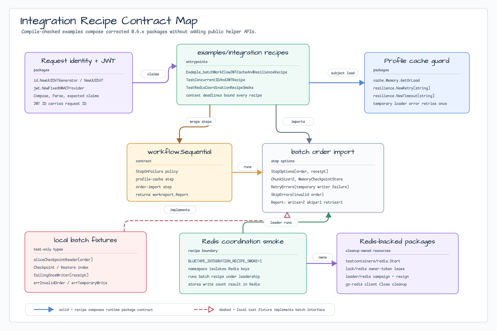
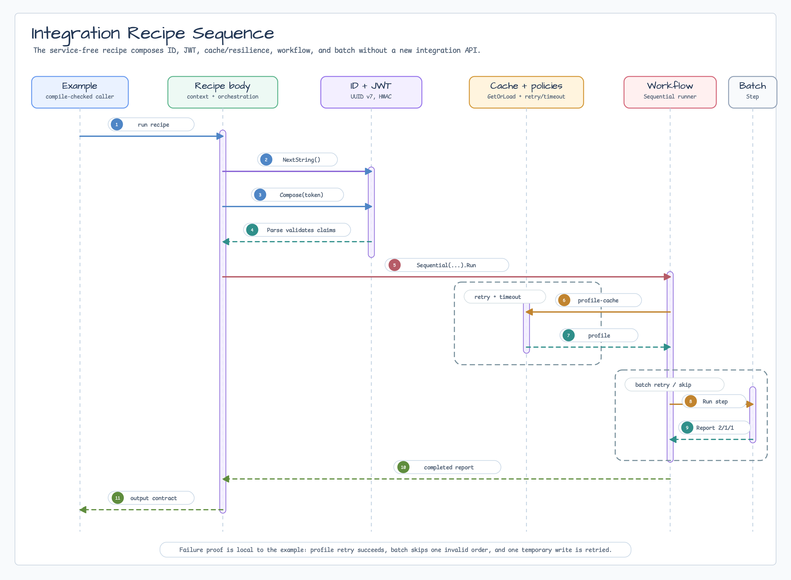

# Integration Recipes

[English](README.md) | [한국어](README.ko.md)

이 package는 수정된 `0.6.x` package를 application에 가까운 흐름으로 묶는
compile-checked recipe를 담습니다. Cross-package 사용법을 문서화하되 public helper
API로 굳히지 않기 위해 `examples/` 아래에 둡니다.

## Recipe

- `Example_batchWorkflowJWTCacheAndResilienceRecipe`는 request ID를 만들고,
  JWT를 sign/parse한 뒤, retry/timeout policy로 보호되는 `cache.Memory` profile
  loader를 실행하고, checkpoint 기반 batch import를 `workflow.Sequential` runner에
  연결합니다.
- `TestConcurrentIDAndJWTRecipe`는 여러 goroutine에서 UUID v7 생성과 JWT
  compose/parse를 검증합니다.
- `TestRedisCoordinationRecipeSmoke`는 `testcontainers/redis`로 Redis를 띄우고,
  Redis owner-token lock과 Redis-backed leadership을 얻은 뒤 batch recipe를
  실행하고 결과를 Redis에 저장합니다.

## Failure Path

Batch recipe는 임시 writer 실패로 retry count를 검증하고 invalid input item으로
skip count를 검증합니다. Reader는 checkpoint capture/restore를 구현하므로 실제
job에서는 step 계약을 바꾸지 않고 checkpoint store만 Redis, Postgres, 다른
durable owner로 교체할 수 있습니다.

Profile loader는 retry와 timeout policy를 함께 씁니다. Production caller는 parent
`context.Context` deadline을 request budget보다 좁게 잡고, policy event hook을
metrics나 log로 연결하는 것이 좋습니다.

## Diagram



Contract map은 이 package가 compile-checked recipe harness임을 보여줍니다.
기존 package 계약을 조합하고, local reader/writer fixture는 test-only로 둡니다.



Sequence는 service-free recipe가 request ID와 JWT 처리에서 cache/resilience,
workflow 실행, batch report 계약까지 이어지는 순서를 보여줍니다.

## Cleanup and Timeout

각 recipe는 명시적인 timeout context를 만듭니다. Redis smoke test는 Redis client,
Redis lock lease, leadership lease, Testcontainers-managed container cleanup을
등록합니다. Docker resource나 port가 공유되는 Testcontainers-backed package는
직렬로 실행하세요.

## Test

Service-free recipe를 compile-check하고 실행합니다.

```bash
go test -count=1 ./examples/integration
```

Docker-backed Redis coordination smoke test를 실행합니다.

```bash
BLUETAPE_INTEGRATION_RECIPE_SMOKE=1 go test -p 1 -count=1 ./examples/integration
```

Concurrency recipe를 race detector로 확인합니다.

```bash
go test -race -count=1 ./examples/integration
```

## Related Packages

- [`batch`](../../batch/README.ko.md)
- [`cache`](../../cache/README.ko.md)
- [`id`](../../id/README.ko.md)
- [`jwt`](../../jwt/README.ko.md)
- [`leader/redis`](../../leader/redis/README.ko.md)
- [`lock/redis`](../../lock/redis/README.ko.md)
- [`resilience`](../../resilience/README.ko.md)
- [`testcontainers/redis`](../../testcontainers/redis/README.ko.md)
- [`workflow`](../../workflow/README.ko.md)
