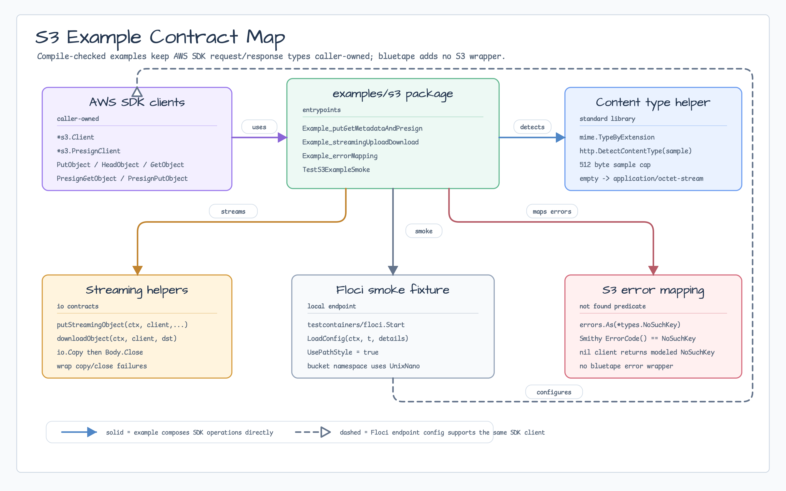
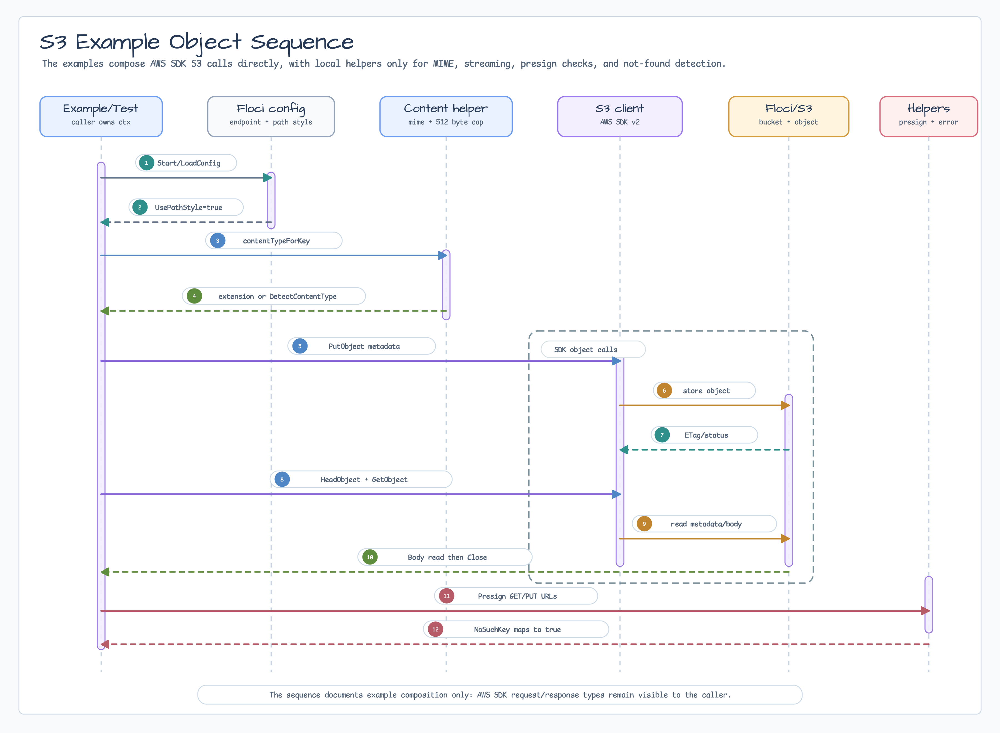

# S3 Examples

[English](README.md) | [한국어](README.ko.md)

This package contains compile-checked S3 examples for AWS SDK for Go v2 and the
`testcontainers/floci` fixture. It intentionally does not provide a bluetape S3
client wrapper. The examples keep `*s3.Client` and `*s3.PresignClient`
caller-owned so application code can use AWS SDK request and response types
directly.

## Scope

- `PutObject` and `GetObject`
- object metadata and content type
- streaming upload and streaming download with `io.Reader` / `io.Writer`
- presigned GET and PUT URLs
- S3 error mapping with modeled errors and Smithy API error codes
- local Floci endpoint configuration with path-style S3 addressing

KMS and client-side encryption are out of scope for this package. Add a focused
KMS/encryption issue only when a concrete Go consumer needs envelope encryption,
key policy, or metadata compatibility.

## Diagram



The contract map shows that the examples keep AWS SDK clients caller-owned and
only document helper boundaries for content type detection, streaming, Floci
local endpoints, and error mapping.



The sequence follows the smoke/example flow from local endpoint configuration
through upload, metadata verification, download, presigned URLs, and modeled
not-found handling.

## Local Endpoint

Floci and other local S3-compatible endpoints need path-style addressing:

```go
client := s3.NewFromConfig(cfg, func(options *s3.Options) {
    options.UsePathStyle = true
})
```

For real AWS S3, omit the local endpoint override and only set options required
by the application.

## Content Type

The examples use standard-library content type handling instead of a bluetape
helper:

1. `mime.TypeByExtension` when the object key has a known extension.
2. `http.DetectContentType` from a payload sample when the extension is absent
   or unknown.

## Test

Compile-check the examples:

```bash
go test -count=1 ./examples/s3
```

Run the Docker-backed Floci smoke test:

```bash
BLUETAPE_S3_EXAMPLE_SMOKE=1 go test -p 1 -count=1 ./examples/s3
```

Run Testcontainers-backed packages serially when Docker resources are shared.
