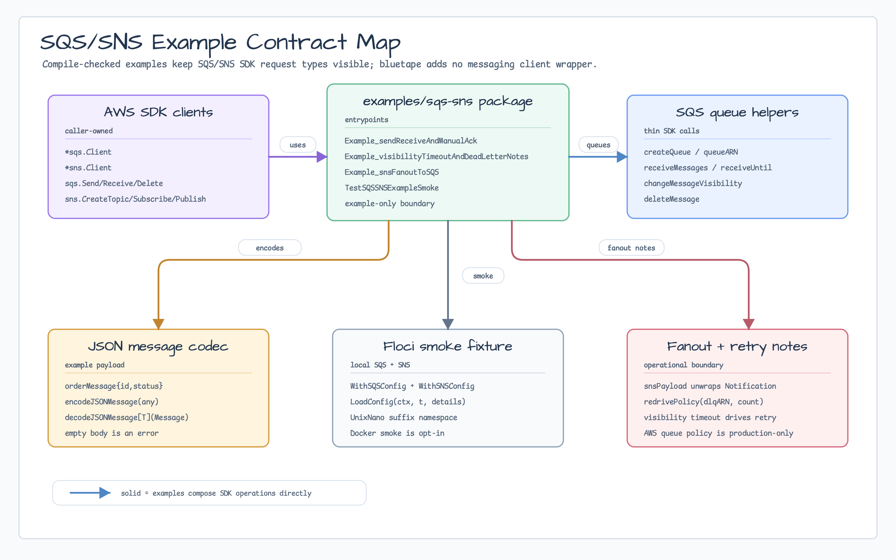
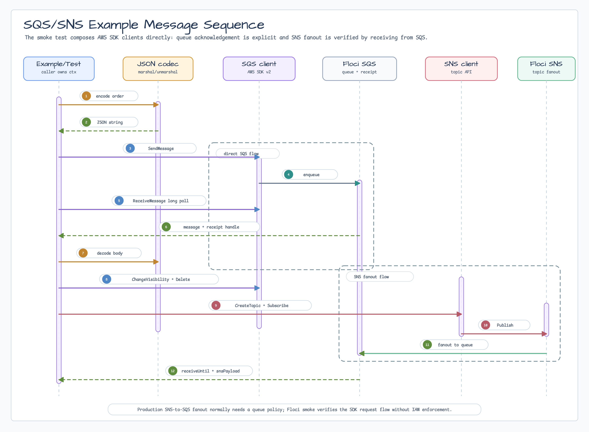

# SQS/SNS 예제

[English](README.md) | [한국어](README.ko.md)

이 패키지는 AWS SDK for Go v2와 `testcontainers/floci` fixture를 사용하는
compile-checked SQS/SNS 예제입니다. bluetape SQS/SNS client wrapper를 제공하지
않습니다. 예제는 `*sqs.Client`와 `*sns.Client`를 caller-owned로 유지해서
애플리케이션 코드가 AWS SDK request/response type을 직접 쓰게 합니다.

## 범위

- SQS `SendMessage`
- long polling 기반 SQS `ReceiveMessage`
- `DeleteMessage`를 통한 manual acknowledgement
- visibility timeout과 `ChangeMessageVisibility`
- retry와 dead-letter queue 설정 메모
- SNS topic publish와 SQS fanout
- 예제용 작은 JSON message codec pattern
- `testcontainers/floci` 기반 local endpoint 설정

## 경계

SQS와 SNS는 이 패키지에서 example-only로 유지합니다. 직접 AWS SDK request type이
잘 표현하지 못하는 Go-specific 반복 boilerplate가 follow-up issue에서 입증될 때만
bluetape helper를 추가합니다.

실제 AWS에서 SNS -> SQS fanout을 쓰려면 보통 topic ARN이 `sqs:SendMessage`를
호출할 수 있도록 SQS queue policy도 붙여야 합니다. Floci smoke test는 IAM policy
enforcement를 요구하지 않지만, production code는 queue를 subscribe하기 전에 queue
policy를 설정해야 합니다.

## Diagram



Contract map은 example-only 경계를 보여줍니다. SQS/SNS client는 caller-owned로
유지하고, local helper는 JSON payload, queue 호출, Floci smoke setup, fanout payload
unwrap, retry/dead-letter note만 담당합니다.



Sequence는 JSON encoding에서 SQS send, long-poll receive,
visibility/delete acknowledgement, SNS publish, SQS fanout receive,
`snsPayload` unwrap까지 이어지는 smoke 흐름을 보여줍니다.

## Retry와 Dead Letter 메모

SQS retry는 receive count 기반입니다. 메시지를 receive한 뒤 delete하지 않으면
visibility timeout 이후 다시 visible해집니다. Dead-letter queue는 `RedrivePolicy`
queue attribute로 설정하고, handler retry는 `context.Context` deadline으로 bounded
하게 유지합니다.

## 테스트

예제를 compile-check합니다:

```bash
go test -count=1 ./examples/sqs-sns
```

Docker-backed Floci smoke test를 실행합니다:

```bash
BLUETAPE_SQS_SNS_EXAMPLE_SMOKE=1 go test -p 1 -count=1 ./examples/sqs-sns
```

Docker resource를 공유하는 Testcontainers-backed package는 serial로 실행합니다.
