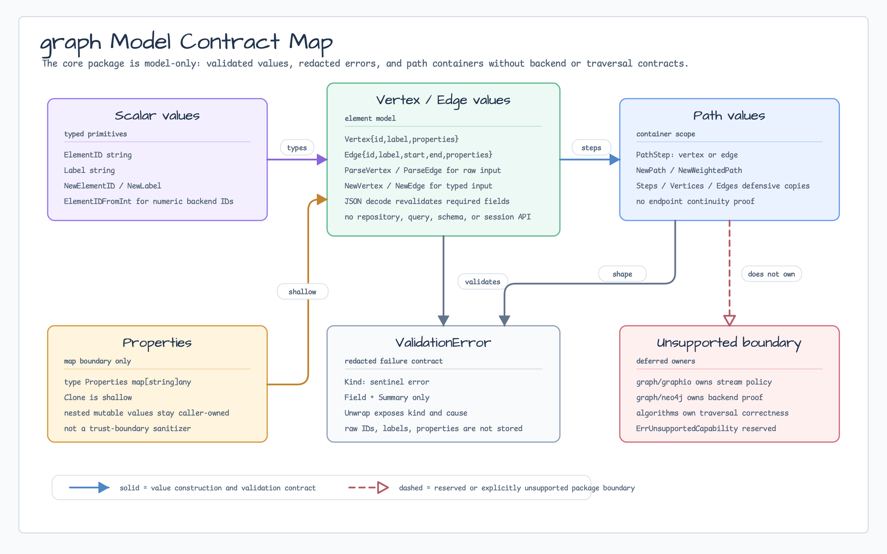
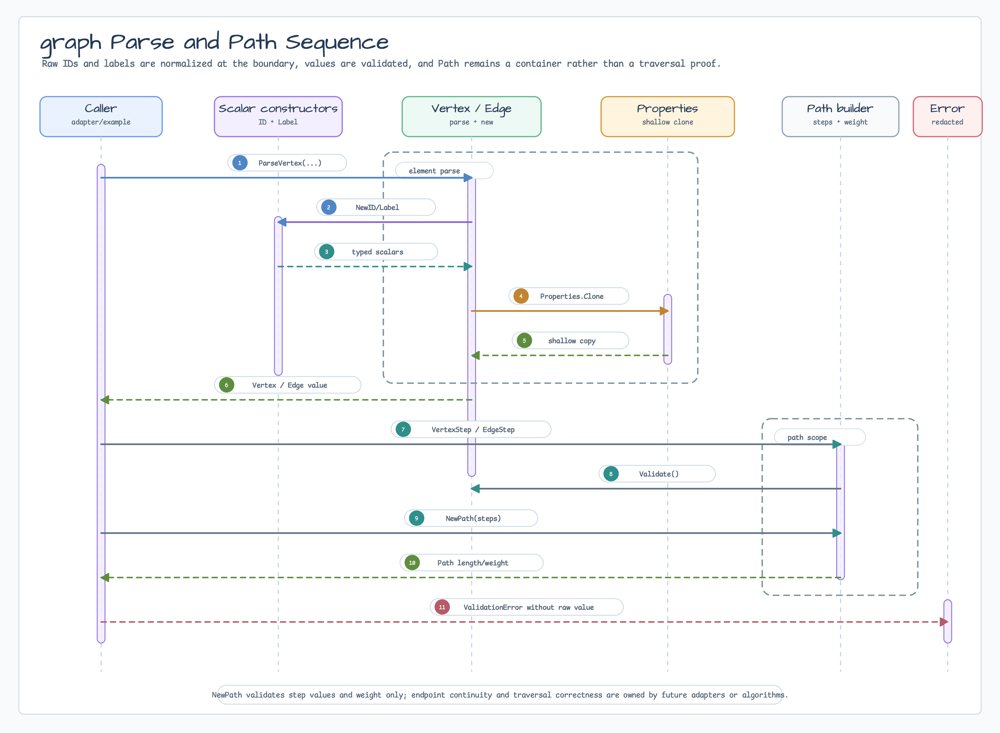

# graph

[English](README.md) | [한국어](README.ko.md)

Model-only graph values for bluetape-go I/O helpers and examples.

This package is intentionally small. It provides validated vertex, edge, path,
label, ID, and property values without introducing a graph database client,
repository, session, transaction, schema DSL, query DSL, algorithm engine, or
backend adapter.

## Import

```go
import "github.com/bluetape4k/bluetape-go/graph"
```

## Usage

```go
vertex, err := graph.ParseVertex("person-1", "Person", graph.Properties{
	"name": "Alice",
})
if err != nil {
	return err
}

edge, err := graph.ParseEdge(
	"edge-1",
	"KNOWS",
	graph.RawEdgeEndpoints{Start: "person-1", End: "person-2"},
	nil,
)
if err != nil {
	return err
}

vertexStep, err := graph.VertexStep(vertex)
if err != nil {
	return err
}
edgeStep, err := graph.EdgeStep(edge)
if err != nil {
	return err
}
path, err := graph.NewPath(vertexStep, edgeStep)
if err != nil {
	return err
}
```

Use `NewElementID` or `ParseVertex`/`ParseEdge` for caller or backend input.
`MustElementID` is only for constants and static test fixtures.

## Diagram



The contract map shows the model-only boundary: scalar IDs and labels feed
validated vertex/edge values, properties are shallow-copied, path values stay
containers, and backend, I/O, query, schema, and traversal responsibilities are
outside this package.



The sequence follows raw input through scalar construction, vertex/edge
creation, property cloning, path-step construction, `NewPath`, and redacted
`ValidationError` reporting.

## Validation Errors

```go
_, err := graph.ParseVertex("", "Person", nil)
if errors.Is(err, graph.ErrInvalidElementID) {
	// caller input used a blank ID
}

var validation *graph.ValidationError
if errors.As(err, &validation) {
	// Field and Summary are redacted and do not retain raw values.
}
```

`ValidationError` exposes only typed error category, field name, redacted
summary, and cause. It does not retain raw property values, raw IDs, or raw
labels.

JSON decoding validates required graph values, required `Path` fields, and
path-step shape. It is not a strict schema validator for untrusted I/O records;
The [`graph/graphio`](graphio/README.md) package owns stream-level size-limit,
duplicate-vertex, and missing-endpoint policy for NDJSON and paired CSV records.

## Path Scope

`Path` is a model container. `NewPath`, `NewWeightedPath`, and `Path.Validate`
check step values and aggregate weight, but they do not prove endpoint
continuity, alternating vertex/edge order, or traversal correctness. Future
algorithms or backend adapters own those stricter invariants.

## Raw Record Adaptation

```go
type rawRelationship struct {
	ID    string
	Type  string
	Start string
	End   string
}

relationship := rawRelationship{
	ID: "edge-1", Type: "KNOWS", Start: "person-1", End: "person-2",
}
edge, err := graph.ParseEdge(
	relationship.ID,
	relationship.Type,
	graph.RawEdgeEndpoints{Start: relationship.Start, End: relationship.End},
	nil,
)
```

There is no broad `any` ID conversion helper. Numeric backend IDs should use
`ElementIDFromInt`; other adapters should parse explicitly at the boundary.
The raw parse helpers keep ID and label as separate string parameters because
they are convenience constructors for small local examples; long-lived adapters
should map raw records through named local structs before calling them.

## Properties

`Properties` is a `map[string]any` with shallow defensive copies at map
boundaries. Nested mutable values remain caller-owned. This package is not a
deep-copy, sanitization, or trust-boundary primitive; backend and I/O adapters
must copy or sanitize nested values before crossing trust boundaries.

## Unsupported Capabilities

| Capability | Owner |
|---|---|
| Graph I/O helpers for NDJSON and paired CSV | [`graph/graphio`](graphio/README.md) |
| Neo4j backend proof | [`graph/neo4j`](neo4j/README.md) |
| GraphML import/export | Deferred follow-up after NDJSON/CSV adoption evidence |
| Memgraph compatibility with the Neo4j surface | [`graph/neo4j`](neo4j/README.md) |
| Domain examples | [`examples/graph/observability`](../examples/graph/observability/README.md), [`examples/graph/iamaccess`](../examples/graph/iamaccess/README.md) |
| Repository/session/schema/query/transaction contracts | Deferred until multiple backend packages prove a shared contract |

`ErrUnsupportedCapability` is reserved for future capability boundaries. No
public API in this package returns it yet.

## Release Support

The graph package family has no service or runtime dependency. Before a release
tag, rollback is deleting `graph`, `graph/graphio`, README updates, and release
bookkeeping. After a release tag, changes should preserve the Go API or be
deferred to a breaking release.

## Test

```bash
go test -count=1 ./graph
go test -count=1 ./graph/graphio
go test -p 1 -count=1 ./graph/neo4j
go test -race -count=1 ./graph
go test -race -count=1 ./graph/graphio
go test -p 1 -race -count=1 ./graph/neo4j
```
