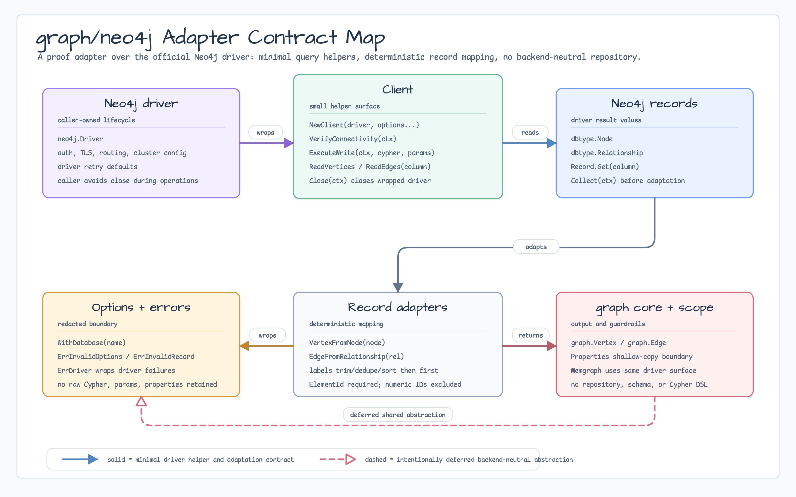
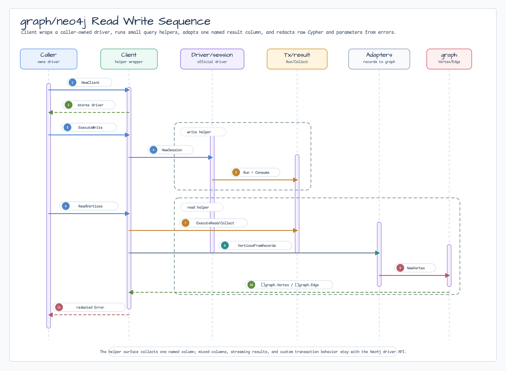

# graph/neo4j

[English](README.md) | [한국어](README.ko.md)

공식 Neo4j Go driver 결과를 `graph.Vertex`와 `graph.Edge`로 변환하는 proof
adapter입니다.

이 package는 의도적으로 작게 유지합니다.
`github.com/neo4j/neo4j-go-driver/v6`의 `dbtype.Node`와
`dbtype.Relationship`을 변환하고, caller-owned driver 위에 최소 read/write
helper만 제공합니다. Backend-neutral repository, session abstraction, schema DSL,
transaction manager, Cypher DSL은 정의하지 않습니다.

## Import

```go
import neo4jgraph "github.com/bluetape4k/bluetape-go/graph/neo4j"
```

## 사용

```go
driver, err := neo4j.NewDriver(uri, neo4j.NoAuth())
if err != nil {
	return err
}
client, err := neo4jgraph.NewClient(driver)
if err != nil {
	return err
}
defer client.Close(ctx)

if err := client.ExecuteWrite(ctx, `
CREATE (a:Service {name: $source})-[r:CALLS]->(b:Service {name: $target})
`, map[string]any{
	"source": "checkout",
	"target": "payments",
}); err != nil {
	return err
}

vertices, err := client.ReadVertices(ctx, `
MATCH (n:Service {name: $name})
RETURN n
`, map[string]any{"name": "checkout"}, "n")
if err != nil {
	return err
}
_ = vertices
```

## Diagram



Contract map은 adapter 경계를 보여줍니다. `Client`는 caller-owned Neo4j driver를
감싸고, 이름이 지정된 result column 하나를 읽어 Neo4j record를 `graph.Vertex` /
`graph.Edge`로 변환합니다. Backend-neutral repository, schema, Cypher DSL contract는
deferred 상태로 유지합니다.



Sequence는 `NewClient`, `ExecuteWrite`, `ReadVertices`/`ReadEdges`, record
collection, deterministic mapping, raw Cypher/parameter/property value를 보관하지
않는 redacted error wrapping 흐름을 보여줍니다.

## Mapping 규칙

- Neo4j `ElementId`가 필요합니다. Deprecated numeric ID는 사용하지 않습니다.
- Neo4j node는 여러 label을 가질 수 있지만 `graph.Vertex`는 label 하나만
  가집니다. Adapter는 label을 trim, deduplicate, lexicographic sort한 뒤 첫
  label을 선택해 deterministic mapping을 보장합니다.
- Relationship은 start/end element ID를 가진 directed `graph.Edge`로 변환합니다.
- Property는 `graph.Properties`의 shallow-copy boundary를 통과합니다. 중첩 mutable
  값은 계속 caller-owned입니다.

## Client 경계

`Client`는 network pool을 소유하지 않습니다. Caller-owned `neo4j.Driver`를 감싸며,
`Client.Close`를 호출할 때만 해당 driver를 닫습니다. Driver 생성, auth, TLS/routing
설정, cluster 동작, driver 기본값을 넘어서는 retry, lifecycle 순서는 caller가
소유합니다.

`ReadVertices`와 `ReadEdges`는 read transaction에서 이름이 지정된 결과 column 하나를
수집합니다. Mixed column, streaming result 처리, custom transaction configuration,
backend-specific behavior가 필요하면 Neo4j session API를 직접 사용하세요.

## Errors

```go
if errors.Is(err, neo4jgraph.ErrInvalidRecord) {
	// result column 누락, 잘못된 타입, graph invariant 위반
}
if errors.Is(err, neo4jgraph.ErrDriver) {
	// driver, session, transaction, query, connectivity failure
}
```

Error 문자열은 operation과 column 이름만 포함하고 raw Cypher, parameter, property 값을
보관하지 않습니다.

## Test

Package test는 Neo4j와 Memgraph에
[`graph/graphtest`](../graphtest/README.ko.md)의 strict core와 traversal suite를
같이 실행합니다. 두 provider는 conformance test에 기록된 digest-pinned image를
사용합니다. Fixed query/column, bound parameter, `limit+1` read는 provider adapter
closure 안에 둡니다. Lifecycle은 fixture cleanup, adapter close, `Run` 반환,
container terminate 순서입니다.

Testcontainers 기반 package test는 직렬로 실행하세요.

```bash
go test -p 1 -count=1 ./graph/neo4j
go test -p 1 -race -count=1 ./graph/neo4j
```

Package test는 node/relationship mapping, bad record, graph semantic parity,
provider error redaction, context cancellation, `ReasonCode` capability validation,
bounded cleanup, close 순서를 검증합니다.

## Benchmark


기본 benchmark는 Docker를 시작하지 않고 pure mapping 및 in-memory record adaptation
비용만 측정합니다.

```bash
go test -run '^$' -bench . -benchmem ./graph/neo4j
```

Neo4j와 Memgraph read/write benchmark는 Testcontainers 기반 database를 시작하므로
serial, opt-in으로 실행합니다.

```bash
BLUETAPE_GRAPH_NEO4J_BENCH=1 go test -p 1 -run '^$' -bench '^BenchmarkGraphNeo4jContainers' -benchtime=100x -benchmem ./graph/neo4j
```

이 행들은 `neo4j:5.26.0` 및 `memgraph/memgraph:3.5.0`을 사용합니다. 측정 범위는
node create/read, relationship create/read, empty read, syntax-error overhead입니다.
결과는 local Testcontainers regression evidence이지 production database ranking이
아닙니다.

## Memgraph Compatibility

Memgraph는 이 package에서 별도 `graph/memgraph` backend abstraction이 아니라
Neo4j-driver compatibility로 시작합니다. Memgraph는 공식 Neo4j Go driver로 접근할
수 있는 Bolt/Cypher compatibility를 제공하므로 proof는 같은 `Client`,
`VertexFromNode`, `EdgeFromRelationship`, `ReadVertices`, `ReadEdges` surface에
머무릅니다.

Testcontainers for Go에는 아직 전용 Memgraph module이 없으므로 package에는 generic
Testcontainers 기반 Memgraph matrix를 포함합니다.

| Runtime | Image | 검증 동작 |
|---|---|---|
| Neo4j | `neo4j:5.26.0@sha256:5a015e53de1895e7eee1574ae0325cf8c4b89587222778108c594bdd45a474b5` | shared strict core, traversal, mapping, provider error, cancellation, cleanup/close |
| Memgraph | `memgraph/memgraph:3.5.0@sha256:b411deeb2341698f4f7a0d69535c8937c341e924f66962aa3e70acb63c7a5bd1` | 같은 shared Neo4j-driver conformance contract |

Guardrail:

- 두 runtime이 공유하는 Cypher subset 안에서 query를 유지합니다.
- Bolt가 반환하는 `ElementId` 값을 요구합니다. Deprecated numeric ID는 adapter
  contract에 포함하지 않습니다.
- 향후 compatibility test가 Neo4j-driver surface로 부족하다는 것을 증명할 때만
  전용 `graph/memgraph` package를 추가합니다.

## Deferred Scope

| 기능 | Owner |
|---|---|
| IAM access graph example | #368 |
| Backend-neutral repository/session/schema/transaction abstraction | 여러 adapter가 common contract를 증명할 때까지 deferred |
| GraphML, AGE, FalkorDB, TinkerPop, Neptune, broad Cypher DSL | 이 proof 범위 밖 |
