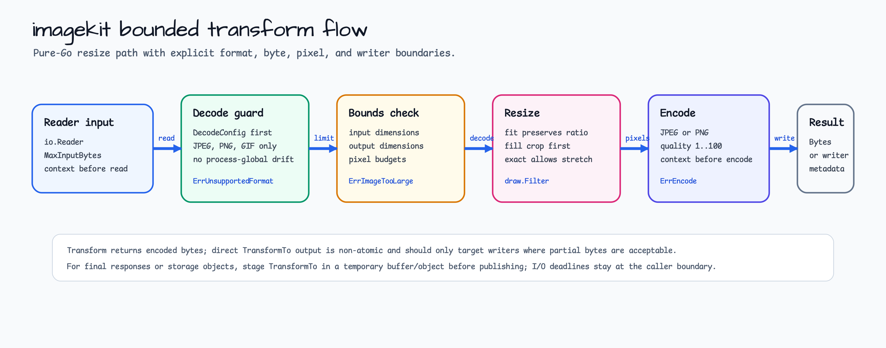
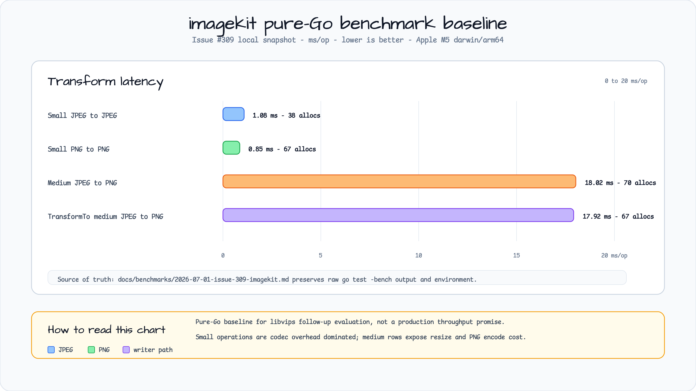

# imagekit

[English](README.md) | [한국어](README.ko.md)

`imagekit`은 하나의 이미지를 bounded pure-Go 방식으로 resize하고 JPEG 또는
PNG로 encode하는 helper를 제공합니다.



## 설치

```bash
go get github.com/bluetape4k/bluetape-go
```

## 지원 형식

| 방향 | 형식 |
|---|---|
| 입력 | JPEG, PNG, GIF |
| 출력 | JPEG, PNG |

입력 형식은 명시적 allowlist를 사용합니다. 다른 dependency가 process-global image
decoder를 등록해도 JPEG, PNG, GIF로 보고되지 않으면 거부합니다.

## 기본 제한

limit field가 0이면 보수적인 service 기본값을 사용합니다.

| 제한 | 기본값 |
|---|---:|
| `MaxInputBytes` | 10 MiB |
| `MaxPixels` | 16,000,000 |
| `MaxWidth` | 8192 |
| `MaxHeight` | 8192 |
| `MaxOutputPixels` | 16,000,000 |
| `MaxOutputWidth` | 8192 |
| `MaxOutputHeight` | 8192 |

`JPEGQuality`는 기본값 `85`를 사용합니다. 0이 아닌 JPEG quality는 `1..100`
범위여야 합니다.

## 사용

```go
result, err := imagekit.Transform(ctx, reader, imagekit.Request{
    Width:        320,
    Height:       180,
    Mode:         imagekit.ModeFit,
    OutputFormat: imagekit.OutputJPEG,
})
```

Direct writer output을 허용할 수 있을 때만 `TransformTo`를 사용하세요.
`TransformTo`는 caller writer로 직접 encode하고 `Result.Bytes == nil`인 metadata를
반환하므로 `Transform`이 반환하는 추가 encoded byte slice를 피합니다. 하지만 이 write는
atomic하지 않습니다. codec 또는 writer 실패가 발생하면 writer에 partial bytes가 남을 수
있습니다. HTTP response 또는 final storage object에는 `Transform`을 선호하거나,
`TransformTo`를 temporary buffer/object에 쓴 뒤 `err == nil`일 때만 publish하세요.

```go
var staged bytes.Buffer
result, err := imagekit.TransformTo(ctx, &staged, reader, imagekit.Request{
    Width:        320,
    Height:       180,
    Mode:         imagekit.ModeFill,
    OutputFormat: imagekit.OutputPNG,
})
if err == nil {
    _, err = writer.Write(staged.Bytes())
}
```

## 모드

| 모드 | 동작 |
|---|---|
| `ModeFit` | Aspect ratio를 유지하며 요청 box 안에 맞춥니다. |
| `ModeFill` | Aspect ratio를 유지하고 center crop으로 요청 box를 채웁니다. |
| `ModeExact` | 요청 크기로 정확히 resize하며 distortion을 허용합니다. |

## 취소

`imagekit`은 bounded read 전/후, decode 전, resize 전, encode 전에
`context.Context`를 확인합니다. 이미 block된 caller-owned `io.Reader`나
`io.Writer`, 실행 중인 standard-library codec call은 preempt할 수 없습니다. 강한
I/O deadline이 필요한 service는 I/O boundary에서 deadline을 적용해야 합니다.

## 오류

오류는 imagekit sentinel에 대해 `errors.Is`와 `errors.As`를 지원합니다.

- `ErrInvalidOptions`
- `ErrUnsupportedFormat`
- `ErrInputTooLarge`
- `ErrImageTooLarge`
- `ErrDecode`
- `ErrEncode`

취소는 `context.Canceled`와 `context.DeadlineExceeded`를 보존합니다. 오류 메시지는
raw image bytes, caller file path, wrapped cause text를 포함하지 않습니다.

## 벤치마크

Pure-Go baseline은
[`docs/benchmarks/2026-07-01-issue-309-imagekit.md`](../docs/benchmarks/2026-07-01-issue-309-imagekit.md)에
기록했습니다. 이 값은 issue #310의 libvips 평가를 위한 기준이며 libvips 수준
throughput을 주장하지 않습니다.



## 비목표

이 패키지는 libvips/cgo integration, OCR, CAPTCHA, SVG rasterization, AVIF,
HEIC, TIFF, EXIF 처리, resize resampling을 넘어서는 image effects/filter,
metadata editing, watermark, similarity metric, framework integration을 제공하지
않습니다.
