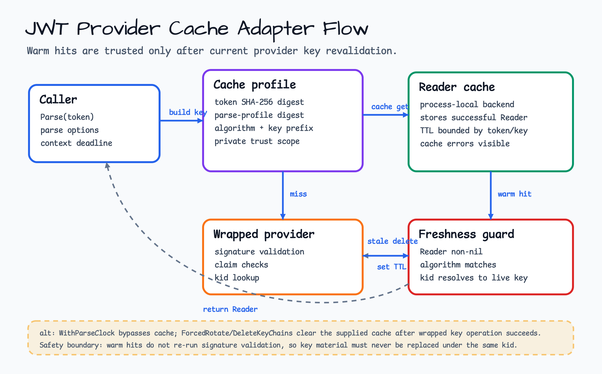
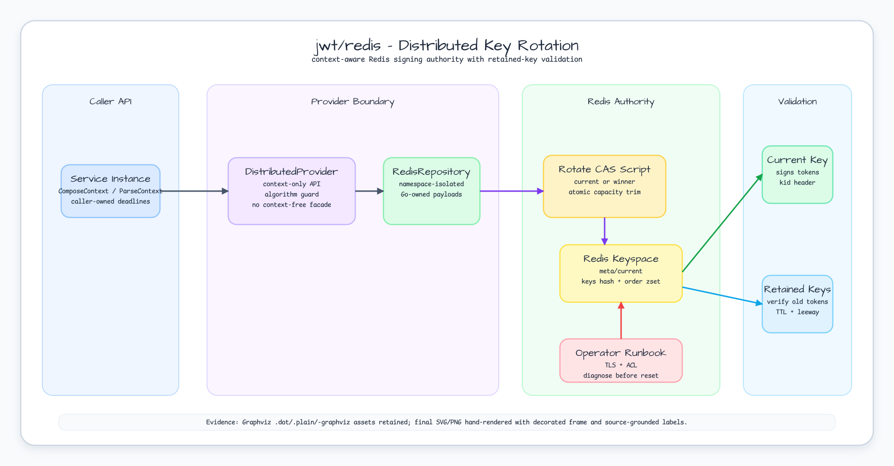
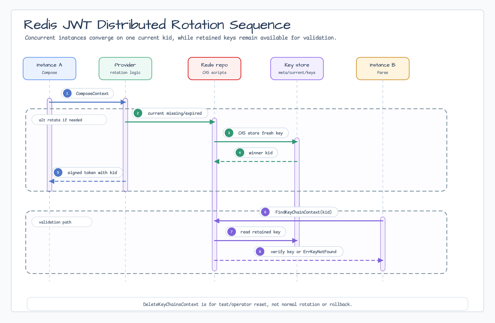
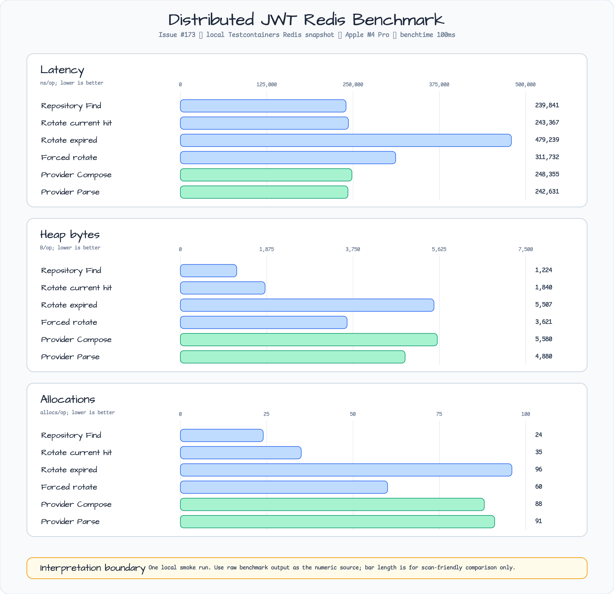

# jwt

[English](README.md) | [한국어](README.ko.md)

`jwt` provides Go-native helper APIs for signing, parsing, validating, and
rotating JSON Web Tokens with explicit algorithms and repo-owned errors.

## Import

```go
import (
    "context"
    "errors"
    "time"

    "github.com/bluetape4k/bluetape-go/cache"
    "github.com/bluetape4k/bluetape-go/jwt"
    mongojwt "github.com/bluetape4k/bluetape-go/jwt/mongo"
    redisjwt "github.com/bluetape4k/bluetape-go/jwt/redis"
    "github.com/redis/go-redis/v9"
    mongodriver "go.mongodb.org/mongo-driver/v2/mongo"
    "go.mongodb.org/mongo-driver/v2/mongo/options"
)
```

## Selection Guide

| Need | Use | Notes |
|---|---|---|
| Fixed symmetric signing key | `NewFixedHMACProvider` | HS256 requires at least a 32-byte secret, HS384 48 bytes, and HS512 64 bytes. |
| Fixed asymmetric signing key | `NewFixedRSAProvider` | Supports RS256/384/512 and PS256/384/512 with validated 2048-bit-or-larger RSA private keys. |
| Local in-memory key rotation | `NewHMACProvider` or `NewRSAProvider` | Uses an in-memory KeyChain repository, `kid` headers, TTL, and retained keys. |
| Redis-backed distributed key rotation | `jwt/redis.New` with `NewDistributedHMACProvider` or `NewDistributedRSAProvider` | Shares signing keys across process instances with context-aware Redis I/O. |
| MongoDB-backed distributed key rotation | `jwt/mongo.New` with `NewDistributedHMACProvider` or `NewDistributedRSAProvider` | Shares signing keys through MongoDB when the service already operates MongoDB as trusted state. |
| Signed JWT compression | Non-goal | `zip` belongs to a JWE boundary, not to the signed JWT helper. |
| JWE, JWK, JWKS | Deferred | JWE/JWKS can be added later as explicit optional JOSE boundaries if real use cases appear. |
| Provider cache adapters | `NewCachedProvider` or `NewCachedDistributedProvider` | Optional trusted `cache.Cache[string,*jwt.Reader]` wrappers reduce repeated parse and signature verification cost without bypassing provider validation. |

## Usage

```go
provider, err := jwt.NewFixedHMACProvider(
    jwt.HS256,
    []byte("0123456789abcdef0123456789abcdef"),
)
if err != nil {
    return err
}

token, err := provider.Compose(
    jwt.WithSubject("account-42"),
    jwt.WithAudience("api"),
    jwt.WithExpiresAfter(time.Hour),
    jwt.WithClaim("role", "admin"),
)
if err != nil {
    return err
}

reader, err := provider.Parse(
    token,
    jwt.WithExpectedSubject("account-42"),
    jwt.WithExpectedAudience("api"),
    jwt.WithExpirationRequired(),
)
if err != nil {
    return err
}
role, ok := reader.ClaimString("role")
```

## Provider Cache Adapters

Use `NewCachedProvider` for local providers and
`NewCachedDistributedProvider` for distributed providers when repeated parsing
of the same token is a hot path. The adapter stores only successful
`*jwt.Reader` results in a trusted cache backend, keys entries by token digest,
parse profile, provider algorithm, key prefix, and trust scope, and revalidates
warm hits against the wrapped provider's current key state before returning.
Warm-hit revalidation depends on the provider contract that `kid` values are not
reused for different key material; rotate to a new `kid` instead of replacing
material under the same `kid`.



```go
provider, err := jwt.NewFixedHMACProvider(
    jwt.HS256,
    []byte("0123456789abcdef0123456789abcdef"),
)
if err != nil {
    return err
}
readerCache := cache.NewMemory[string, *jwt.Reader]()
cached, err := jwt.NewCachedProvider(provider, readerCache)
if err != nil {
    return err
}

token, err := cached.Compose(
    jwt.WithSubject("account-42"),
    jwt.WithExpiresAfter(time.Hour),
)
if err != nil {
    return err
}
reader, err := cached.Parse(token, jwt.WithExpectedSubject("account-42"))
if err != nil {
    return err
}
```

Distributed providers use the same cache contract while preserving explicit
contexts for repository I/O:

```go
opCtx, cancelOp := context.WithTimeout(context.Background(), time.Second)
defer cancelOp()
repo, err := redisjwt.New(redisjwt.Options{
    Client:    redisClient,
    Namespace: "service-auth",
})
if err != nil {
    return err
}
provider, err := jwt.NewDistributedHMACProvider(opCtx, repo, jwt.HS256)
if err != nil {
    return err
}
token, err := provider.ComposeContext(opCtx,
    jwt.WithSubject("account-42"),
    jwt.WithExpiresAfter(time.Hour),
)
if err != nil {
    return err
}
readerCache := cache.NewMemory[string, *jwt.Reader]()
cached, err := jwt.NewCachedDistributedProvider(provider, readerCache)
if err != nil {
    return err
}
reader, err := cached.ParseContext(opCtx, token, jwt.WithExpectedSubject("account-42"))
```

Cache adapters are performance helpers only. They are not auth middleware,
session storage, token revocation, authorization policy, JWKS, or an external
trust service. Use only trusted application-process cache backends for
`*jwt.Reader` values; untrusted shared/external caches are unsupported in this
slice because a Reader value is already a validated-token result.

`WithParseClock` bypasses caching. Cache hits still verify that the cached
Reader is non-nil, the algorithm matches, the `kid` resolves to a live key, and
the key algorithm still matches. They do not re-run token signature validation
on every warm hit or fingerprint key material, so cache safety relies on
non-reused `kid` values. Adapter-owned `ForcedRotate`,
`ForcedRotateContext`, and `DeleteKeyChainsContext` clear the configured cache
after the wrapped operation succeeds. `ClearCache` affects only the supplied
cache backend scope; with `cache.Memory`, that means process-local state.

Operator notes:

- Treat `WithCacheTrustScope` as a private provider/tenant/key namespace. Do
  not reuse it across tenants, algorithms, or key stores. The default scope is
  randomly generated for each adapter construction; set a stable private scope
  only when intentionally sharing a cache namespace across adapter instances.
- Add diagnostics/monitoring for cache get/set/delete/clear failures at the
  application boundary. Non-miss cache errors and stale-entry delete failures
  are caller-visible.
- Classify adapter metrics and logs by parse sentinel
  (`ErrInvalidToken`, `ErrExpiredToken`, `ErrNotYetValid`, `ErrInvalidKey`,
  `ErrKeyNotFound`), unknown `kid` and key revalidation failures,
  timeout/cancellation, cache get/set/delete/clear failures, stale-entry delete
  failures, and clear failures after rotation or reset.
- If `ForcedRotate`, `ForcedRotateContext`, or `DeleteKeyChainsContext` returns
  `jwt cache clear failed`, the wrapped key operation may already have
  succeeded. Inspect key state, clear or recreate the affected process-local
  cache, restart affected instances when needed, and roll forward instead of
  treating the operation as rolled back.
- In multi-instance deployments, each process-local cache clears independently.
  Safety comes from hit revalidation, not global invalidation.
- Do not log raw bearer tokens, cache keys, token digests, parse-profile
  hashes, or any raw-token correlation value.

## Redis Distributed Provider

Use `github.com/bluetape4k/bluetape-go/jwt/redis` when multiple service
instances must share the same signing authority. The Redis repository stores
Go-owned KeyChain payloads by `kid`; it is not a Kotlin/JVM wire-compatible
format, provides no Kotlin/JVM wire compatibility, and must not be treated as a
cross-language storage contract.

```go
setupCtx, cancelSetup := context.WithTimeout(context.Background(), 2*time.Second)
defer cancelSetup()

client := redis.NewClient(&redis.Options{Addr: "127.0.0.1:6379"})
defer func() { _ = client.Close() }()

repo, err := redisjwt.New(redisjwt.Options{
    Client:    client,
    Namespace: "service-auth",
    Capacity:  8,
})
if err != nil {
    return err
}
provider, err := jwt.NewDistributedHMACProvider(setupCtx, repo, jwt.HS256)
if err != nil {
    return err
}

opCtx, cancelOp := context.WithTimeout(context.Background(), time.Second)
defer cancelOp()

token, err := provider.ComposeContext(opCtx, jwt.WithSubject("account-42"))
if err != nil {
    return err
}
reader, err := provider.ParseContext(opCtx, token, jwt.WithExpectedSubject("account-42"))
if err != nil {
    return err
}
if reader.Subject() != "account-42" {
    return errors.New("subject missing")
}
```

All distributed operations require an explicit `context.Context`:
`ComposeContext`, `ParseContext`, `CurrentKeyChainContext`, `RotateContext`,
`ForcedRotateContext`, `FindKeyChainContext`, and `DeleteKeyChainsContext`.
`DeleteKeyChainsContext` is for tests and operator reset procedures only; it is
not part of normal rotation.

If `redisjwt.Options.KeyTTL` is configured, it must cover the provider key
lifetime plus `RetentionLeeway`; otherwise bootstrap and rotation reject the
candidate key to avoid losing retained signing keys before token validation
leeway expires.

The provider default key lifetime is 365 days. When you shorten it, configure
the provider and Redis repository together:

```go
keyTTL := 24 * time.Hour
retention := 10 * time.Minute

repo, err := redisjwt.New(redisjwt.Options{
    Client:          client,
    Namespace:       "service-auth",
    Capacity:        8,
    KeyTTL:          keyTTL + retention,
    RetentionLeeway: retention,
})
if err != nil {
    return err
}
provider, err := jwt.NewDistributedHMACProvider(setupCtx, repo, jwt.HS256, jwt.WithKeyTTL(keyTTL))
```

`RotateContext` returns the current live key when one exists. If the current key
is missing or expired, Redis performs an atomic compare-and-store so concurrent
instances converge on one winner. `ForcedRotateContext` always stores a fresh
current key and leaves retained keys available until they expire, hit the Redis
TTL, or are trimmed by repository capacity.

Fixed providers and local in-memory rotating providers cannot preserve token
continuity across process restarts or independent service instances.
Redis-backed distributed providers can preserve continuity while retained keys
remain available. If retained keys are lost, evicted, deleted, or restored from
an old backup, the service owner must make an explicit token invalidation
decision.





## MongoDB Distributed Provider

Use `github.com/bluetape4k/bluetape-go/jwt/mongo` when multiple service
instances must share signing authority and MongoDB is already the trusted
operational store. The MongoDB repository stores Go-owned KeyChain payloads by
`kid`; it is not a Kotlin/JVM wire-compatible format and must not be treated as
a cross-language storage contract.

```go
setupCtx, cancelSetup := context.WithTimeout(context.Background(), 2*time.Second)
defer cancelSetup()

client, err := mongodriver.Connect(options.Client().ApplyURI("mongodb://127.0.0.1:27017"))
if err != nil {
    return err
}
defer client.Disconnect(context.Background())

repo, err := mongojwt.New(mongojwt.Options{
    Client:    client,
    Database:  "service_auth",
    Namespace: "service-auth",
    Capacity:  8,
})
if err != nil {
    return err
}
provider, err := jwt.NewDistributedHMACProvider(setupCtx, repo, jwt.HS256)
```

`RotateContext` returns the current live key when one exists. If the current key
is missing or expired, MongoDB performs a conditional current-pointer update so
concurrent instances converge on one winner. `ForcedRotateContext` always
stores a fresh current key and retained keys remain available until they expire
or are trimmed by repository capacity.

Prefer Redis when you need built-in key TTL and a narrow low-latency signing
state boundary. Prefer MongoDB when your service already operates MongoDB as a
trusted replicated store and wants key-chain state alongside related service
data. Both repositories use the same `DistributedKeyChainRepository` provider
contract.

## Behavior

- `jwt` is not an auth framework. It does not provide HTTP middleware,
  sessions, OIDC, JWKS, authorization rules, roles, user models, auth
  middleware, background rotation timers, or token revocation storage.
- Parsing always constrains accepted algorithms with `WithValidMethods`, and
  the token `alg` header must match the provider's configured algorithm before
  verification key material is returned.
- Reader APIs expose verified headers and claims, but they do not expose the raw
  bearer token.
- Fixed providers allow a missing inbound `kid` only when exactly one fixed key
  is configured. Rotating providers require `kid` for lookup.
- In-memory rotation stores retained keys by `kid` and evicts older keys by
  repository capacity. A retained key can verify old tokens until the key
  expires or is evicted.
- HMAC fixed secrets must be at least the selected hash size. Weak secrets
  return `ErrInvalidKey`.
- RSA provider constructors require validated 2048-bit-or-larger private keys
  for signing. The provider stores an internal copy and uses public key material
  internally for verification, so later caller mutation of the original key does
  not change provider behavior.
- Errors wrap repo-owned sentinels for `errors.Is`, including
  `ErrInvalidToken`, `ErrExpiredToken`, `ErrNotYetValid`, `ErrInvalidKey`, and
  `ErrKeyNotFound`; error strings do not include raw tokens, HMAC secrets, or
  private keys.
- Inbound signed tokens containing unsupported JOSE/compression headers
  `zip`, `crit`, `jku`, `jwk`, `x5u`, or `x5c` are rejected. Issue #174
  concluded that signed JWT compression is a non-goal; standards-compatible
  compression belongs to a future explicit JWE API.
- Redis-backed and MongoDB-backed context-aware distributed key storage are
  available through `jwt/redis` and `jwt/mongo`.

## Rotation Contract

`Rotate` returns the current non-expired key when one exists and creates a new
key only after expiration. `ForcedRotate` always creates a new key for rotating
providers. Fixed providers do not rotate.

Key generation uses caller-provided entropy when configured, otherwise
`crypto/rand`. Custom entropy readers, clocks, and key ID generators must be
safe for concurrent use when one provider is shared across goroutines.

## Redis Operations Runbook

The Redis repository owns this key layout:

```text
bluetape:jwt:v1:<namespace>:meta
bluetape:jwt:v1:<namespace>:current
bluetape:jwt:v1:<namespace>:keys
bluetape:jwt:v1:<namespace>:order
```

Use TLS, ACLs, Redis persistence/backups, and sizing policies appropriate for a
trusted signing-key boundary. Remote Redis requires TLS. Configure a
least-privilege ACL user limited to `bluetape:jwt:v1:<namespace>:*`; do not use
shared untrusted Redis or reuse one namespace across tenants. Prefer
`maxmemory-policy noeviction` or equivalent sizing; evicting retained signing
keys invalidates otherwise live tokens. The application owns Redis outage retry
policy and request deadlines through the contexts passed to provider methods.

Representative diagnostics:

```bash
redis-cli --tls HGET bluetape:jwt:v1:<namespace>:meta version
redis-cli --tls HMGET bluetape:jwt:v1:<namespace>:meta version algorithm
redis-cli --tls GET bluetape:jwt:v1:<namespace>:current
redis-cli --tls HLEN bluetape:jwt:v1:<namespace>:keys
redis-cli --tls ZCARD bluetape:jwt:v1:<namespace>:order
redis-cli --tls PTTL bluetape:jwt:v1:<namespace>:keys
```

Diagnose connection, TLS, and ACL failures separately from an empty namespace or
wrong namespace by checking the current pointer, hash cardinality, sorted-set
cardinality, TTL, and `meta` version/algorithm with the commands above. If the
stored algorithm family does not match the provider being rolled forward, fix
the namespace/config before any reset. For namespace misconfiguration, fix the
namespace/config and roll forward before any reset. Before a reset, prefer
rolling forward with a healthy instance and a new `ForcedRotateContext` key. If
a reset is unavoidable, coordinate token invalidation explicitly and keep
`DeleteKeyChainsContext` limited to test or operator reset workflows. A rollback
should point instances back to a Redis state that still contains the required
retained keys; do not rely on `DeleteKeyChainsContext` as a rollback mechanism.

Monitor unknown `kid` lookups, `ErrKeyNotFound`, `ErrInvalidKey`, context
timeouts/cancellations, and Redis command errors. Logs may identify namespace,
`kid`, operation, and sentinel error class, but must not include raw tokens,
HMAC secrets, RSA private keys, or serialized key payloads.

## Redis Benchmark Snapshot

The benchmark snapshot below is local Testcontainers Redis evidence for the
distributed repository and provider paths.



Raw benchmark output is stored at
`docs/research/outputs/issue-173/distributed-jwt-redis-bench.txt`; the chart
source is `docs/images/readme-charts/distributed-jwt-redis-benchmark.vl.json`.

## Test

```bash
go test -count=1 ./jwt
go test -count=1 ./jwt/redis
go test -count=1 ./jwt/mongo
go test -race -count=1 ./jwt
go test -race -count=1 ./jwt ./jwt/redis ./jwt/mongo
```
