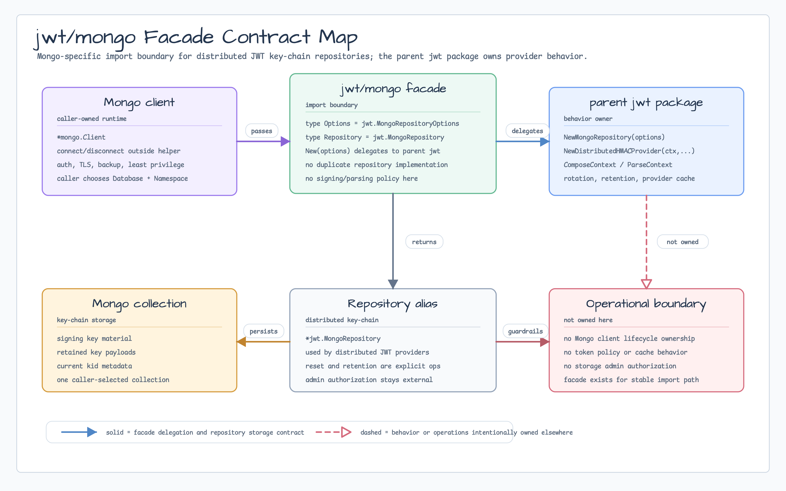
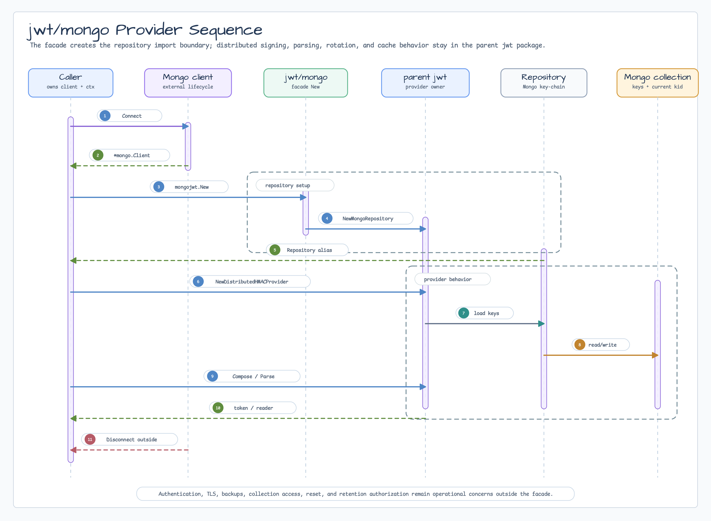

# jwt/mongo

[English](README.md) | 한국어

`jwt/mongo`는 distributed JWT key-chain storage를 위한 MongoDB 전용 import
boundary입니다. `jwt.MongoRepositoryOptions`와 `jwt.MongoRepository` alias를
노출하고, 생성은 parent `jwt` package로 위임합니다.

## 가져오기

```go
import mongojwt "github.com/bluetape4k/bluetape-go/jwt/mongo"
```

## 사용 예

```go
repo, err := mongojwt.New(mongojwt.Options{
    Client:    mongoClient,
    Database:  "service_auth",
    Namespace: "service-auth",
})
if err != nil {
    return err
}

provider, err := jwt.NewDistributedHMACProvider(ctx, repo, jwt.HS256)
if err != nil {
    return err
}
token, err := provider.ComposeContext(ctx, jwt.WithSubject("account-42"))
```

## Diagram



Contract map은 `jwt/mongo`가 MongoDB-specific import facade임을 보여줍니다.
Alias를 노출하고 생성은 parent `jwt` package로 위임하며, Mongo client lifecycle은
caller-owned로 유지하고 provider policy와 운영 authorization은 facade 밖에 둡니다.



Sequence는 caller-owned Mongo setup, `mongojwt.New`, parent
`jwt.NewMongoRepository`, distributed provider 생성, repository-backed compose/parse
동작, 외부 disconnect/operations ownership 흐름을 보여줍니다.

## 동작

- `Options`는 `jwt.MongoRepositoryOptions`의 alias입니다.
- `Repository`는 `jwt.MongoRepository`의 alias입니다.
- `New`는 parent package의 MongoDB repository option 검증을 거쳐 distributed
  JWT provider가 사용하는 key-chain repository를 반환합니다.
- Signing, parsing, key rotation, retention, provider cache behavior는 계속
  `jwt` package가 소유합니다.

## 운영 경계

- MongoDB 전용 import path를 제공하면서 parent package의 repository 구현 이름에
  직접 의존하고 싶지 않을 때 사용합니다.
- MongoDB에는 signing key material, retained key payload, 현재 `kid` metadata가
  caller가 선택한 하나의 collection에 저장됩니다. Authentication, TLS, backup,
  least-privilege collection access는 이 helper 밖에서 설정해야 합니다.
- Reset과 retention 작업은 parent package repository의 명시적 operation입니다.
  Administrative authorization 뒤에 두세요.

## 테스트

```bash
go test -count=1 ./jwt/mongo
go test -count=1 ./jwt
```
