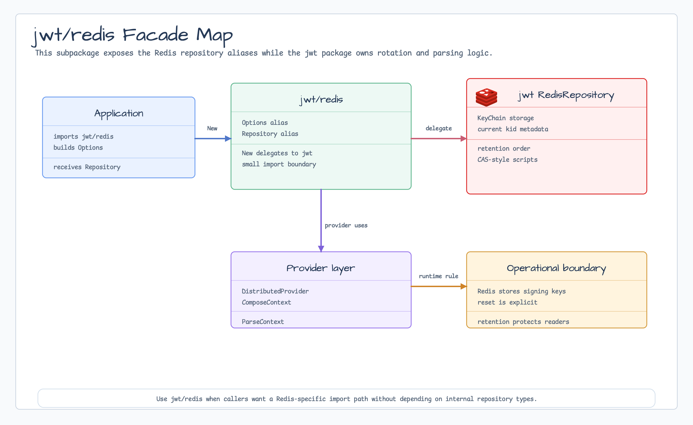

# jwt/redis

[English](README.md) | 한국어

`jwt/redis`는 distributed JWT key-chain storage를 위한 Redis 전용 import
boundary입니다. `jwt.RedisRepositoryOptions`와 `jwt.RedisRepository` alias를
노출하고, 생성은 parent `jwt` package로 위임합니다.



## 가져오기

```go
import redisjwt "github.com/bluetape4k/bluetape-go/jwt/redis"
```

## 사용 예

```go
repo, err := redisjwt.New(redisjwt.Options{
    Client:    redisClient,
    Namespace: "service-auth",
})
if err != nil {
    return err
}

provider, err := jwt.NewDistributedHMACProvider(ctx, repo, jwt.HS256)
if err != nil {
    return err
}
token, err := provider.ComposeContext(ctx, jwt.WithSubject("account-42"))
```

## 동작

- `Options`는 `jwt.RedisRepositoryOptions`의 alias입니다.
- `Repository`는 `jwt.RedisRepository`의 alias입니다.
- `New`는 parent package의 Redis repository option 검증을 거쳐 distributed JWT
  provider가 사용하는 key-chain repository를 반환합니다.
- Signing, parsing, key rotation, retention, provider cache behavior는 계속
  `jwt` package가 소유합니다.

## 운영 경계

- Redis 전용 import path를 제공하면서 parent package의 repository 구현 이름에
  직접 의존하고 싶지 않을 때 사용합니다.
- Redis에는 signing key material과 현재 `kid` metadata가 저장됩니다. Redis
  authentication, TLS, ACL, persistence, backup 정책은 이 helper 밖에서 설정해야
  합니다.
- Reset과 retention 작업은 parent package repository의 명시적 operation입니다.
  Administrative authorization 뒤에 두세요.

## 테스트

```bash
go test -count=1 ./jwt/redis
go test -count=1 ./jwt
```
