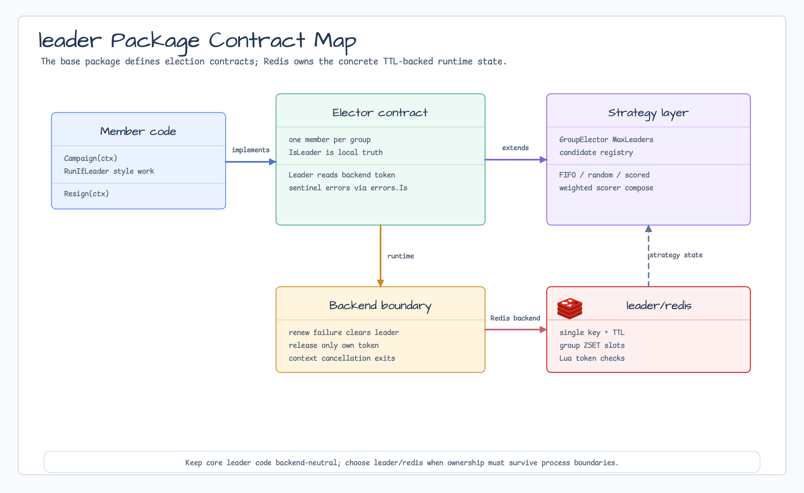

# leader

[English](README.md) | [한국어](README.ko.md)

`leader` defines the leader-election contracts used by bluetape-go backends.
The package owns option validation, sentinel errors, and the shared API shape;
backend-specific implementations live in `leader/redis`, `leader/mongo`, and
`leader/sql`.

## Diagram



## Import

```go
import "github.com/bluetape4k/bluetape-go/leader"
```

## Usage

```go
opts, err := leader.Options{
    Group:         "billing-workers",
    MemberID:      "worker-1",
    Lease:         30 * time.Second,
    RenewInterval: 10 * time.Second,
}.Normalize()
if err != nil {
    return err
}
```

## Behavior

- `Elector` represents one member inside one leader group.
- `Campaign` attempts leadership acquisition; `Resign` releases only the
  caller's current ownership.
- `GroupElector` allows up to `MaxLeaders` live members in one group.
- `StrategicElector` uses a candidate registry plus a deterministic
  `ElectionStrategy` so every node can compute the same winner from the same
  live candidate list.
- Built-in strategies include FIFO, seed-stable random, and scored election.
- Built-in scorers include idle time, success rate, candidate weight, and
  weighted composition.
- Public errors are sentinel errors and should be compared with `errors.Is`.
- Backend renewal failures should cause `IsLeader` to return false.

## Backend Notes

- `leader/redis` supports single, group, and strategic leader election.
- `leader/mongo` supports single `Elector`, bounded-slot `GroupElector`, and
  candidate-registry `StrategicElector`.
  Single electors store one MongoDB lease document per group; group electors
  store one lease document per slot to preserve exact `MaxLeaders`; strategic
  electors store one candidate document per node. TTL indexes are cleanup only.
- `leader/sql` is a PostgreSQL-only single `Elector` over caller-owned row
  leases and a caller-owned `*sql.DB`. It does not provide group or strategic
  election.

## Test

```bash
go test -count=1 ./leader
go test -count=1 ./leader/mongo
go test -p 1 -count=1 ./leader/sql
```

## Single-Elector Conformance

Single electors now wait for acquisition or caller-context termination. Local
duplicate, in-progress, cleanup-pending, and nil-context states have distinct
sentinels. Check typed `OperationError` and `ErrCommitUnknown` before bare context
errors; on an indeterminate commit, use bounded `Resign` and then TTL fallback.
`leader/leadertest.Run` applies the same contract to Redis, Mongo, and
PostgreSQL. Group and strategic electors remain outside this single-elector
suite.
