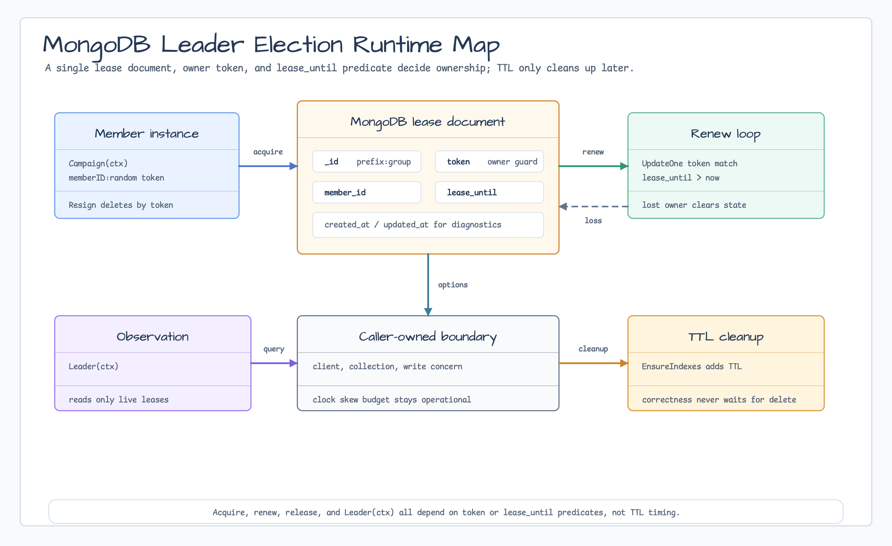
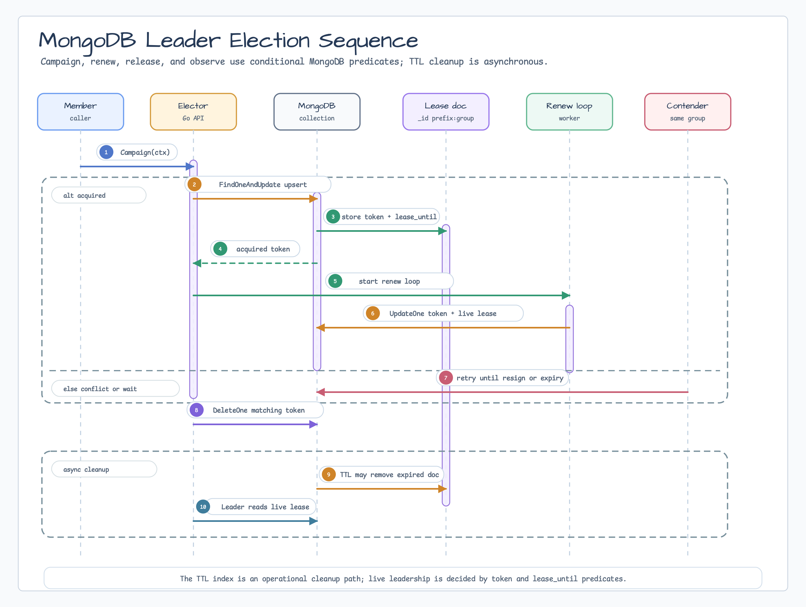

# leader/mongo

[English](README.md) | [한국어](README.ko.md)

`leader/mongo`는 `leader.Elector`, `leader.GroupElector`,
`leader.StrategicElector`를 구현하는 MongoDB backend입니다. 단일 elector는
leader key마다 하나의 lease document를 저장합니다. Group elector는 bounded
slot마다 하나의 lease document를 사용하므로 MongoDB single-document
atomicity만으로 concurrent acquisition 중에도 정확한 `MaxLeaders` 상한을
지킵니다. Strategic elector는 node마다 하나의 leased candidate document를
저장하고 caller가 FIFO, random, scored strategy 실행 방식을 선택하게 합니다.

## 다이어그램





## 가져오기

```go
import mongoleader "github.com/bluetape4k/bluetape-go/leader/mongo"
```

## 사용 예

```go
collection := client.Database("coordination").Collection("leader_leases")
if err := mongoleader.EnsureIndexes(ctx, collection); err != nil {
    return err
}

elector, err := mongoleader.New(collection, leader.Options{
    Group:         "billing-workers",
    MemberID:      "worker-1",
    Lease:         30 * time.Second,
    RenewInterval: 10 * time.Second,
})
if err != nil {
    return err
}
campaignCtx, campaignCancel := context.WithTimeout(ctx, 15*time.Second)
defer campaignCancel()
if err := elector.Campaign(campaignCtx); err != nil {
    if errors.Is(err, leader.ErrCommitUnknown) {
        cleanupCtx, cancel := context.WithTimeout(context.Background(), 5*time.Second)
        cleanupErr := elector.Resign(cleanupCtx)
        cancel()
        return errors.Join(err, cleanupErr) // lease TTL이 최종 fallback
    }
    return err
}
defer func() {
    cleanupCtx, cancel := context.WithTimeout(context.Background(), 5*time.Second)
    defer cancel()
    _ = elector.Resign(cleanupCtx)
}()
```

최대 `MaxLeaders`개의 worker가 동시에 실행될 수 있어야 한다면 `NewGroup`을
사용합니다.

```go
group, err := mongoleader.NewGroup(collection, leader.GroupOptions{
    Options: leader.Options{
        Group:         "billing-workers",
        MemberID:      "worker-1",
        Lease:         30 * time.Second,
        RenewInterval: 10 * time.Second,
    },
    MaxLeaders: 3,
})
if err != nil {
    return err
}
groupCtx, groupCancel := context.WithTimeout(ctx, 15*time.Second)
defer groupCancel()
if err := group.Campaign(groupCtx); err != nil {
    return err
}
defer func() {
    cleanupCtx, cancel := context.WithTimeout(context.Background(), 5*time.Second)
    defer cancel()
    _ = group.Resign(cleanupCtx)
}()
```

Candidate들이 lock 경합 대신 metadata 기반으로 순위화되어야 한다면
`NewStrategic`을 사용합니다.

```go
strategic, err := mongoleader.NewStrategic[string](collection, leader.Options{
    Group:    "nightly-jobs",
    MemberID: "worker-1",
})
if err != nil {
    return err
}

err = strategic.RegisterCandidate(ctx, "nightly-jobs", leader.CandidateInfo{
    NodeID:   "worker-1",
    Weight:   10,
    Metadata: map[string]string{"zone": "a"},
}, 30*time.Second)
if err != nil {
    return err
}

strategy := leader.ScoredStrategy{Scorer: leader.WeightScorer{}}
result, ran, err := strategic.RunIfLeader(ctx, "nightly-jobs", strategy, func(context.Context) (string, error) {
    return "report-created", nil
})
_ = result
_ = ran
```

## 저장소 계약

각 leader group은 `_id`로 식별되는 하나의 document를 사용합니다.

| Field | 목적 |
|---|---|
| `_id` | 정규화된 leader key, `<keyPrefix>:<group>`. |
| `group` | Leader group name. |
| `member_id` | 현재 owner member ID. |
| `token` | `Leader`가 반환하는 opaque owner token. |
| `lease_until` | 권위 있는 lease expiry. |
| `created_at` / `updated_at` | 진단용 timestamp. |

`EnsureIndexes`는 cleanup용 `lease_until` TTL index를 만듭니다. MongoDB TTL
monitor는 비동기이므로 leadership correctness는 TTL 삭제 timing에 의존하지
않습니다. `Campaign`과 `Leader`는 일반 `lease_until` predicate로 판단합니다.

Group elector는 slot마다 하나의 document를 저장합니다.

| Field | 목적 |
|---|---|
| `_id` | 정규화된 slot key, `<keyPrefix>:<group>:slot:<slot>`. |
| `group_key` | Active slot count를 위한 shared group key. |
| `group` | Leader group name. |
| `slot` | `[0, MaxLeaders)` 범위의 zero-based slot number. |
| `member_id` | 현재 slot owner member ID. |
| `token` | 이 slot의 opaque owner token. |
| `lease_until` | 권위 있는 slot lease expiry. |
| `created_at` / `updated_at` | 진단용 timestamp. |

`NewGroup`은 bounded slot set 안에서만 slot을 획득하고, renew/delete는 owner
token으로 보호합니다. `ActiveCount`는 같은 `group_key`와 `lease_until > now`를
만족하는 document를 세고, `AvailableSlots`는 음수를 0으로 clamp합니다. 따라서
`MaxLeaders`를 낮춘 경우에도 기존 active slot이 drain되기 전 새 owner를
over-admit하지 않습니다.

Strategic elector는 candidate마다 하나의 document를 저장합니다.

| Field | 목적 |
|---|---|
| `_id` | 정규화된 candidate key, `<keyPrefix>:<group>:candidate:<nodeID>`. |
| `group_key` | Live candidate scan을 위한 shared group key. |
| `group` | Strategy group name. |
| `node_id` | Candidate node ID. |
| `registered_at` | Caller가 지정하거나 registration 시 기본값으로 채워지는 strategy ordering timestamp. |
| `last_started_at` / `last_completed_at` | 진단용 action timestamp. |
| `success_count` / `failure_count` | Atomic action outcome counter. |
| `weight` / `metadata` | `leader.CandidateInfo`에서 복사한 strategy input. |
| `lease_until` | 권위 있는 candidate expiry. |
| `created_at` / `updated_at` | 진단용 timestamp. |

`ListCandidates`는 live document를 반환하기 전에 expired candidate document를
prune하고 `node_id` 순으로 정렬합니다. `UpdateResult`는 candidate lease가 live일
때만 counter를 갱신하며, 누락되었거나 만료된 candidate에는 `leader.ErrNotLeader`를
반환합니다.

## 운영 경계

- MongoDB client, database, collection, index, write concern, cleanup은 caller가
  소유합니다.
- 운영 환경에서는 caller-owned client나 collection에 적절한 write concern,
  일반적으로 majority를 설정하세요.
- 첫 구현은 process clock으로 `lease_until`을 계산합니다. contender 사이의 clock을
  동기화하고, 예상 clock skew와 MongoDB operation latency보다 충분히 긴 lease를
  사용하세요.
- `Campaign(ctx)`은 leadership을 얻거나 context가 취소될 때까지 대기합니다.
- Renewal 실패, token 교체, backend renewal error가 발생하면 `IsLeader`는 false가
  됩니다.
- `GroupElector`는 contender들이 같은 key prefix, group name, collection, bounded
  clock-skew assumption을 사용할 때 group당 최대 `MaxLeaders`개의 live local owner만
  허용합니다.
- `StrategicElector`는 live candidate registry와 result counter를 제공합니다. 이는
  distributed mutex가 아니며 모든 contender가 같은 strategy, group, key prefix,
  collection, clock-skew assumption을 사용해야 합니다.
- `EnsureIndexes`는 group active-slot check와 strategic live-candidate scan에
  사용하는 `group_key, lease_until` index도 생성합니다.

## 테스트

```bash
go test -count=1 ./leader ./leader/mongo
go test -race -count=1 ./leader ./leader/mongo
go test -p 1 -count=1 ./leader/mongo ./testcontainers/mongodb
```

## Conformance 및 복구

Mixed-version 제약, canary telemetry/threshold, resign/TTL rollback gate는 영·한
[v0.19.0 rollout runbook](../../docs/release/v0.19.0-provider-conformance-runbook.md)을
따릅니다.

Single elector는 `leader/leadertest.Run`을 실행하고 서로 다른 local-state sentinel을
사용하며 backend 실패를 `leader.OperationError`로 감쌉니다. Dispatch된 campaign 또는
resign 실패는 `leader.ErrCommitUnknown`을 match할 수 있습니다. 같은 elector로 bounded
`Resign`을 재시도하고 새 campaign 전에는 lease TTL을 기다립니다. BSON lease schema와
TTL cleanup index는 변경되지 않았습니다.
