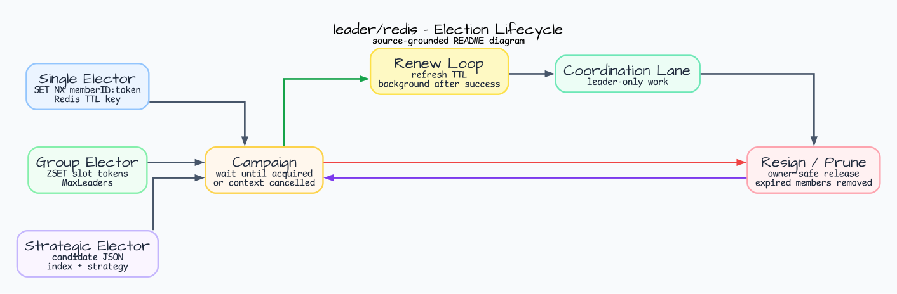
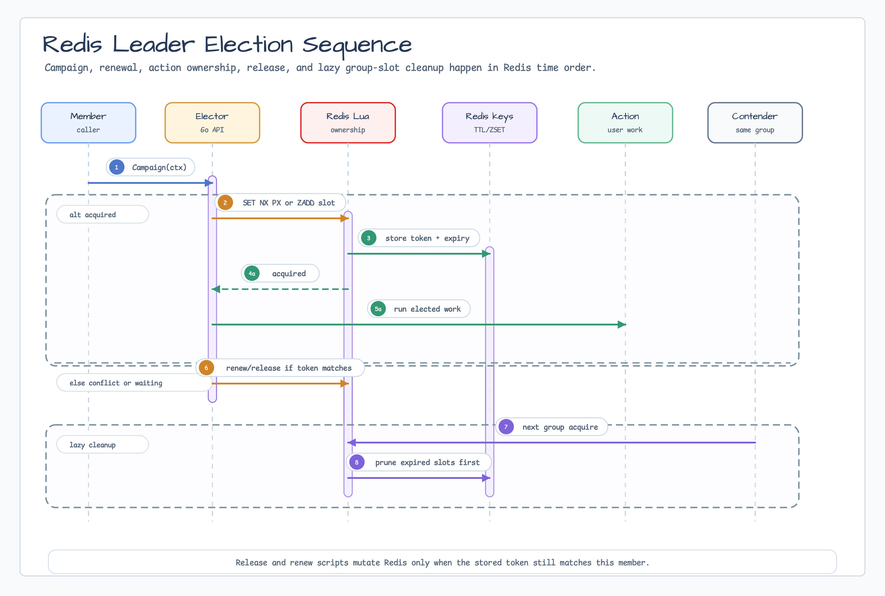

# leader/redis

[English](README.md) | [한국어](README.ko.md)

`leader/redis` implements `leader.Elector`, `leader.GroupElector`, and
`leader.StrategicElector` with Redis TTL ownership. Use it when only one
replica, a bounded number of replicas, or one strategy-elected candidate may
run a coordination lane.

## Diagram





## Import

```go
import redisleader "github.com/bluetape4k/bluetape-go/leader/redis"
```

## Usage

```go
elector, err := redisleader.New(client, leader.Options{
    Group:         "billing-workers",
    MemberID:      "worker-1",
    Lease:         30 * time.Second,
    RenewInterval: 10 * time.Second,
})
if err != nil {
    return err
}

campaignCtx, campaignCancel := context.WithTimeout(ctx, 15*time.Second)
defer campaignCancel()

if err := elector.Campaign(campaignCtx); err != nil {
    return err
}
defer func() {
    cleanupCtx, cleanupCancel := context.WithTimeout(context.Background(), 5*time.Second)
    defer cleanupCancel()
    _ = elector.Resign(cleanupCtx)
}()
```

Use `NewGroup` when up to `MaxLeaders` workers may run concurrently:

```go
group, err := redisleader.NewGroup(client, leader.GroupOptions{
    Options: leader.Options{
        Group:    "batch-workers",
        MemberID: "worker-1",
    },
    MaxLeaders: 3,
})
```

Use `NewStrategic` when candidates should be ranked by metadata instead of
competing for a lock:

```go
elector, err := redisleader.NewStrategic[string](client, leader.Options{
    Group:    "nightly-jobs",
    MemberID: "worker-1",
})
if err != nil {
    return err
}

err = elector.RegisterCandidate(ctx, "nightly-jobs", leader.CandidateInfo{
    NodeID: "worker-1",
}, 30*time.Second)
if err != nil {
    return err
}

strategy := leader.ScoredStrategy{Scorer: leader.IdleTimeScorer{}}
result, ran, err := elector.RunIfLeader(ctx, "nightly-jobs", strategy, func(context.Context) (string, error) {
    return "report-created", nil
})
_ = result
_ = ran
```

## Behavior

- Single leader election stores `memberID:random` in
  `bluetape:leader:<group>` with a Redis TTL.
- Group election stores slot tokens in `bluetape:leader-group:<group>` as ZSET
  members with expiry scores.
- Strategic election stores candidate JSON values under
  `bluetape:leader-strategy:<group>:candidates:<nodeID>` and tracks live
  candidates in `bluetape:leader-strategy:<group>:index`.
- Renewal runs in the background after a successful campaign.
- Duplicate campaign calls on the same elector are rejected.
- Expired group slots are pruned during acquire and status checks.
- Expired strategic candidates are pruned during list operations.

## Operational Boundaries

- Redis key formats are Go-owned and are not compatible with Kotlin/JVM
  bluetape4k-leader Lettuce or Redisson participants.
- Campaign waits until leadership is acquired or the caller context is
  cancelled.
- Cleanup may outlive a request context, but copied examples should still bound
  `Resign` with an explicit cleanup timeout.
- Single-elector values retain the `memberID:<random>` layout; the random
  suffix is an internal canonical owner token, not a caller-visible lease API.
- Single-Elector Redis provider failures preserve their cause for
  `errors.Is` / `errors.As` while diagnostic text redacts raw Redis keys and
  owner-token values.

## Runnable Batch Examples

`coordination_example_test.go` connects `leader/redis` with the `batch` package:

- `TestBatchSchedulerExample` lets only the current leader run a scheduled
  batch job.
- `TestMigrationGateExample` lets only the current leader run a migration batch
  and skips an already applied migration after leadership changes.

The examples use `testcontainers/redis`, so Docker or another
Testcontainers-compatible runtime must be available.

```bash
go test -count=1 ./leader/redis -run 'Test(BatchSchedulerExample|MigrationGateExample)'
```

## Test

```bash
go test -count=1 ./leader/redis
```
