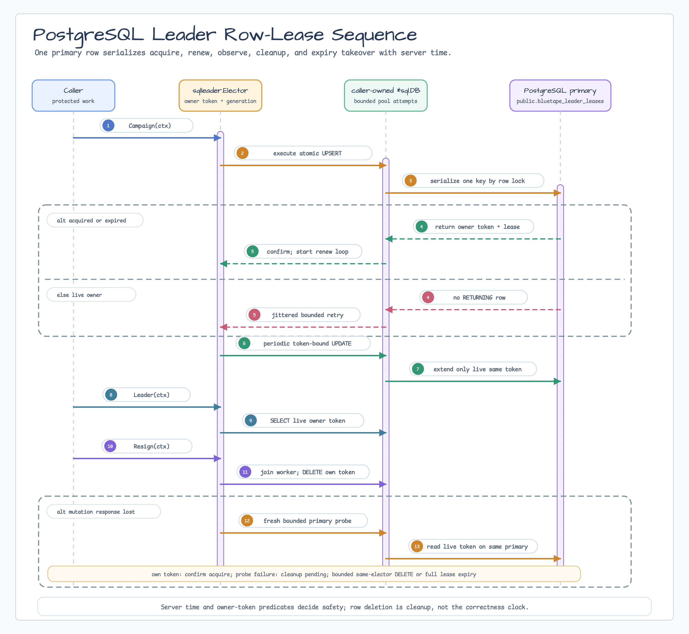

# leader/sql

[English](README.md) | [한국어](README.ko.md)

`leader/sql`은 leader key마다 PostgreSQL server-time row lease 하나를 사용하는 PostgreSQL 전용 `leader.Elector`입니다. Migration, `*sql.DB`, role, failover, shutdown은 caller가 소유합니다. v0.19.0의 relation은 `public.bluetape_leader_leases`로 고정되며 custom schema와 replica-routed read는 지원하지 않습니다.

## Preflight

| 점검 | 필수 결과 |
|---|---|
| Migration role | 보호된 고정 `public` relation을 생성하고 소유할 수 있습니다. |
| Runtime role | `public`에 생성할 수 없고 schema usage와 table DML만 가집니다. |
| Endpoint | 모든 mutation, lookup, reconciliation probe가 의도한 writable primary에 도달합니다. |
| Timing | `Lease`와 `RenewInterval`이 모두 0(정규화 후 10s/3s)이거나 `0 < RenewInterval < Lease`입니다. 짧은 custom lease는 두 값을 모두 명시합니다. |
| 미지원 topology | Custom schema나 replica-routed endpoint가 필요하면 migration 전에 중단합니다. |

하나라도 다르면 진행하지 마세요.

## Diagram



## Import

```go
import sqlleader "github.com/bluetape4k/bluetape-go/leader/sql"
```

`pgx` `database/sql` driver를 사용할 때 `github.com/jackc/pgx/v5/stdlib`을 blank import합니다.

## Schema

Elector 시작 전에 caller migration으로 `SchemaSQL`을 실행합니다. 직접 실행은 development/bootstrap에만 적합합니다. 이는 v0.19.0 bootstrap contract이지 upgrade engine이 아니므로, 향후 비호환 변경은 versioned migration으로 배포해야 합니다.

```go
_, err := migrationDB.ExecContext(ctx, sqlleader.SchemaSQL)
```

다음 결과가 문서화된 일곱 column 순서 `leader_key`, `group_name`, `member_id`, `owner_token`, `lease_until`, `created_at`, `updated_at`와 다르면 배포를 중단합니다.

```sql
select column_name, data_type, is_nullable
from information_schema.columns
where table_schema = 'public' and table_name = 'bluetape_leader_leases'
order by ordinal_position;
```

보호 object, primary key, trigger, runtime 권한도 검증합니다.

```sql
select c.relkind, pg_catalog.pg_get_userbyid(c.relowner) as owner,
       c.relrowsecurity, c.relforcerowsecurity
from pg_catalog.pg_class c
join pg_catalog.pg_namespace n on n.oid = c.relnamespace
where n.nspname = 'public' and c.relname = 'bluetape_leader_leases';

select array_agg(a.attname order by key_column.ordinality) as primary_key_columns
from pg_catalog.pg_constraint con
cross join lateral unnest(con.conkey) with ordinality as key_column(attnum, ordinality)
join pg_catalog.pg_attribute a on a.attrelid = con.conrelid and a.attnum = key_column.attnum
where con.conrelid = 'public.bluetape_leader_leases'::regclass and con.contype = 'p';

select count(*) as user_trigger_count
from pg_catalog.pg_trigger
where tgrelid = 'public.bluetape_leader_leases'::regclass and not tgisinternal;

select has_schema_privilege(current_user, 'public', 'USAGE') as schema_usage,
       has_schema_privilege(current_user, 'public', 'CREATE') as schema_create,
       has_table_privilege(current_user, 'public.bluetape_leader_leases', 'SELECT,INSERT,UPDATE,DELETE') as table_dml,
       has_table_privilege(current_user, 'public.bluetape_leader_leases', 'TRUNCATE,REFERENCES,TRIGGER') as table_ddl;
```

기대값은 relation kind `r`, 설정한 migration owner, RLS false, primary key `{leader_key}`, user trigger 0, runtime `schema_usage=true`, `schema_create=false`, `table_dml=true`, `table_ddl=false`입니다. Direct/inherited role membership와 `PUBLIC` grant도 점검합니다.

## Least Privilege Grants

Application migration grant block:

```sql
grant usage on schema public to app_runtime;
grant select, insert, update, delete
on table public.bluetape_leader_leases to app_runtime;
```

아래는 database 전체에 영향을 주므로 DB administrator가 검토 후 별도 실행합니다.

```sql
revoke create on schema public from public;
```

Migration role이 table을 소유합니다. Runtime role은 소유권 및 `CREATE`, `ALTER`, `TRUNCATE`, `REFERENCES`, `TRIGGER` 권한을 가지면 안 됩니다.

## Usage

```go
db, err := sql.Open("pgx", dsn) // caller-owned writable-primary pool
if err != nil { return err }
defer db.Close()

opts := leader.Options{
    Group: "billing-workers", MemberID: "worker-1",
    Lease: 30 * time.Second, RenewInterval: 10 * time.Second,
}
elector, err := sqlleader.New(db, opts)
if err != nil { return err }
campaignCtx, cancel := context.WithTimeout(ctx, 15*time.Second)
defer cancel()
if err := elector.Campaign(campaignCtx); err != nil { return err }
// RenewInterval보다 자주 IsLeader를 확인하고 loss 시 protected work를 중단합니다.
```

`New`는 migration이나 pool close를 하지 않습니다. Pool을 닫기 전에 fresh bounded context로 `Resign`합니다.

## Lease Semantics

Acquire/takeover는 하나의 atomic `INSERT ... ON CONFLICT ... WHERE ... RETURNING`입니다. Renew와 resign은 같은 opaque owner token을 요구합니다. PostgreSQL `pg_catalog.clock_timestamp()`이 권위 있는 시간이며 process clock으로 ownership을 판단하지 않습니다. Expiry는 logical takeover를 허용하지만 row를 삭제하지 않습니다.

이 API는 fencing을 제공하지 않습니다. Token은 elector instance를 식별하지만 secret, credential, fencing value가 아닙니다. Confirmed token probe 때문에 caller context가 끝난 뒤에도 `Campaign`이 성공할 수 있습니다. 이때 caller가 cleanup을 소유하며 protected work 시작 전에 `campaignCtx.Err()`를 확인해야 합니다.

## Primary/Failover Contract

모든 mutation, `Leader` lookup, reconciliation probe는 같은 writable primary에 도달해야 합니다. Replica로 read를 보내지 마세요. Controlled HA exercise 전후에 다음 결과를 보관합니다.

```sql
select pg_catalog.inet_server_addr() as server_addr,
       pg_catalog.inet_server_port() as server_port,
       pg_catalog.pg_is_in_recovery() as in_recovery,
       current_setting('transaction_read_only') as read_only,
       pg_catalog.pg_postmaster_start_time() as postmaster_started,
       pg_catalog.pg_current_wal_lsn() as wal_lsn;
```

HA controller가 보고하는 server identity와 timeline도 전후에 기록합니다. `pg_is_in_recovery()`가 true, `transaction_read_only`가 `on`, endpoint가 의도한 primary가 아니거나 promotion 후 old primary가 write를 받으면 중단합니다. 모든 elector/probe endpoint를 증명하고 HA controller로 restart/promotion하며, new writer가 lease를 받기 전에 old writer를 fence한 뒤 bounded cleanup 또는 full-lease takeover를 확인합니다. Local backend-termination test는 pool reconnect만 증명하며 promotion/fencing 증거가 아닙니다. Topology에 맞는 durability를 선택하세요.

## Pool and Timing

Active renewal과 application work를 위한 connection을 확보합니다. `DBStats.WaitCount` 또는 `DBStats.WaitDuration`가 증가하거나, `DBStats.InUse`가 `DBStats.MaxOpenConnections`에 가까워지거나, p99 pool/statement latency가 `Lease-RenewInterval` margin을 소모하면 alert합니다. `RenewInterval < Lease`는 검증되지만 실용적인 latency margin은 caller가 확보해야 합니다.

각 campaign attempt는 내부 deadline으로 제한됩니다. 각 renewal deadline은 `RenewInterval`이므로 pool/row-lock starvation 시 safety budget을 넘겨 leadership을 유지하지 않고 local leadership을 해제합니다.

## Failure Recovery

예상하지 못한 `IsLeader` transition이면 protected work를 즉시 중단합니다. Mutation failure는 redacted `leader.OperationError`입니다. 명시적으로 unwrap한 driver cause를 logging하면 이 redaction을 우회합니다.

`ErrCommitUnknown` 또는 `ErrCleanupPending`이면 같은 elector를 보존하고 fresh context로 bounded `Resign`을 재시도합니다. Cleanup을 우회하려고 replacement elector를 만들지 마세요. 해결되지 않으면 마지막 가능한 mutation 또는 마지막 실패 cleanup attempt부터 full lease를 기다린 뒤 restart/reuse합니다. TTL/server-time expiry가 최종 safety fallback입니다.

## Shutdown

Protected work를 중단하고 campaign을 cancel/join한 뒤 모든 elector를 bounded resign합니다. Renewal traffic 중단을 확인하고 미해결 full lease wait를 inventory하며 다른 pool user도 모두 종료합니다. `DBStats.InUse == 0`을 확인한 후에만 caller-owned pool을 닫습니다.

## Expired Row Cleanup

Expiry correctness는 row 삭제에 의존하지 않습니다. Table cardinality, `dead tuples`, `autovacuum`을 관찰하세요. 최대 configured lease보다 긴 grace interval이 지난 row는 선택적으로 정리할 수 있습니다.

```sql
delete from public.bluetape_leader_leases
where lease_until < pg_catalog.clock_timestamp() - interval '1 day';
```

이는 correctness TTL이 아니며 live row를 삭제하면 안 됩니다.

## Security Boundaries

`Group`, `MemberID`, `KeyPrefix`, owner token은 plaintext로 저장되거나 반환됩니다. Credential, secret, 민감한 customer identifier를 넣지 마세요. `KeyPrefix`는 naming collision을 줄일 뿐 authorization이 아닙니다. 서로 다른 trust domain은 별도 database 또는 caller가 독립 검증한 authorization을 사용합니다.

Provider는 RLS를 구성하지 않습니다. Caller policy가 SELECT, INSERT, UPDATE, DELETE, `ON CONFLICT DO UPDATE` 네 경로를 독립적으로 증명하지 못하면 해당 배포에서 RLS는 미지원입니다. Rollout 전에 hostile object creation을 막고 owner, PK, trigger, RLS, membership, `PUBLIC` grant를 검증하세요.

## Test

```bash
go test -p 1 -count=1 ./leader/sql
go test -p 1 -race -count=1 ./leader/sql
go test -p 1 -count=10 ./leader/sql -run '^TestPostgresElectorConformance$'
```
