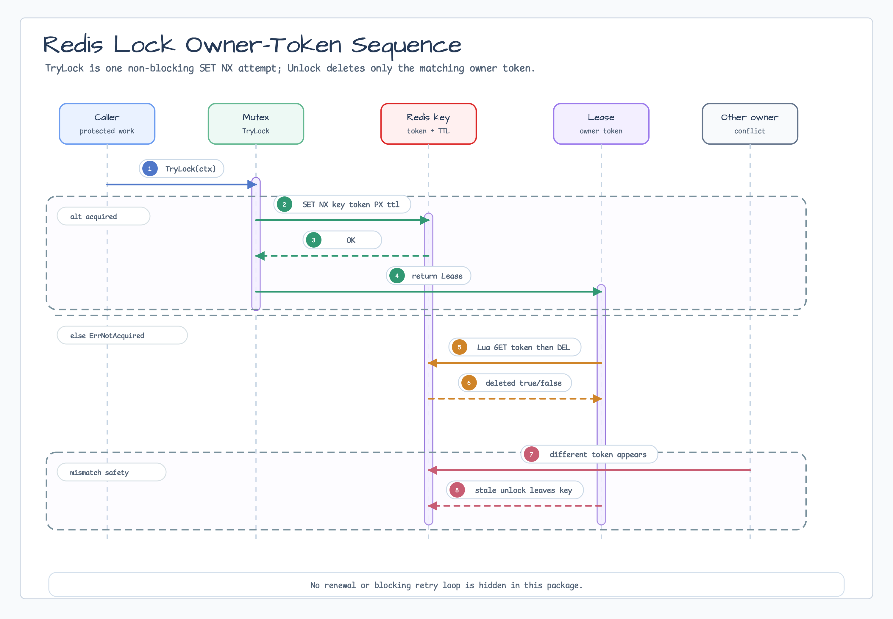

# lock/redis

[English](README.md) | [한국어](README.ko.md)

`lock/redis`는 TTL cleanup과 owner-safe unlock semantic이 필요한 coordination
작업을 위해 single-Redis-instance owner-token lock을 제공합니다.

## 다이어그램




## 가져오기

```go
import redislock "github.com/bluetape4k/bluetape-go/lock/redis"
```

## 사용 예

```go
mutex, err := redislock.New(client, redislock.Options{
    Key: "locks:billing-rollup",
    TTL: 30 * time.Second,
})
if err != nil {
    return err
}

lockCtx, lockCancel := context.WithTimeout(ctx, 5*time.Second)
defer lockCancel()

lease, err := mutex.TryLock(lockCtx)
if errors.Is(err, redislock.ErrNotAcquired) {
    return nil
}
if err != nil {
    return err
}
defer func() {
    cleanupCtx, cleanupCancel := context.WithTimeout(context.Background(), 5*time.Second)
    defer cleanupCancel()
    _, _ = lease.Unlock(cleanupCtx)
}()
```

## 동작

- `TryLock`은 Redis `SET NX`와 TTL로 non-blocking acquire를 한 번 시도합니다.
- `Lease.Unlock`은 저장된 token이 lease token과 여전히 일치할 때만 Redis key를 삭제합니다.
- `Options.Token`으로 custom token을 제공할 수 있습니다. 제공하지 않으면 acquire마다 random owner token을 생성합니다.
- Redis command의 context cancellation은 보존됩니다.
- Redis command failure는 `errors.Is`, `errors.As`를 위한 cause를 보존하고,
  diagnostic message에서는 raw lock key와 owner token을 redacted 처리합니다.
- Cleanup은 request cancellation 뒤의 fresh context를 사용할 수 있지만,
  명시적인 timeout으로 제한해야 합니다.

## 운영 경계

- 이 구현은 Redlock quorum이 아니며 fencing token을 제공하지 않습니다.
- TTL renewal과 blocking retry loop는 의도적으로 포함하지 않았습니다.
- 보호하려는 작업 시간을 안전하게 덮는 TTL을 선택하거나 higher layer에서 renewal을 조합하세요.

## 테스트

```bash
go test -count=1 ./lock/redis
```
