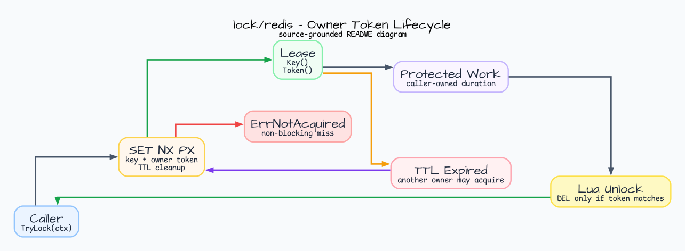

# lock/redis

[English](README.md) | [한국어](README.ko.md)

`lock/redis` provides a small single-Redis-instance owner-token lock for
coordination work that needs TTL cleanup and owner-safe unlock semantics.

## Diagram



## Import

```go
import redislock "github.com/bluetape4k/bluetape-go/lock/redis"
```

## Usage

```go
mutex, err := redislock.New(client, redislock.Options{
    Key: "locks:billing-rollup",
    TTL: 30 * time.Second,
})
if err != nil {
    return err
}

lease, err := mutex.TryLock(ctx)
if errors.Is(err, redislock.ErrNotAcquired) {
    return nil
}
if err != nil {
    return err
}
defer lease.Unlock(context.Background())
```

## Behavior

- `TryLock` performs one non-blocking acquire attempt with Redis `SET NX` and
  a TTL.
- `Lease.Unlock` deletes the Redis key only when the stored token still matches
  the lease token.
- A custom token may be supplied through `Options.Token`; otherwise each
  acquire generates a random owner token.
- Context cancellation is preserved for Redis commands.

## Operational Boundaries

- This is not Redlock quorum and does not provide fencing tokens.
- TTL renewal and blocking retry loops are intentionally not included.
- Choose a TTL that safely covers the protected operation or compose renewal at
  a higher layer.

## Test

```bash
go test -count=1 ./lock/redis
```
