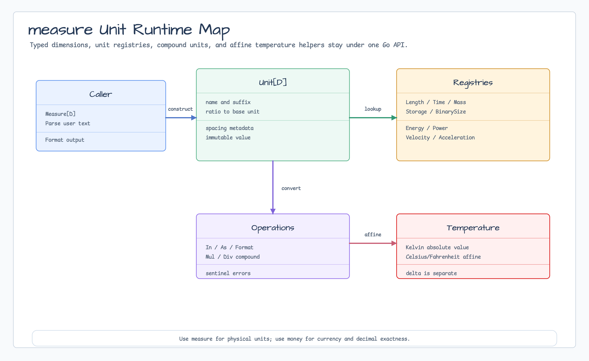

# measure

[English](README.md) | [한국어](README.ko.md)

`measure`는 `bluetape4k-measured`의 방향을 Go에 맞게 옮긴 typed unit, measured
value, parsing, formatting, compound unit, affine temperature helper를 제공합니다.



## 가져오기

```go
import "github.com/bluetape4k/bluetape-go/measure"
```

## 선택 가이드

| 필요 | 사용 | 메모 |
|---|---|---|
| 타입이 지정된 물리량 | built-in `Unit[D]`와 `Measure[D]` | length/time/mass 등을 섞지 않도록 차원 타입을 분리합니다. |
| 변환 또는 포맷 | `In`, `As`, `Format`, `Human*` | 각 단위의 base-unit ratio로 변환합니다. |
| 사용자 문자열 파싱 | `Parse*` 또는 generic `Parse` | Registry를 명시하고 suffix scope를 family별로 나눕니다. |
| 복합 단위 | `ProductUnit`, `RatioUnit`, `Mul`, `Div` | velocity와 acceleration built-in을 포함합니다. |
| 절대 온도 | `Temperature` | Kelvin/Celsius/Fahrenheit affine 변환은 `Measure`로 모델링하지 않습니다. |
| money/decimal 정밀도 | `money` package | `measure`는 `float64`를 사용하므로 currency와 decimal-oriented amount는 `money`를 사용하세요. |

## 사용법

```go
distance := measure.Must(1500, measure.LengthMeter())
text, err := distance.Format(measure.LengthKilometer())
if err != nil {
    return err
}
fmt.Println(text) // 1.5 km

speed, err := measure.Div(
    measure.Must(100, measure.LengthMeter()),
    measure.Must(9.58, measure.TimeSecond()),
)
if err != nil {
    return err
}
metersPerSecond, err := speed.In(measure.VelocityMeterPerSecond())
```

## 동작

- `Unit[D]`는 name, suffix, base-unit ratio, formatting spacing metadata를 가진
  immutable value입니다.
- Built-in family는 Length, Time, Mass, Area, Volume, Storage, BinarySize,
  Frequency, Energy, Power, Pressure, Angle, GraphicsLength, Velocity,
  Acceleration, Temperature, TemperatureDelta를 포함합니다.
- `Measure[D]`는 현재 단위의 amount를 저장합니다. `In`은
  `amount * from.Ratio() / to.Ratio()` 공식으로 변환합니다.
- Public constructor와 error-returning operation은 `ErrInvalidUnit`,
  `ErrInvalidMeasure`, `ErrIncompatibleUnit`, `ErrInvalidParse`,
  `ErrDivideByZero` sentinel을 감쌉니다.
- `String()`은 panic 없는 debug formatting입니다. 호출자가 typed validation
  failure를 다뤄야 하면 `Format` 또는 `Parse`를 사용해야 합니다.
- Built-in storage 단위는 1024 ratio(`KB`, `MB`, ...)를 씁니다. Binary size는
  decimal byte(`kB`, `MB`, ...), IEC byte(`KiB`, ...), bit 단위를 별도 registry로
  분리합니다.
- Temperature는 affine 값입니다. `Temperature`는 Kelvin 절대값을 저장하고
  `TemperatureDelta`는 Kelvin delta를 저장합니다.
- `measure`는 `github.com/docker/go-units`를 import하지 않습니다. Compound unit,
  typed dimension, registry parsing, temperature 계약은 이 module의 API 안에서
  유지합니다.

## Test

```bash
go test -count=1 ./measure
go test -race -count=1 ./measure
```
