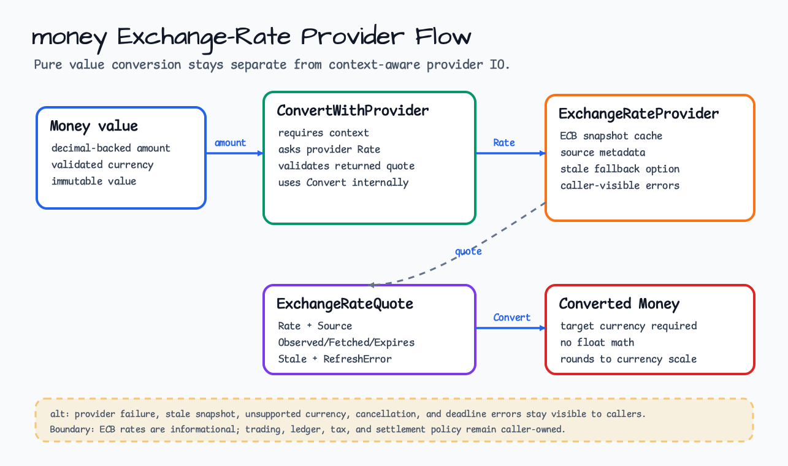
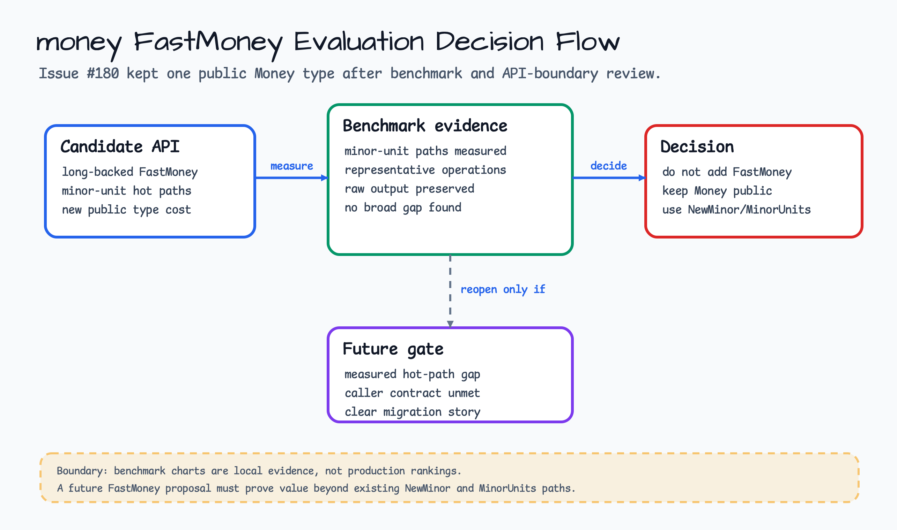
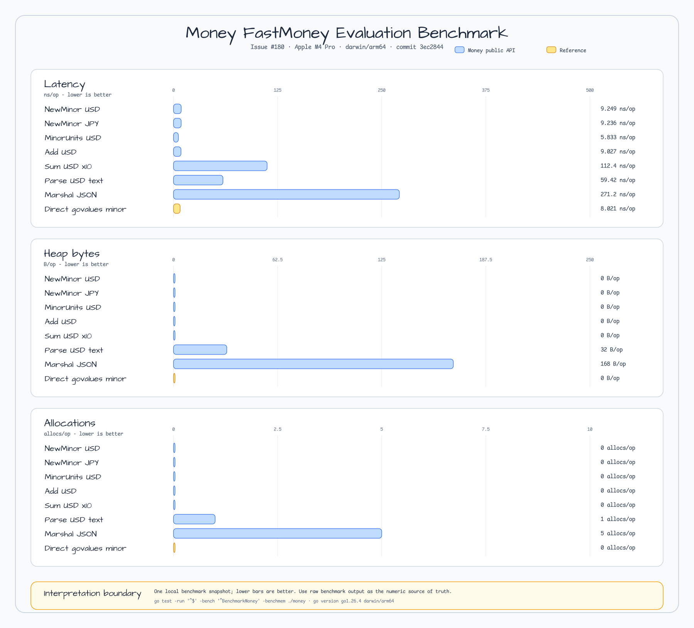
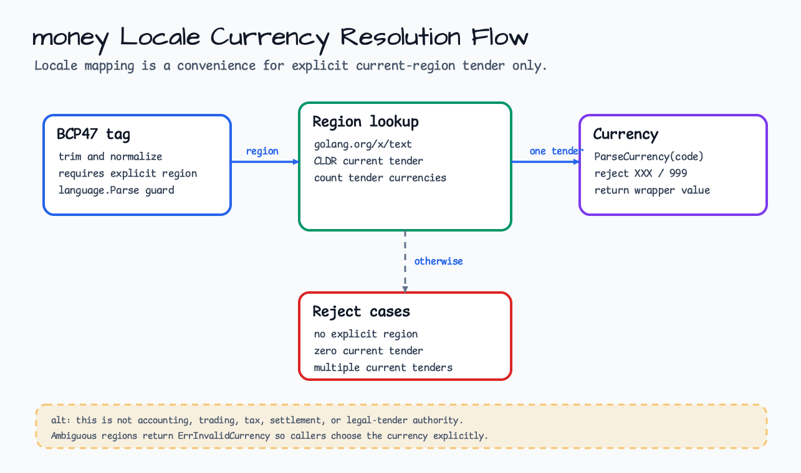

# money

[English](README.md) | [한국어](README.ko.md)

`money`는 ISO 4217 통화, decimal-backed 금액, 합산, 직렬화, caller-supplied
환율 변환, context-aware provider-backed 환율 변환을 위한 Go-native value API를
제공합니다.



## Import

```go
import "github.com/bluetape4k/bluetape-go/money"
```

## 선택 가이드

| 필요 | 사용 | 메모 |
|---|---|---|
| 통화 코드 파싱 | `ParseCurrency` 또는 `MustParseCurrency` | ISO alphabetic/numeric code를 받지만 no-currency `XXX`/`999`는 거부합니다. |
| 결정적 금융 입력 | `New` | `"12.34"` 같은 decimal string을 우선 사용합니다. |
| major-unit 정수 입력 | `NewFromInt64` | `NewFromInt64(12, USD)`는 `USD 12.00`, `NewFromInt64(12, KRW)`는 `KRW 12`입니다. |
| minor-unit 정수 입력 | `NewMinor` | `NewMinor(12, USD)`는 `USD 0.12`, `NewMinor(12, JPY)`는 `JPY 12`입니다. |
| 합산 | `Sum` | 입력이 비어 있으면 요청한 통화의 valid zero amount를 반환합니다. |
| caller-supplied 환율 변환 | `NewExchangeRate`와 `Convert` | 순수 value 경로입니다. network, cache, provider IO를 수행하지 않습니다. |
| provider-backed 환율 변환 | `ExchangeRateProvider`, `NewECBProvider`, `NewIMFProvider`, `ConvertWithProvider` | source, freshness, stale fallback, refresh failure metadata를 드러내는 context-aware provider 경로입니다. |
| locale-to-currency convenience | `CurrencyByLocale` | 명시적 region이 있는 BCP47 tag와 CLDR current legal tender data를 사용합니다. Ambiguous 또는 no-tender region은 거부합니다. |
| Long-backed FastMoney | 추가하지 않음 | #180 benchmark 근거에 따라 `Money`를 public API로 유지합니다. minor-unit 경로는 `NewMinor`와 `MinorUnits`를 사용하십시오. |

## Money vs FastMoney

`Money`를 public 금액 타입으로 유지합니다. #180은 minor-unit 및 대표 hot path를
측정했고 별도 long-backed `FastMoney` 타입을 추가하지 않았습니다. 정수 minor-unit
입력은 `NewMinor`, 정수 추출은 `MinorUnits`를 사용하세요.





이 benchmark snapshot은 local 비교 근거이며 production ranking이 아닙니다. Raw output은
`docs/research/outputs/issue-180/money-fastmoney-evaluation-bench.txt`에 보관합니다.

## 사용법

```go
price, err := money.New("12.34", money.USD)
if err != nil {
    return err
}
tax, err := money.New("0.66", money.USD)
if err != nil {
    return err
}
total, err := price.Add(tax)
if err != nil {
    return err
}

payload, err := json.Marshal(total)
```

Provider-backed 환율 변환은 IO를 명시적으로 다룹니다.

```go
provider, err := money.NewECBProvider(money.ECBProviderOptions{
    Timeout:           3 * time.Second,
    CacheTTL:          24 * time.Hour,
    MaxStale:          72 * time.Hour,
    AllowStaleOnError: true,
})
if err != nil {
    return err
}

usd, err := money.New("2.00", money.USD)
if err != nil {
    return err
}
krw, quote, err := money.ConvertWithProvider(ctx, usd, money.KRW, provider)
if err != nil {
    return err
}
if quote.Stale {
    log.Printf("using stale %s quote observed at %s: %v",
        quote.Source,
        quote.ObservedAt.Format(time.DateOnly),
        quote.RefreshError,
    )
}
_ = krw
```

IMF-backed rate도 같은 provider contract를 사용합니다.

```go
provider, err := money.NewIMFProvider(money.IMFProviderOptions{
    RateFamily:        money.IMFRateEndOfPeriod,
    Frequency:         money.IMFFrequencyMonthly,
    Timeout:           3 * time.Second,
    CacheTTL:          24 * time.Hour,
    MaxStale:          72 * time.Hour,
    AllowStaleOnError: true,
})
if err != nil {
    return err
}
_ = provider
```

Locale currency mapping은 current-region convenience입니다.



```go
currency, err := money.CurrencyByLocale("en-GB")
if err != nil {
    return err
}
_ = currency // GBP
```

## 동작

- `money`는 전체 회계 시스템이 아닙니다. Ledger, posting rule, tax policy,
  financial calendar, trading rate, settlement rule, jurisdiction-specific
  rounding policy는 제공하지 않습니다.
- `NewExchangeRate`와 `Convert`는 순수 value API로 유지됩니다. 이 경로는
  network나 cache IO를 수행하지 않습니다.
- `NewECBProvider`는 ECB daily XML endpoint의 euro reference rate를
  사용합니다. ECB reference rate는 정보 제공용입니다. Trading, accounting,
  ledger, tax, settlement 권위로 취급하지 마십시오.
- `NewIMFProvider`는 IMF Exchange Rates SDMX API의 configured period-average
  또는 end-of-period reference data를 사용합니다. IMF data는 provider-backed
  reference data이며 전체 accounting, trading-rate, tax, settlement system이
  아닙니다.
- `ConvertWithProvider`는 `context.Context`를 받고 변환된 `Money`와 사용한
  `ExchangeRateQuote`를 함께 반환합니다. Quote는 `Source`, `ObservedAt`,
  `FetchedAt`, `ExpiresAt`, `Stale`, `RefreshError`를 드러냅니다.
- ECB rate는 EUR 기준입니다. Provider는 같은 snapshot에서 EUR direct rate,
  reverse rate, non-EUR cross rate를 계산하며 float math를 사용하지 않습니다.
- IMF rate는 request마다 domestic currency 한쪽과 USD/EUR pivot 한쪽만
  지원합니다. Quote `Source`는 `IMF ER:XDC_USD:EOP_RT:M`처럼 IMF indicator,
  rate family, frequency를 포함합니다. Domestic-to-domestic cross rate는 이번
  provider slice의 non-goal입니다.
- 기본 IMF domestic-currency map은 `AUD`, `CAD`, `CHF`, `CNY`, `GBP`, `JPY`,
  `KRW`를 포함합니다. Caller가 다른 IMF country code mapping을 필요로 하면
  `IMFProviderOptions.CountryCodes`를 확장하십시오.
- 기본 IMF request는 `Now` 기준 18개월 monthly lookback window를 사용합니다.
  Caller가 고정 IMF period window를 필요로 하면 `StartPeriod`와 `EndPeriod`를
  함께 설정하십시오.
- IMF ER은 SDR/XDR family도 publish하지만 현재 package의 `Currency` backend는
  `XDR`을 거부합니다. SDR 노출은 currency backend가 XDR 값을 안전하게 생성하고
  변환할 수 있을 때까지 deferred scope입니다.
- 주말과 TARGET 휴장일에는 최신 ECB observation이 local fetch time보다 오래될 수
  있습니다. IMF publication cadence도 local fetch time보다 늦을 수 있습니다.
  Caller의 risk tolerance에 맞춰 `CacheTTL`, `MaxStale`, `AllowStaleOnError`를
  설정하십시오.
- Provider failure는 caller에게 보입니다. Network, HTTP, XML, stale,
  unsupported currency, cancellation, deadline failure는 `errors.Is`로 확인할 수
  있는 sentinel error를 보존합니다.
- IMF provider retry는 `RetryCount`가 설정된 경우 HTTP `429`와 `5xx` response에만
  적용됩니다. Caller cancellation, caller-owned deadline, `4xx` response,
  malformed XML, invalid observation value는 retry하지 않습니다.
- Bloomberg-backed 환율은 #232에서 평가했습니다. 이 경로는 customer-owned
  Bloomberg access, entitlement, SDK/session setup, network security, data usage
  monitoring, deployment topology를 요구합니다. Default `money` 동작이나 기본
  CI에는 포함하지 않으며, 향후 adapter는 `ExchangeRateProvider` 뒤에 두고
  fake/contract test로 검증해야 합니다. 이미 Bloomberg infrastructure를 운영하는
  caller에게는 그 adapter가 여전히 가장 빠르고 마찰이 적은 premium-data 경로가
  될 수 있습니다.
- 정밀도 모델은 `github.com/govalues/money`와 `github.com/govalues/decimal`에
  기반합니다. 값은 immutable decimal-backed value지만 무제한 arbitrary precision
  숫자는 아닙니다.
- Public API type은 bluetape-go wrapper입니다. Caller는 public signature에서
  upstream concrete type에 의존하지 않습니다.
- Zero-value `Money{}`, `Currency{}`, `ExchangeRate{}`는 invalid sentinel
  value입니다. 유효한 0 금액은 `Zero(currency)`를 사용합니다.
- `ParseCurrency("XXX")`, `ParseCurrency("999")`, no-currency 값으로 생성하는
  작업은 `ErrInvalidCurrency`를 반환합니다.
- `CurrencyByLocale`는 명시적 BCP47 region을 요구하고
  `golang.org/x/text/currency`의 CLDR current legal tender data를 사용합니다.
- Locale mapping은 current-region convenience이며 accounting, trading, tax,
  settlement, legal-tender 권위를 대체하지 않습니다. 현재 tender가 없거나 current
  tender가 여러 개인 region은 `ErrInvalidCurrency`를 반환하므로 caller가
  명시적으로 선택해야 합니다.
- 산술은 같은 통화끼리만 허용합니다. 통화 불일치는 `errors.Is`로 확인 가능한
  `ErrCurrencyMismatch`를 반환합니다.
- `Round`는 통화 scale 기준 half-even 반올림을 사용합니다. `RoundTo`는 요청한
  scale에 half-even 반올림을 적용하되 통화의 최소 scale은 유지합니다.
- `MinorUnits`는 통화 scale 기준 half-even 반올림 후 minor-unit 정수를
  반환합니다. `int64` 범위를 넘으면 `ErrOverflow`를 반환합니다.
- JSON 직렬화 shape은 `{"amount":"12.34","currency":"USD"}`입니다. Text
  직렬화 shape은 `USD 12.34`입니다.
- Parse와 unmarshal helper는 제한된 money shape을 검증하지만 HTTP request size,
  body size, streaming limit는 caller가 소유합니다.
- `NewFromFloat64`는 편의를 위해 제공하지만 결정적 금융 입력에는 string 또는
  minor-unit constructor를 우선합니다.
- Money value는 immutable하며 goroutine 사이에 전달해도 안전합니다. #35는
  대표 연산을 `testing/concurrency.GoroutineStressTester`와 `go test -race`로
  검증합니다.
- #180 benchmark 근거에 따라 `Money`를 public 금액 타입으로 유지합니다. 향후
  `FastMoney` 이슈는 `NewMinor`와 `MinorUnits`로 해결할 수 없는 measured hot-path
  gap과 public caller contract가 함께 있을 때만 열어야 합니다.

## Test

```bash
go test -count=1 ./money
go test -race -count=1 ./money
```
