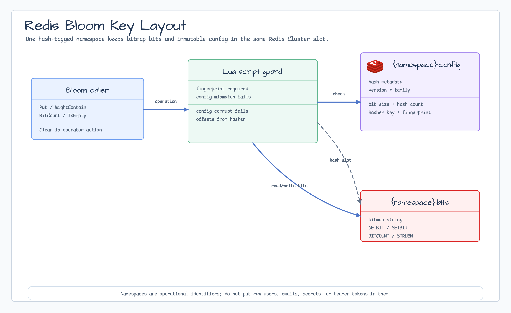

# probabilistic

[English](README.md) | [한국어](README.ko.md)

`probabilistic`는 first-party 확률적 자료구조를 제공합니다. 인메모리 Bloom
filter와 분산 공유 상태를 위한 Redis-backed Bloom filter를 포함합니다.

## 가져오기

```go
import "github.com/bluetape4k/bluetape-go/probabilistic"
```

## Bloom Filter

```go
cfg, err := probabilistic.NewConfig(1_000_000, 0.01)
if err != nil {
    return err
}

filter, err := probabilistic.NewStringBloomFilter(cfg)
if err != nil {
    return err
}

filter.Put("user:42")
if filter.MightContain("user:42") {
    // 값이 있을 수 있습니다.
}
```

string이나 `[]byte`가 아닌 값은 stable compatibility key를 가진 명시적 hasher를
제공합니다.

```go
hasher, err := probabilistic.NewHasher("int-decimal", func(v int) []byte {
    return []byte(strconv.Itoa(v))
})
```

패키지 생성 filter 병합은 config와 hasher key가 모두 같은 경우에만 허용됩니다.
Custom hasher 함수는 deterministic하고 goroutine-safe해야 합니다. 같은 key를 가진
두 filter는 merge-compatible로 간주되므로 compatibility key 안정성은 caller가
보장합니다.

## 동작

- `MightContain`이 `false`를 반환하면 값이 없다는 뜻입니다.
- `MightContain`이 `true`를 반환하면 값이 있을 수 있습니다. False positive는
  Bloom filter의 정상 동작입니다.
- 성공적으로 삽입되고 이후 `Clear`로 지워지지 않은 값은 false negative를 만들지
  않아야 합니다.
- `Put`은 하나 이상의 bit가 새로 켜졌는지 반환합니다. `false`가 값의 기존 존재를
  증명하지는 않습니다.
- 삭제는 지원하지 않습니다.
- 구현은 concurrent `Put`, `MightContain`, `PutAll`, `Clear`, metadata read에
  대해 hasher가 goroutine-safe일 때 goroutine-safe입니다.
- 패키지는 context-aware I/O나 background job 경계를 갖지 않습니다.

## Redis-backed Bloom Filter

Redis-backed package는 다음 import path를 사용합니다.

```go
import redisbloom "github.com/bluetape4k/bluetape-go/probabilistic/redis"
```

여러 Go process가 하나의 Bloom filter 상태를 공유해야 할 때 사용합니다.

```go
cfg, err := probabilistic.NewConfig(1_000_000, 0.01)
if err != nil {
    return err
}

filter, err := redisbloom.NewStringBloomFilter(ctx, redisClient, "auth:tenant-a:login-attempts", cfg)
if err != nil {
    return err
}

changed, err := filter.Put(ctx, value)
if err != nil {
    return err
}
if !changed {
    // 모든 hashed bit가 이미 켜져 있었다는 뜻입니다. 중복 확정은 아닙니다.
}
```



### Redis 상태

Redis Bloom은 namespace마다 Redis Cluster-safe hash-tagged key pair 하나를
사용합니다.

| Key | Type | 목적 |
|---|---|---|
| `bluetape:probabilistic:bloom:v1:{namespace}:bits` | bitmap string | `GETBIT`, `SETBIT`, `BITCOUNT`를 쓰는 static Lua script가 읽고 쓰는 Bloom bitset. |
| `bluetape:probabilistic:bloom:v1:{namespace}:config` | hash | 모든 공유 상태 연산 전에 확인하는 immutable config metadata. |

`{namespace}` segment는 두 key를 Redis Cluster의 같은 hash slot에 둡니다.
Namespace는 안정적인 운영 식별자여야 합니다. Raw user ID, email, secret,
token 같은 민감한 값을 namespace에 넣지 마세요.

저장 wire layout은 Go 구현이 소유하며 이전 Kotlin Lettuce 실험과 호환되지
않습니다. Migration은 새 namespace를 만들고, source data에서 rebuild하거나
verification window 동안 dual-write한 뒤, reader를 전환하고 rollback이 필요
없어진 뒤 old keys를 retire하는 방식으로 진행합니다.

### 운영 경계

- Bloom 의미는 그대로입니다. `MightContain(ctx, value) == false`는 값이
  확실히 없다는 뜻이고, `true`는 있을 수 있다는 뜻입니다.
- `Put(ctx, value) == false`는 모든 hashed bit가 이미 켜져 있었다는 뜻입니다.
  정확히 같은 값이 이미 삽입되었음을 증명하지 않습니다.
- `Clear(ctx)`는 config metadata를 보존하면서 공유 bitmap 상태를 삭제합니다.
  Operator/admin 작업으로 취급하고 caller-side approval과 authorization을
  요구해야 하며 ordinary request path에서는 사용하지 않습니다.
- 실수로 `Clear`했거나 key를 삭제한 경우 source data에서 새 namespace로
  rebuild하고 reader를 검증한 뒤 rollback 지점을 결정하고, 새 namespace를
  수용한 후 old keys를 retire합니다.
- Redis persistence와 eviction policy는 caller 책임입니다. 이 package는 TTL을
  설정하지 않습니다. 공유 filter에는 `noeviction`이나 충분한 reserved memory를
  권장합니다. `allkeys-*` eviction policy는 피하세요. Redis가 `:config`는 남기고
  `:bits`를 evict하면 read는 빈 bitmap으로 보이며 no-false-negative 보장은 새
  namespace로 rebuild하기 전까지 무효입니다.
- Incident 중에는 `evicted_keys`를 monitoring하고 두 key를 모두 확인하세요.
  `:bits`와 `:config`에 대해 `EXISTS`와 `PTTL`을 확인하고, bitmap이 없거나 외부에서
  삭제된 경우 해당 namespace의 data loss로 취급해야 합니다.
- TLS, AUTH, ACL을 사용하세요. Application access에는 script 실행과 script/runbook이
  쓰는 최소 command set이 필요합니다. `EVALSHA`, `EVAL`, `HSET`, `HGET`,
  `HGETALL`, `HLEN`, `GETBIT`, `SETBIT`, `BITCOUNT`, `STRLEN`, `DEL`, `PTTL`.

Diagnostics는 보통 metadata와 size 확인에서 시작합니다.

```text
HGETALL bluetape:probabilistic:bloom:v1:{namespace}:config
HLEN    bluetape:probabilistic:bloom:v1:{namespace}:config
EXISTS  bluetape:probabilistic:bloom:v1:{namespace}:config
STRLEN  bluetape:probabilistic:bloom:v1:{namespace}:bits
BITCOUNT bluetape:probabilistic:bloom:v1:{namespace}:bits
PTTL    bluetape:probabilistic:bloom:v1:{namespace}:bits
EXISTS  bluetape:probabilistic:bloom:v1:{namespace}:bits
```

### Redis 오류

| Error | Detection | 조치 |
|---|---|---|
| `ErrConfigMismatch` | `errors.Is(err, redisbloom.ErrConfigMismatch)` | Caller config가 저장 metadata와 다릅니다. `HGETALL`로 확인하고 새 namespace를 만든 뒤 source data로 rebuild하고 verification 후 reader를 전환합니다. |
| `ErrConfigCorrupt` | `errors.Is(err, redisbloom.ErrConfigCorrupt)` | Metadata가 없거나 불완전합니다. 상태를 삭제하기 전에 operator runbook으로 escalation하고, source data가 있으면 새 namespace로 rebuild합니다. |
| `RedisError` | `errors.As(err, &redisErr)` | Redis 운영 장애입니다. Operation과 redacted key id만 log하고 connectivity, ACL, latency, Redis health를 확인합니다. |

```go
if errors.Is(err, redisbloom.ErrConfigMismatch) {
    // metadata를 확인하고 새 namespace로 rebuild합니다.
}

var redisErr redisbloom.RedisError
if errors.As(err, &redisErr) {
    // redisErr.Operation과 redisErr.KeyID만 log합니다.
}
```

## 오류

Sentinel error는 `errors.Is`를 지원합니다.

- `ErrInvalidConfig`
- `ErrIncompatibleFilter`
- `ErrNilFilter`
- `ErrNilHasher`
- `ErrEmptyHasherKey`

## 후속 범위

여기서 공개하는 Redis-backed 확률적 자료구조는 Redis Bloom뿐입니다. Cuckoo와
HLL/HyperLogLog constructor는 후속 범위이며 이 Redis Bloom API에 포함되지
않습니다.

## 테스트

```bash
go test -count=1 ./probabilistic
go test -p 1 -count=1 ./probabilistic/redis
go test -race -count=1 ./probabilistic
go test -p 1 -race -count=1 ./probabilistic/redis
```

`./probabilistic/redis`는 Redis Testcontainers를 사용하므로 Docker가 필요합니다.
