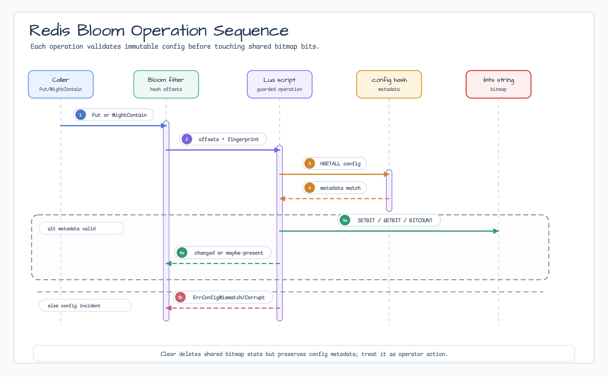

# probabilistic

[English](README.md) | [한국어](README.ko.md)

`probabilistic` provides first-party probabilistic data structures. It includes
an in-memory Bloom filter and a Redis-backed Bloom filter for shared
distributed state.

## Import

```go
import "github.com/bluetape4k/bluetape-go/probabilistic"
```

## Bloom Filter

```go
cfg, err := probabilistic.NewConfig(1_000_000, 0.01)
if err != nil {
    return err
}

filter, err := probabilistic.NewStringBloomFilter(cfg)
if err != nil {
    return err
}

filter.Put("user:42")
if filter.MightContain("user:42") {
    // The value may be present.
}
```

For non-string or non-`[]byte` values, provide an explicit hasher with a stable
compatibility key:

```go
hasher, err := probabilistic.NewHasher("int-decimal", func(v int) []byte {
    return []byte(strconv.Itoa(v))
})
```

Package-created filters can be merged only when their config and hasher key match.
Custom hasher functions must be deterministic and goroutine-safe. Callers own
the stability of the compatibility key: two filters with the same key are treated
as merge-compatible.

## Behavior

- `MightContain` returning `false` means the value is definitely absent.
- `MightContain` returning `true` means the value may be present; false
  positives are possible.
- Successful inserts that are not followed by `Clear` should not produce false
  negatives.
- `Put` returns whether at least one bit changed. A `false` return does not
  prove the value already existed.
- Deletion is unsupported.
- The implementation is goroutine-safe for concurrent `Put`, `MightContain`,
  `PutAll`, `Clear`, and metadata reads when the hasher is goroutine-safe.
- The package has no context-aware I/O or background job boundary.

## Redis-backed Bloom Filter

The Redis-backed package lives at:

```go
import redisbloom "github.com/bluetape4k/bluetape-go/probabilistic/redis"
```

Use it when multiple Go processes need one shared Bloom filter:

```go
cfg, err := probabilistic.NewConfig(1_000_000, 0.01)
if err != nil {
    return err
}

filter, err := redisbloom.NewStringBloomFilter(ctx, redisClient, "auth:tenant-a:login-attempts", cfg)
if err != nil {
    return err
}

value := "candidate-key"
changed, err := filter.Put(ctx, value)
if err != nil {
    return err
}
if !changed {
    // All hashed bits were already set. This is not duplicate certainty.
}
```




### Redis State

Redis Bloom uses one Cluster-safe hash-tagged key pair per namespace.

| Key | Type | Purpose |
|---|---|---|
| `bluetape:probabilistic:bloom:v1:{namespace}:bits` | bitmap string | Bloom bits read and written by static Lua scripts with `GETBIT`, `SETBIT`, and `BITCOUNT`. |
| `bluetape:probabilistic:bloom:v1:{namespace}:config` | hash | Immutable config metadata checked before every shared-state operation. |

The `{namespace}` segment keeps both keys in the same Redis Cluster hash slot.
Namespaces must be stable operational identifiers. Do not put raw user IDs,
emails, secrets, tokens, or other sensitive values in a namespace.

The stored wire layout is Go-owned and is incompatible with any previous Kotlin
Lettuce experiment. Migrate by creating a new namespace, rebuilding from source
data or dual-write during a verification window, switching readers, and then
retiring old keys after rollback is no longer needed.

### Operational Boundaries

- Bloom semantics are unchanged: `MightContain(ctx, value) == false` means the
  value is definitely absent; `true` means the value may be present.
- `Put(ctx, value) == false` means every hashed bit was already set. It does not
  prove the exact value had already been inserted.
- `Clear(ctx)` deletes shared bitmap state while preserving config metadata.
  Treat it as an operator/admin action, require caller-side approval and
  authorization, and keep it out of ordinary request paths.
- Recovery from an accidental `Clear` or key deletion should rebuild from source
  data into a new namespace, verify readers, decide rollback points, and retire
  old keys only after the new namespace is accepted.
- Redis persistence and eviction policy are caller-owned. The package does not
  set TTLs; prefer `noeviction` or reserved Redis memory for shared filters.
  Avoid `allkeys-*` eviction policies: if Redis evicts `:bits` while `:config`
  remains, reads observe an empty bitmap and the no-false-negative guarantee is
  void until the filter is rebuilt into a new namespace.
- Monitor `evicted_keys` and verify both keys during incidents. Check `EXISTS`
  and `PTTL` for `:bits` and `:config`; a missing or externally deleted bitmap
  must be treated as data loss for that namespace.
- Use TLS, AUTH, and ACLs. Application access needs script execution plus the
  minimum command set used by the scripts and runbooks: `EVALSHA`, `EVAL`,
  `HSET`, `HGET`, `HGETALL`, `HLEN`, `GETBIT`, `SETBIT`, `BITCOUNT`, `STRLEN`,
  `DEL`, and `PTTL`.

Diagnostics usually start with metadata and size checks:

```text
HGETALL bluetape:probabilistic:bloom:v1:{namespace}:config
HLEN    bluetape:probabilistic:bloom:v1:{namespace}:config
EXISTS  bluetape:probabilistic:bloom:v1:{namespace}:config
STRLEN  bluetape:probabilistic:bloom:v1:{namespace}:bits
BITCOUNT bluetape:probabilistic:bloom:v1:{namespace}:bits
PTTL    bluetape:probabilistic:bloom:v1:{namespace}:bits
EXISTS  bluetape:probabilistic:bloom:v1:{namespace}:bits
```

### Redis Errors

| Error | Detection | Action |
|---|---|---|
| `ErrConfigMismatch` | `errors.Is(err, redisbloom.ErrConfigMismatch)` | Caller config does not match stored metadata. Inspect `HGETALL`, create a new namespace, rebuild from source data, and switch readers after verification. |
| `ErrConfigCorrupt` | `errors.Is(err, redisbloom.ErrConfigCorrupt)` | Metadata is missing or incomplete. Escalate to the operator runbook before deleting state; rebuild into a new namespace when source data is available. |
| `RedisError` | `errors.As(err, &redisErr)` | Operational Redis failure. Log the operation and redacted key id, then inspect connectivity, ACL, latency, or Redis health. |

```go
if errors.Is(err, redisbloom.ErrConfigMismatch) {
    // inspect metadata and rebuild into a new namespace
}

var redisErr redisbloom.RedisError
if errors.As(err, &redisErr) {
    // log redisErr.Operation and redisErr.KeyID only
}
```

## Errors

Sentinel errors support `errors.Is`:

- `ErrInvalidConfig`
- `ErrIncompatibleFilter`
- `ErrNilFilter`
- `ErrNilHasher`
- `ErrEmptyHasherKey`

## Follow-up Scope

Redis Bloom is the only Redis-backed probabilistic structure exposed here.
Cuckoo and HLL/HyperLogLog constructors remain follow-up scope; they are not
part of this Redis Bloom API.

## Test

```bash
go test -count=1 ./probabilistic
go test -p 1 -count=1 ./probabilistic/redis
go test -race -count=1 ./probabilistic
go test -p 1 -race -count=1 ./probabilistic/redis
```

`./probabilistic/redis` uses Redis Testcontainers, so Docker must be available.
