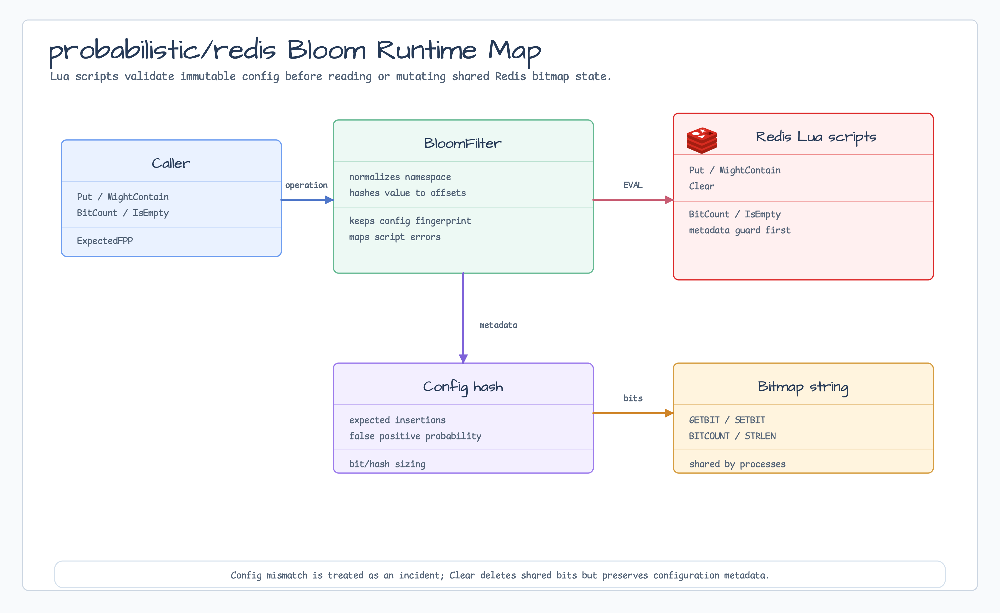

# probabilistic/redis

[English](README.md) | 한국어

`probabilistic/redis`는 Redis-backed shared Bloom filter를 제공합니다. Bloom
configuration을 Redis metadata에 immutable하게 보관하고, 모든 read/mutation 전에
Lua script로 metadata를 검증하며, shared bit는 Redis bitmap string에 저장합니다.



## 가져오기

```go
import redisbloom "github.com/bluetape4k/bluetape-go/probabilistic/redis"
```

## 사용 예

```go
cfg, err := probabilistic.NewConfig(1_000_000, 0.01)
if err != nil {
    return err
}

filter, err := redisbloom.NewStringBloomFilter(ctx, redisClient, "auth:tenant-a:login-attempts", cfg)
if err != nil {
    return err
}

changed, err := filter.Put(ctx, "candidate-key")
if err != nil {
    return err
}
if !changed {
    // 모든 hashed bit가 이미 set된 상태입니다. 중복 확정은 아닙니다.
}

mayExist, err := filter.MightContain(ctx, "candidate-key")
```

`[]byte` 값에는 `NewBytesBloomFilter`를 사용하고, custom value type에는 deterministic
`probabilistic.Hasher[T]`를 명시해 `NewBloomFilter`를 사용합니다.

## Redis 상태

Redis Bloom은 namespace마다 Redis Cluster-safe hash-tag key pair 하나를 사용합니다.

| Key suffix | Type | 목적 |
|---|---|---|
| `:bits` | bitmap string | `GETBIT`, `SETBIT`, `BITCOUNT`, `STRLEN`으로 읽고 쓰는 Bloom bit. |
| `:config` | hash | 모든 shared-state operation 전에 확인하는 immutable metadata. |

Namespace는 안정적인 운영 식별자여야 합니다. Raw user ID, email, token, secret,
password, credential, API key를 namespace에 넣지 마세요.

## 동작

- `MightContain(ctx, value) == false`는 값이 확실히 없다는 뜻입니다.
- `MightContain(ctx, value) == true`는 값이 있을 수 있다는 뜻이며 false positive가
  가능합니다.
- `Put(ctx, value) == false`는 모든 hashed bit가 이미 set되어 있었다는 뜻입니다.
  같은 값이 이미 들어 있었다는 확정은 아닙니다.
- `Clear(ctx)`는 config metadata는 보존하고 shared bitmap state만 삭제합니다.
- `BitCount`, `IsEmpty`, `ApproximateElementCount`, `ExpectedFPP`는 shared bitmap에서
  운영 metadata를 읽습니다.
- Config 또는 hasher mismatch는 shared state를 읽거나 변경하기 전에 error로
  처리됩니다.

## 운영 경계

- Redis persistence, eviction policy, TLS, AUTH, ACL, backup policy는 caller가
  책임집니다.
- Shared filter에는 `noeviction` 또는 reserved memory를 권장합니다. `:config`가
  남은 상태에서 `:bits`가 evict되면 namespace를 rebuild하기 전까지 no-false-negative
  기대가 깨질 수 있습니다.
- `Clear`는 administrative action으로 취급하세요. 실수로 삭제했다면 새 namespace로
  rebuild하고 reader를 검증한 뒤, 새 namespace가 승인된 후에만 old key를 정리합니다.

## 테스트

```bash
go test -count=1 ./probabilistic/redis
```
