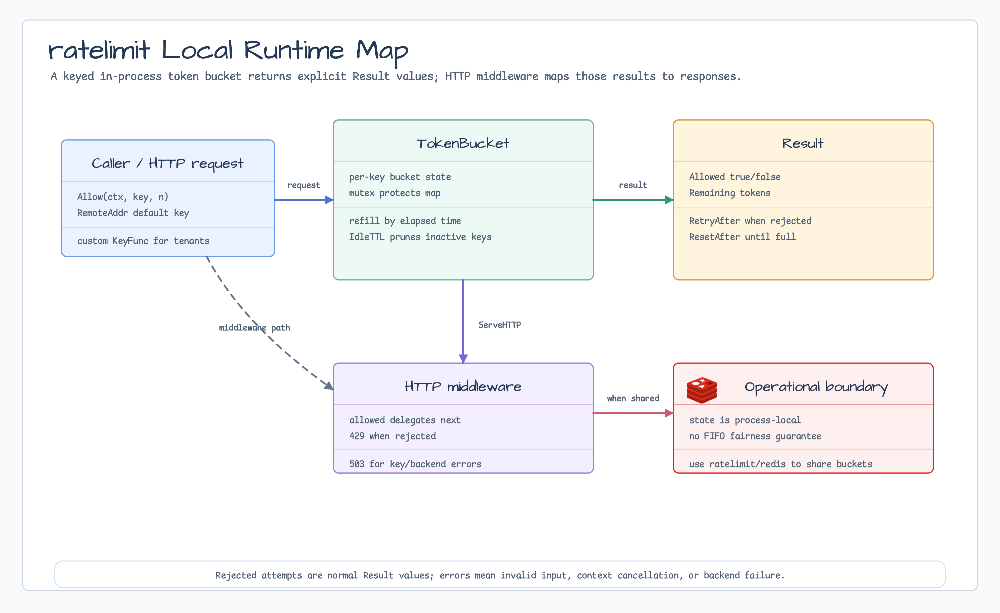
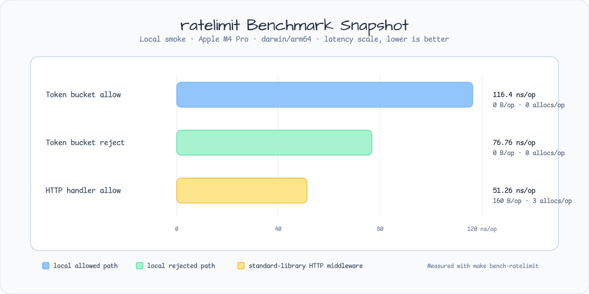

# ratelimit

[English](README.md) | [한국어](README.ko.md)

`ratelimit` provides a process-local keyed token-bucket limiter and
standard-library HTTP middleware. It is intended for in-process request guards,
tenant throttles, and tests that need deterministic rejection diagnostics.

Choose a provider by ownership and traffic shape:

| Provider | Use when | Boundary |
|---|---|---|
| Local `ratelimit` | One process owns the quota. | Fast in-memory state; not shared across processes. |
| [`ratelimit/redis`](redis/README.md) | Multiple processes need a shared low-latency quota. | Caller-owned Redis; atomic Lua operation. |
| [`ratelimit/sql`](sql/README.md) | A moderate-QPS, database-only deployment already shares PostgreSQL. | Caller-owned PostgreSQL schema, pool, and cleanup; not a Redis replacement for high-QPS traffic. |

## Diagram



## Install

```go
import "github.com/bluetape4k/bluetape-go/ratelimit"
```

## Local Token Bucket

```go
limiter, err := ratelimit.New(ratelimit.Options{
    RatePerSecond: 10,
    Burst:         20,
})
if err != nil {
    return err
}

result, err := limiter.Allow(ctx, "tenant:blue", 1)
if err != nil {
    return err
}
if !result.Allowed {
    return fmt.Errorf("retry after %s", result.RetryAfter)
}
```

Rejected attempts are normal results, not errors. Errors are reserved for
invalid input, context cancellation, and backend failures in implementations
such as `ratelimit/redis` and `ratelimit/sql`.

## HTTP Middleware

```go
handler, err := ratelimit.NewHandler(next, ratelimit.HandlerOptions{
    Limiter: limiter,
    KeyFunc: func(r *http.Request) string {
        return authenticatedTenantID(r)
    },
})
```

The default key function uses `Request.RemoteAddr` only. It does not trust
`X-Forwarded-For`, `Forwarded`, or other proxy headers. Services behind trusted
proxies should provide an explicit `KeyFunc` based on authenticated tenant,
user, or API-key identity.

Default middleware behavior:

- allowed attempts delegate to the wrapped handler;
- rejected attempts return `429 Too Many Requests`;
- rejected attempts set `Retry-After` when a retry delay is known;
- backend/key errors return `503 Service Unavailable`;
- `ErrorHandler` can replace the response policy.

## Operational Boundary

- State is process-local and held in memory.
- `IdleTTL` removes inactive key state; the default is at least one minute and
  at least two full refill windows.
- Requests for more tokens than `Burst` are validation errors because the bucket
  can never satisfy them.
- The limiter is concurrency-safe but does not provide FIFO fairness.

## Tests

```bash
go test -count=1 ./ratelimit
go test -race -count=1 ./ratelimit
```

Stress and cancellation coverage uses
`testing/concurrency.GoroutineStressTester` and
`testing/concurrency.AsyncJobTester`.

## Benchmarks

```bash
make bench-ratelimit
```

Measured paths:

- local allowed path;
- local rejected path;
- HTTP middleware allowed path.

Lower `ns/op` and lower allocations are better. Redis-backed benchmark scope is
kept separate because it depends on external Redis latency and deployment
topology.

## Benchmark Snapshot

These are local smoke numbers, not production capacity rankings. The run used
macOS arm64 on Apple M4 Pro. Lower `ns/op`, `B/op`, and `allocs/op` are better.



| Benchmark | ns/op | B/op | allocs/op |
|---|---:|---:|---:|
| `BenchmarkTokenBucketAllowAllowed` | 116.4 | 0 | 0 |
| `BenchmarkTokenBucketAllowRejected` | 76.76 | 0 | 0 |
| `BenchmarkHandlerAllowed` | 51.26 | 160 | 3 |

## Provider Conformance

`ratelimit/ratelimittest.Run` applies the same burst, refill, cancellation, and
exact-admission contract to local, Redis, and SQL providers. Distributed
providers expose redacted failures through `ratelimit.OperationError`. If
`errors.Is(err, ratelimit.ErrCommitUnknown)` is true, discard the zero result and
do not replay automatically because one debit may have committed.

Local, Redis, and SQL quota state is not shared. Simultaneous mixed-provider
serving can grant multiple full bursts and is prohibited. A safe canary uses an
independent namespace and an independent cohort. For cutover or rollback,
quiesce the old provider and wait a conservative full-refill window before
activating exactly one new provider, or record an approved extra-burst budget
for the overlap.
