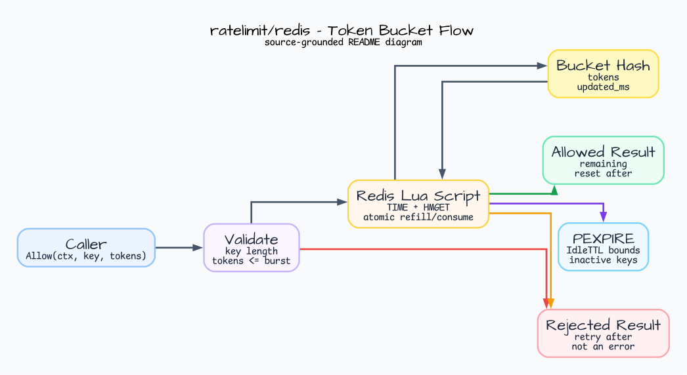
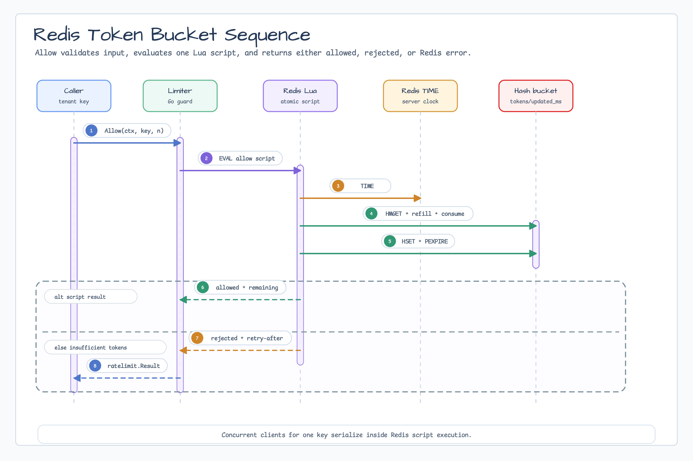

# ratelimit/redis

[English](README.md) | [한국어](README.ko.md)

`ratelimit/redis` provides a Redis-backed token-bucket limiter for multiple
processes. Each `Allow` call runs one Redis Lua script that refills, consumes,
stores bucket state, and refreshes key expiration atomically.

## Diagram





## Install

```go
import (
    redisratelimit "github.com/bluetape4k/bluetape-go/ratelimit/redis"
    btredis "github.com/bluetape4k/bluetape-go/redis"
)
```

## Usage

```go
limiter, err := redisratelimit.New(redisratelimit.Options{
    Client:        redisClient,
    Namespace:     "api",
    RatePerSecond: 100,
    Burst:         200,
})
if err != nil {
    return err
}

result, err := limiter.Allow(ctx, "tenant:blue", 1)
if errors.Is(err, btredis.ErrCommitUnknown) {
    fullRefill := 2 * time.Second // Burst / RatePerSecond
    return fmt.Errorf("do not replay; wait at least %s or absorb one debit: %w", fullRefill, err)
}
if err != nil {
    return err
}
if !result.Allowed {
    return fmt.Errorf("retry after %s", result.RetryAfter)
}
```

The Redis client is caller-owned. This package does not create or close Redis
connections.

## Redis State

Default key shape:

```text
bluetape:ratelimit:<namespace>:bucket:<key>
```

The bucket key is a Redis hash:

- `tokens`: remaining microtokens;
- `updated_ms`: Redis server timestamp for the last refill.

The script uses Redis `TIME`, so distributed callers do not rely on their local
machine clocks. `PEXPIRE` keeps inactive bucket keys bounded by `IdleTTL`.

## Operational Boundary

- Concurrent clients for one key are serialized by Redis script execution.
- Rejected attempts are normal `ratelimit.Result` values, not errors.
- Redis command/script failures are returned as errors.
- Redis command/script failures retain their original cause for `errors.Is`,
  expose typed diagnostics through `errors.As`, and redact raw Redis key and
  provider details.
- No FIFO fairness, waiting, reservations, adaptive limits, or Redis Cluster
  multi-key behavior is provided.
- `MaxKeyBytes` bounds untrusted logical key length; default is 512 bytes.
- Requests for more tokens than `Burst` are validation errors.

## Tests

Redis tests use Testcontainers and require Docker:

```bash
go test -count=1 ./ratelimit/redis
go test -race -count=1 ./ratelimit/redis
```

Coverage includes burst/rejection, refill, namespace isolation, idle key
expiration, context cancellation, and concurrent-client stress with
`GoroutineStressTester`.

## Conformance And Commit-Unknown Recovery

Use the bilingual [v0.19.0 rollout runbook](../../docs/release/v0.19.0-provider-conformance-runbook.md)
for mixed-version constraints, canary telemetry and thresholds, and cleanup/TTL
rollback gates.

The provider runs `ratelimittest.Run` at the Lua debit boundary. An Eval response
loss returns a zero `Result` and a typed `btredis.OpError` matching
`btredis.ErrCommitUnknown`; it may represent one debit. Do not replay. Wait at least
`Burst / RatePerSecond` or account for one debit in the caller's budget.
